# HỌC SÂU VÀ ỨNG DỤNG TRONG THỊ GIÁC MÁY TÍNH

**Đề bài tập lớn cho Nhóm 4 - Bài tập lớn số 1**

> **GVHD:** TS. Lê Thành Sách
>
> **SV thực hiện:**
> - Nguyễn Hữu Trưởng - 2470573
> - Nguyễn Nhật Thanh - 2570316
> - Võ Thị Bích Phượng - 2470570


# Tài liệu và Mã nguồn dự án

Nhằm đảm bảo tính minh bạch khoa học và khả năng tái lập (reproducibility) kết quả, toàn bộ mã nguồn, dữ liệu thực nghiệm, bài thuyết trình và portfolio của nhóm được công khai tại các đường dẫn sau:

-   **Trang giới thiệu (Github Page):**
    <https://hcmut-master.github.io/portfolio/#/>

-   **Mã nguồn thực nghiệm (Github Repo):**
    <https://github.com/hcmut-master/dl4cv/tree/master>

-   **Slide trình bày (Canva):**
    <https://www.canva.com/design/DAHE9HdVt3o/fjYvClFKaNK-rSQiKfWjmQ>

# Giới thiệu đề tài

## Ngữ cảnh và Mục tiêu

Trong khuôn khổ môn học Học sâu và ứng dụng trong thị giác máy tính, nhóm chúng em thực hiện Bài tập lớn số 1 với chủ đề tập trung vào bài toán phân loại (classification). Mục tiêu cốt lõi của đề tài là vận dụng và đánh giá hiệu năng của các kiến trúc mạng nơ-ron học sâu tiên tiến trên ba loại dữ liệu khác biệt: ảnh, văn bản và đa phương thức (ảnh kết hợp văn bản).

Thông qua quá trình triển khai, nhóm hướng tới việc đạt được các mục tiêu cụ thể sau:

-   Chuẩn bị dữ liệu và thiết lập quy trình huấn luyện, đánh giá chuẩn xác.

-   Vận dụng các mô hình pretrained đa dạng để giải quyết bài toán phân loại.

-   So sánh, phân tích kết quả giữa các họ mô hình học sâu khác nhau thông qua bảng số liệu và biểu đồ trực quan.

## Phương pháp và Mô hình thực nghiệm

Để thực hiện so sánh một cách toàn diện theo yêu cầu của Bài tập lớn, nhóm tiến hành xây dựng và huấn luyện (fine-tune) các mô hình sau:

-   **Với dữ liệu ảnh:** Đối chiếu hiệu năng giữa mạng tích chập truyền thống CNN (Convolutional Neural Networks) và kiến trúc ViT (Vision Transformer).

-   **Với dữ liệu văn bản:** Đánh giá sự khác biệt giữa mạng nơ-ron hồi quy RNN (cụ thể là cấu trúc LSTM) và kiến trúc Transformer.

-   **Với dữ liệu đa phương thức:** Khảo sát khả năng phân loại thông qua hai chiến lược tiếp cận là Zero-shot classification và Few-shot classification.

## Tập dữ liệu sử dụng

Nhằm đảm bảo các mô hình được đánh giá một cách thuyết phục nhất, nhóm đã lựa chọn ba tập dữ liệu đáp ứng tiêu chí về độ phân biệt lớp và số lượng mẫu huấn luyện từ vài nghìn mẫu trở lên:

-   **Tập dữ liệu ảnh - CIFAR-10:** Đây là một trong những tập dữ liệu tiêu chuẩn và được gợi ý sử dụng cho bài toán phân loại ảnh.

-   **Tập dữ liệu văn bản - IMDB:** Được lựa chọn cho tác vụ phân loại văn bản (text classification).

-   **Tập dữ liệu đa phương thức - COCO-caption 2017:** Đây là tập dữ liệu cung cấp các cặp ảnh và văn bản thực sự, cùng mô tả một thực thể hoặc sự kiện, đáp ứng đúng yêu cầu của bài toán phân loại đa phương thức.

### Tập dữ liệu ảnh: CIFAR-10

Tập dữ liệu CIFAR-10 bao gồm 60.000 ảnh màu có kích thước 32x32 pixel, được phân bổ đều vào 10 lớp vật thể và động vật khác nhau (như máy bay, ô tô, chó, mèo,\...).

-   **Đáp ứng tiêu chí:** Tập dữ liệu có 50.000 ảnh dùng để huấn luyện, thỏa mãn hoàn toàn yêu cầu có từ vài nghìn mẫu trở lên (lớn hơn 5.000 mẫu). Đồng thời, với 10 lớp phân biệt, CIFAR-10 vượt mức tối thiểu 5 lớp mà đề bài bắt buộc.

-   **Lý do lựa chọn:** Đây là một tập dữ liệu có độ khó vừa phải, các lớp có sự đa dạng về góc chụp và bối cảnh, khắc phục được sự đơn giản quá mức của tập MNIST. Điều này tạo ra một môi trường thử nghiệm hoàn hảo để nhóm đánh giá và so sánh năng lực trích xuất đặc trưng không gian của mạng tích chập (CNN) so với khả năng nắm bắt ngữ cảnh toàn cục của kiến trúc Vision Transformer (ViT).

### Tập dữ liệu văn bản: IMDB Movie Reviews

Tập dữ liệu IMDB chứa 50.000 văn bản đánh giá phim tiếng Anh, với độ dài và cấu trúc ngữ nghĩa phong phú, đa dạng. Kích thước tập dữ liệu này hoàn toàn đáp ứng điều kiện về số lượng mẫu huấn luyện.

-   **Đặc trưng bài toán:** Thông thường, tập dữ liệu IMDB được sử dụng cho bài toán phân loại nhị phân (Binary Classification) để dự đoán thái độ Tích cực (Positive) hoặc Tiêu cực (Negative) của người dùng đối với một tác phẩm điện ảnh. Điều này cho phép nhóm tập trung hoàn toàn vào việc đánh giá khả năng trích xuất đặc trưng ngữ nghĩa của các mô hình học sâu.

-   **Lý do lựa chọn:** Các đoạn đánh giá trên IMDB thường có cấu trúc câu dài và phức tạp. Việc phân loại thái độ yêu cầu mô hình phải hiểu được các từ khóa nhấn mạnh và ngữ cảnh đảo ngược. Nhờ đó, nhóm có thể thấy rõ sự chênh lệch về hiệu năng khi xử lý chuỗi dài giữa mạng nơ-ron hồi quy RNN (LSTM) và cơ chế tự chú ý của Transformer.

### Tập dữ liệu đa phương thức: COCO Captions 2017

COCO (Common Objects in Context) Captions là bộ dữ liệu tiêu chuẩn quy mô lớn dùng để nghiên cứu mối liên hệ giữa hình ảnh và ngôn ngữ tự nhiên.

-   **Đáp ứng tiêu chí:** Tập dữ liệu cung cấp các cặp ảnh - văn bản thực sự. Mỗi bức ảnh đi kèm với khoảng 5 câu mô tả (captions) do con người trực tiếp chú thích, đảm bảo sự liên kết chặt chẽ về mặt thực thể và sự kiện, tuân thủ tuyệt đối quy định không được phép ghép ảnh và văn bản một cách ngẫu nhiên. Đây cũng là một trong những tập dữ liệu được gợi ý trực tiếp trong hướng dẫn.

-   **Lý do lựa chọn:** Sự đa dạng và độ phức tạp cao của COCO Captions cung cấp một nền tảng thử nghiệm lý tưởng để nhóm đánh giá sức mạnh của các mô hình đa phương thức. Cụ thể, nhóm sử dụng bộ dữ liệu này để đối chiếu hiệu quả của hai phương pháp tiếp cận: Zero-shot classification (khả năng mô hình nhận diện các lớp chưa từng thấy trong quá trình huấn luyện) và Few-shot classification (khả năng học nhanh từ một lượng rất nhỏ dữ liệu mẫu).

## Metric đánh giá (Evaluation Metrics)

Để đảm bảo sự công bằng và khách quan khi đối chiếu kết quả giữa các kiến trúc mô hình khác nhau (CNN vs. ViT, RNN vs. Transformer), nhóm thống nhất sử dụng chung một hệ thống các độ đo (metrics).

-   **Accuracy (Độ chính xác toàn cục):** Đây là metric bắt buộc được sử dụng để đánh giá tổng quan tỷ lệ dự đoán đúng trên toàn bộ tập dữ liệu. $$\text{Accuracy}=\frac{TP+TN}{TP+TN+FP+FN}$$

-   **F1-Score:** Trong các trường hợp các lớp dữ liệu có sự phân bổ không đồng đều (mất cân bằng lớp), F1-Score được bổ sung để đánh giá mô hình một cách toàn diện hơn, tránh sai lệch do độ chính xác ảo. F1-Score là trung bình điều hòa của Precision (Độ xác thực) và Recall (Độ bao phủ): $$F1 = 2 \times \frac{\text{Precision} \times \text{Recall}}{\text{Precision} + \text{Recall}}$$

-   **Ma trận nhầm lẫn (Confusion Matrix):** Nhóm bổ sung thêm ma trận này nhằm trực quan hóa các trường hợp mô hình nhận diện sai, từ đó phục vụ cho việc phân tích lỗi sâu hơn ở phần sau.

# Phân loại văn bản với RNN & Transformer

## Tổng quan về Xử lý ngôn ngữ tự nhiên và Phân tích cảm xúc

Xử lý Ngôn ngữ Tự nhiên (Natural Language Processing - NLP) là một nhánh của Trí tuệ Nhân tạo (AI) tập trung vào việc tương tác giữa máy tính và ngôn ngữ của con người. Trong giới hạn của nghiên cứu này, tác vụ cốt lõi được giải quyết là Phân tích cảm xúc (Sentiment Analysis) hay Phân loại văn bản (Text Classification).

Về mặt toán học, bài toán phân loại cảm xúc nhị phân có thể được định nghĩa như sau: Cho một tập hợp các văn bản (đánh giá phim) $D = \{d_1, d_2, \dots, d_N\}$ và tập nhãn phân lớp $Y = \{0, 1\}$, trong đó $0$ đại diện cho cảm xúc tiêu cực (Negative) và $1$ đại diện cho cảm xúc tích cực (Positive). Mục tiêu của mô hình học máy là tìm ra một hàm ánh xạ $f: D \rightarrow Y$ sao cho hàm mục tiêu (thường là sự sai lệch giữa dự đoán và thực tế) đạt giá trị nhỏ nhất.

## Cơ sở lý thuyết

### Tiền xử lý dữ liệu và Không gian nhúng từ (Word Embeddings)
#### Tiền xử lý và Mã hóa (Tokenization) 
Máy tính không thể trực tiếp xử lý văn bản dạng chuỗi ký tự. Do đó, dữ liệu thô cần được làm sạch (loại bỏ nhiễu như thẻ HTML, ký tự đặc biệt) và phân rã thành các đơn vị cơ sở gọi là *token* (từ, cụm từ, hoặc ký tự phụ). Mỗi token sau đó được ánh xạ thành một số nguyên duy nhất (ID) tạo thành một từ điển (Vocabulary). Tuy nhiên, việc biểu diễn bằng ID hay One-hot Encoding mang lại những ma trận thưa (sparse matrix) khổng lồ và hoàn toàn triệt tiêu mối quan hệ ngữ nghĩa giữa các từ.
#### Biểu diễn từ phân tán với GloVe (Global Vectors for Word Representation) 
Để giải quyết hạn chế của One-hot Encoding, các kỹ thuật Word Embeddings ánh xạ mỗi từ vào một không gian vector thực liên tục (continuous vector space) nhiều chiều, nơi các từ có nghĩa tương đồng sẽ nằm gần nhau. Trong nghiên cứu này, thuật toán GloVe (cụ thể là ma trận GloVe 100 chiều) được sử dụng cho mô hình LSTM.

GloVe là một mô hình học không giám sát được phát triển bởi Đại học Stanford, kết hợp lợi thế của ma trận phân tích nhân tử toàn cục (global matrix factorization) và các phương pháp trượt cửa sổ ngữ cảnh cục bộ (local context window). Giả sử $X$ là ma trận đồng xuất hiện (co-occurrence matrix), trong đó phần tử $X_{ij}$ thể hiện số lần từ $j$ xuất hiện trong ngữ cảnh của từ $i$. Gọi $X_i = \sum_k X_{ik}$ là tổng số lần bất kỳ từ nào xuất hiện trong ngữ cảnh của $i$. Xác suất đồng xuất hiện được định nghĩa là $P_{ij} = P(j|i) = \frac{X_{ij}}{X_i}$.

GloVe thiết lập một hàm mục tiêu dựa trên bình phương sai số có trọng số (weighted least squares) nhằm tối thiểu hóa sự chênh lệch giữa tích vô hướng của hai vector nhúng và logarit xác suất đồng xuất hiện của chúng:
$$J = \sum_{i,j=1}^{V} f(X_{ij}) \left( w_i^T \tilde{w}_j + b_i + \tilde{b}_j - \log X_{ij} \right)^2$$
Trong đó:

-   $V$ là kích thước tập từ vựng.

-   $w_i, \tilde{w}_j \in \mathbb{R}^d$ là các vector biểu diễn của từ mục tiêu và từ ngữ cảnh.

-   $b_i, \tilde{b}_j$ là các hệ số chệch (bias).

-   $f(X_{ij})$ là hàm trọng số nhằm giới hạn sự ảnh hưởng của các từ xuất hiện quá thường xuyên và ngăn chặn hàm $\log(0)$ khi $X_{ij} = 0$.

### Mạng Nơ-ron Hồi quy tiến hóa: Từ RNN đến Bi-LSTM
#### Mạng LSTM (Long Short-Term Memory) 
Mạng Nơ-ron Hồi quy (RNN) truyền thống gặp phải bài toán triệt tiêu đạo hàm (Vanishing Gradient) khi chuỗi quá dài. LSTM giải quyết vấn đề này thông qua kiến trúc tế bào (cell) phức tạp chứa \"trạng thái ô\" (cell state - $C_t$), cùng với ba \"cổng\" (gates) để kiểm soát luồng thông tin:

-   **Cổng quên (Forget gate - $f_t$):**
    $$f_t = \sigma(W_f \cdot [h_{t-1}, x_t] + b_f)$$

-   **Cổng đầu vào (Input gate - $i_t$) và Trạng thái ứng viên
    ($\tilde{C}_t$):** $$i_t = \sigma(W_i \cdot [h_{t-1}, x_t] + b_i)$$
    $$\tilde{C}_t = \tanh(W_C \cdot [h_{t-1}, x_t] + b_C)$$

-   **Cập nhật trạng thái ô ($C_t$):**
    $$C_t = f_t \odot C_{t-1} + i_t \odot \tilde{C}_t$$

-   **Cổng đầu ra (Output gate - $o_t$) và Trạng thái ẩn ($h_t$):**
    $$o_t = \sigma(W_o \cdot [h_{t-1}, x_t] + b_o)$$
    $$h_t = o_t \odot \tanh(C_t)$$

*(Trong đó: $\odot$ là ký hiệu cho phép nhân từng phần tử - element-wise multiplication).*

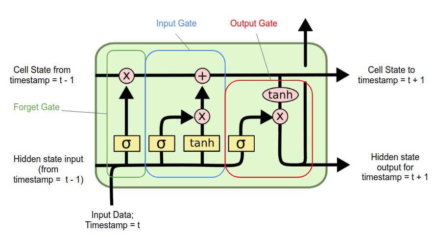
#### Mạng LSTM hai chiều (Bidirectional LSTM) và Cơ chế Gộp (Pooling) 
Ngôn ngữ tự nhiên có tính phụ thuộc hai chiều. Bi-LSTM vận hành hai lớp LSTM song song: chiều xuôi ($\overrightarrow{h_t}$) và chiều ngược ($\overleftarrow{h_t}$). Trạng thái ẩn tổng hợp là sự ghép nối: $$h_t = [\overrightarrow{h_t} \oplus \overleftarrow{h_t}]$$

Để trích xuất đặc trưng toàn cục, mô hình sử dụng kết hợp hai phép toán Pooling:

-   **Average Pooling ($h_{avg}$):** Nắm bắt ngữ nghĩa tổng thể.

-   **Max Pooling ($h_{max}$):** Phát hiện các từ khóa mang ý nghĩa quyết định.

Vector đặc trưng cuối cùng: $v_{out} = [h_{avg} \oplus h_{max}]$.

### Kiến trúc Transformer và Mô hình BERT
#### Cơ chế Tự chú ý (Self-Attention) 
Cơ chế này cho phép mô hình tính toán mức độ quan tâm của một từ đến tất cả các từ khác trong câu thông qua ba vector: Query ($Q$), Key ($K$) và Value ($V$):
$$\text{Attention}(Q, K, V) = \text{softmax}\left(\frac{QK^T}{\sqrt{d_k}}\right)V$$
#### Mô hình BERT 
BERT (Bidirectional Encoder Representations from Transformers) dựa trên các khối Encoder của Transformer. Nghiên cứu áp dụng phiên bản `bert-base-uncased` (12 layers, hidden size 768). Đồ án sử dụng phương pháp Học chuyển giao (Transfer Learning) bằng cách Tinh chỉnh (Fine-tuning) lớp phân loại trên token đặc biệt `[CLS]`.

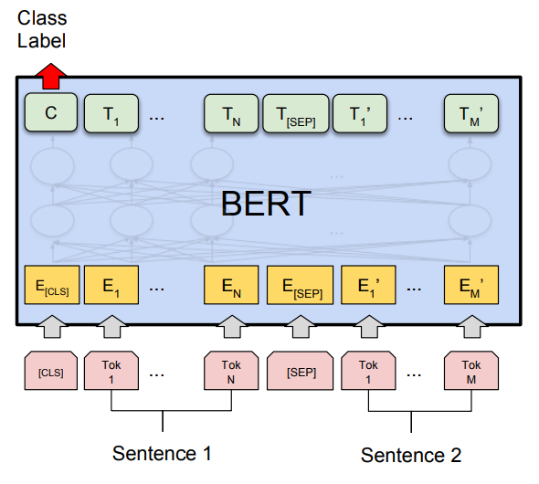

### Hàm mất mát và Kỹ thuật Tối ưu hóa
#### Hàm mất mát (Loss Functions) 
Đối với bài toán phân loại nhị phân, hàm Binary Cross-Entropy Loss được áp dụng:
$$\mathcal{L}_{BCE} = -\frac{1}{N} \sum_{i=1}^N \left[ y_i \log(\sigma(\hat{y}_i)) + (1 - y_i) \log(1 - \sigma(\hat{y}_i)) \right]$$
#### Kỹ thuật chống Quá khớp (Overfitting)

-   **Dropout:** Vô hiệu hóa ngẫu nhiên nơ-ron (tỷ lệ $p=0.3$).

-   **Gradient Clipping:** Giới hạn $\text{max\_norm}=1.0$ để ngăn bùng nổ đạo hàm.

-   **Tối ưu hóa:** Sử dụng thuật toán **AdamW** (cho BERT) và **Adam** (cho Bi-LSTM).

### Các độ đo đánh giá (Evaluation Metrics)

Dựa trên ma trận nhầm lẫn (Confusion Matrix) với các giá trị $TP, TN, FP, FN$, các chỉ số được xác định như sau:

-   **Accuracy:** $\frac{TP + TN}{TP + TN + FP + FN}$

-   **Precision:** $\frac{TP}{TP + FP}$

-   **Recall:** $\frac{TP}{TP + FN}$

-   **F1-Score:**
    $2 \times \frac{Precision \times Recall}{Precision + Recall}$

## Mô hình đề xuất

Để giải quyết bài toán phân loại cảm xúc trên văn bản một cách hiệu quả, nghiên cứu này đề xuất và đối sánh hai quy trình hoàn chỉnh (end-to-end pipelines): một phương pháp dựa trên kiến trúc hồi quy truyền thống (Bi-LSTM kết hợp GloVe) và một phương pháp dựa trên học chuyển giao (Fine-tuning BERT). Chương này trình bày chi tiết về luồng xử lý dữ liệu, kiến trúc mạng nơ-ron và các chiến lược tối ưu hóa.

### Phân tích Khám phá và Phân chia Dữ liệu (EDA & Data Splitting)

Tập dữ liệu được sử dụng là *IMDb Reviews Dataset*, bao gồm $50,000$ đánh giá điện ảnh được dán nhãn nhị phân. Tập dữ liệu thể hiện tính cân bằng hoàn hảo với tỷ lệ 50% cho mỗi lớp (Tích cực và Tiêu cực), giúp loại bỏ rủi ro thiên lệch (class imbalance bias).

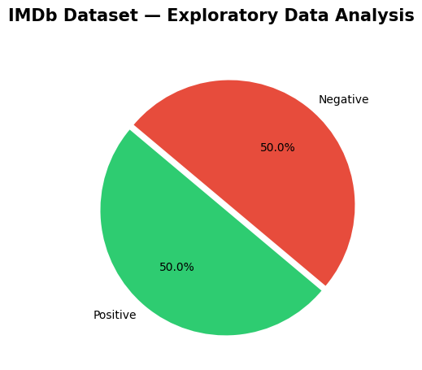

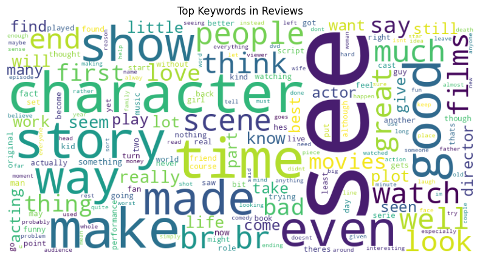

*Hình: Từ khóa phổ biến trong các đánh giá*

Phân tích phân phối chỉ ra rằng 92.6% số lượng đánh giá có độ dài $\le 512$ từ. Do đó, ngưỡng giới hạn chiều dài chuỗi (*max sequence length*) được thiết lập như sau:

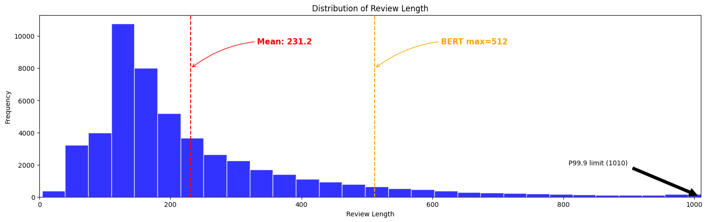

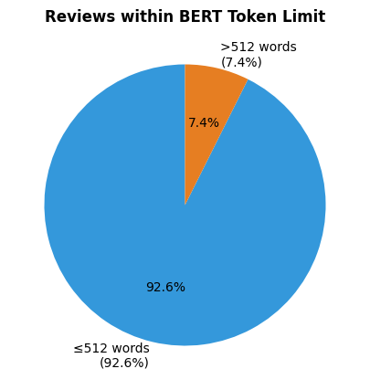

-   **Mô hình BERT:** 512 token (tối đa hóa ngữ nghĩa).

-   **Mô hình Bi-LSTM:** 256 token (tối ưu hóa tốc độ tính toán).

Dữ liệu được phân chia theo chiến lược phân tầng (*stratified split*)
với tỷ lệ 80-10-10:

  **Tập dữ liệu**    **Số lượng mẫu**  **Mục đích**
  ----------------- ------------------ --------------------------------------------
  Training Set           $40,000$      Cập nhật trọng số mạng.
  Validation Set         $5,000$       Tinh chỉnh siêu tham số và lưu checkpoint.
  Test Set               $5,000$       Đánh giá độ tổng quát hóa cuối cùng.

  : Phân chia tập dữ liệu nghiên cứu

### Tiền xử lý Văn bản và Biểu diễn Dữ liệu

Nghiên cứu xây dựng quy trình chuẩn hóa văn bản thông qua hàm `clean_text` sử dụng biểu thức chính quy (Regex) để: chuyển chữ thường, loại bỏ thẻ HTML (ví dụ: `<br />`), tách dấu câu và chuẩn hóa khoảng trắng.
#### Biểu diễn cho mô hình Bi-LSTM 
Văn bản được tách từ dựa trên khoảng trắng và ánh xạ vào ma trận nhúng **GloVe 100 chiều** (`glove.6B.100d.txt`).

-   Kích thước từ vựng thực tế: $111,798$ token.

-   Tỷ lệ bao phủ (*Coverage*): 66.40%.

-   Các chuỗi ngắn hơn 256 được đệm (*padding*) bằng ID 0.
#### Biểu diễn cho mô hình BERT 
Sử dụng bộ `BertTokenizer` từ kiến trúc `bert-base-uncased` với thuật toán **WordPiece**. Kích thước từ vựng đạt $30,522$ token. Các chuỗi được xử lý tự động để đạt độ dài cố định `MAX_LEN = 512`.

*Ghi chú: Trong môi trường triển khai thực tế, kỹ thuật **Dynamic Padding** (đệm theo batch thay vì đệm toàn cục về 512 token) có thể giảm đáng kể chi phí tính toán và tăng tốc độ suy diễn, vì phần lớn các đoạn văn bản trong thực tế ngắn hơn nhiều so với 512 token.*

### Kiến trúc Đề xuất 1: Mạng Bi-LSTM tích hợp Gộp đặc trưng (Pooling)

Mô hình `LSTMClassifier` bao gồm các tầng chức năng sau:

1.  **Embedding Layer:** Nhận đầu vào kích thước $(B \times 256)$, ánh xạ qua trọng số GloVe đã được đóng băng (`freeze=True`).

2.  **Bi-LSTM Layer:** Kích thước trạng thái ẩn (*hidden size*) là $128$. Đầu ra tại mỗi bước thời gian $t$ là $h_t \in \mathbb{R}^{256}$ (do kết hợp hai chiều).

3.  **Multi-pooling Strategy:** Trích xuất đặc trưng toàn cục bằng cách nối kết (*concatenate*) kết quả của Average Pooling và Max Pooling:
    $$v_{concat} = \left[ \frac{1}{L} \sum_{t=1}^{L} h_t \right] \oplus \left[ \max_{t=1}^{L} h_t \right]$$
    Kết quả thu được vector đặc trưng $512$ chiều.

4.  **Classification Head:** Đi qua lớp Dropout ($p=0.3$) và một tầng tuyến tính (`nn.Linear(512, 1)`).

### Kiến trúc Đề xuất 2: Tinh chỉnh Mô hình BERT (Fine-tuning)

Nghiên cứu sử dụng biến thể `bert-base-uncased` (12 layers, 12 heads, 768 hidden size). Chiến lược **Học chuyển giao** được thực hiện bằng cách thêm một lớp phân loại tuyến tính lên trên token đầu ra `[CLS]`. Toàn bộ 109 triệu tham số sẽ được cập nhật nhẹ trong quá trình Fine-tuning.

### Cấu hình Huấn luyện và Chiến lược Tối ưu hóa
#### Tối ưu hóa Mô hình Bi-LSTM

-   **Hàm mất mát:** Binary Cross Entropy with Logits.

-   **Optimizer:** Adam ($\eta = 10^{-3}$).

-   **Batch size:** 16; **Epochs:** 100.

-   **Gradient Clipping:** `max_norm=1.0`.
#### Tối ưu hóa Mô hình BERT 
Quá trình Fine-tuning áp dụng các kỹ thuật đặc thù:

-   **Optimizer:** AdamW ($\eta = 2 \times 10^{-5}$, $\lambda = 0.01$).

-   **Scheduler:** *Linear Schedule with Warmup*. Tốc độ học tăng dần trong 10% số bước đầu tiên (*warmup ratio* = 0.1) sau đó giảm dần về 0.

-   **Quy mô:** 3 epoch (tương đương 7,500 bước huấn luyện).

#### Tóm tắt siêu tham số thực nghiệm

**Bảng:** So sánh cấu hình huấn luyện của hai mô hình

| **Thông số** | **Bi-LSTM + GloVe** | **BERT (Fine-tuning)** |
| --- | --- | --- |
| Learning Rate | $10^{-3}$ | $2 \times 10^{-5}$ |
| Optimizer | Adam | AdamW |
| Max Length | 256 | 512 |
| Batch Size | 16 | 16 |
| Epochs | 100 (Early Stopping) | 3 |

## Kết quả Thực nghiệm và Đánh giá

Phần này trình bày chi tiết các kết quả đạt được sau quá trình huấn luyện hai kiến trúc mạng học sâu: Bi-LSTM kết hợp không gian nhúng GloVe và mô hình ngôn ngữ lớn BERT. Các phân tích được thực hiện dựa trên sự biến thiên của hàm mất mát, các độ đo phân loại chuẩn mực trên tập kiểm thử (Test Set) và đánh giá định tính qua các ca kiểm thử thực tế (Inference).

### Môi trường Thực nghiệm và Cấu hình Siêu tham số

Nhằm đảm bảo tính công bằng và khả năng tái lập kết quả (reproducibility), toàn bộ các thực nghiệm được tiến hành trên cùng một môi trường phần cứng và phần mềm:

-   **Tài nguyên điện toán:** Bộ xử lý đồ họa (GPU) Tesla T4 với dung lượng bộ nhớ khả dụng xấp xỉ $15.6\text{ GB}$.

-   **Cấu hình BERT:** Sử dụng biến thể `bert-base-uncased`. Thuật toán tối ưu AdamW được áp dụng với tốc độ học $\eta = 2 \times 10^{-5}$, hệ số suy giảm trọng số (weight decay) $0.01$ và tỷ lệ hâm nóng (warmup ratio) $0.1$. Quy mô lô (batch size) là 16. Quá trình tinh chỉnh (fine-tuning) diễn ra trong 3 epoch (tương đương 7,500 bước huấn luyện).

-   **Cấu hình Bi-LSTM:** Đầu vào được giới hạn 256 token, đi qua ma trận nhúng GloVe 100 chiều. Thuật toán tối ưu Adam với $\eta = 10^{-3}$, batch size 16. Quá trình huấn luyện được thiết lập chạy tối đa 100 epoch để quan sát rõ ranh giới hội tụ và quá khớp.

### Phân tích Động lực học Quá trình Huấn luyện

Sự biến thiên của hàm suy hao (Loss) và độ chính xác (Accuracy) qua các kỷ nguyên là cơ sở để đánh giá khả năng tổng quát hóa của mô hình.
#### Động lực học của Mô hình BERT 
Quá trình tinh chỉnh BERT cho thấy sự hội tụ cực kỳ nhanh chóng. Ngay tại Kỷ nguyên 1 (Epoch 1), hàm mất mát trên tập huấn luyện (Train Loss) đã giảm xuống mức $0.2669$, đồng thời độ chính xác (Train Acc) đạt $89.35\%$. Tương ứng, độ chính xác trên tập kiểm định (Validation) đạt $93.22\%$.

Tuy nhiên, biểu đồ huấn luyện cho thấy dấu hiệu của hiện tượng quá khớp vi mô (micro-overfitting) bắt đầu xuất hiện từ Kỷ nguyên 2:

-   Train Loss tiếp tục giảm mạnh xuống $0.0744$ và Train Acc đạt đỉnh $98.16\%$.

-   Ngược lại, Validation Loss bắt đầu tăng ngược trở lại lên mức $0.2696$, dù Validation Acc vẫn cải thiện nhẹ lên $93.88\%$.

Hệ thống đã tự động lưu lại điểm kiểm tra (checkpoint) tại Kỷ nguyên 2 với chỉ số $Best\ Val\ F1 = 0.9388$ làm mô hình dự đoán chính thức.

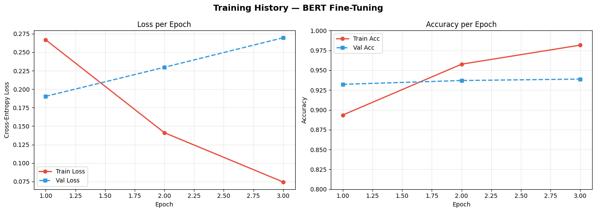
#### Động lực học của Mô hình Bi-LSTM 
Trái ngược với khả năng hội tụ ổn định của BERT, Bi-LSTM bộc lộ rõ rệt đặc tính khó kiểm soát của mạng hồi quy khi đối mặt với dữ liệu nhiễu trong thời gian dài.

-   Xuyên suốt 100 kỷ nguyên, Train Loss của LSTM tiệm cận về 0 (đạt $0.0146$ ở Epoch 100) và Train Acc gần như hoàn hảo ở mức $99.62\%$.

-   Dẫu vậy, bắt đầu từ khoảng Epoch 10-15, Validation Loss bắt đầu phân kỳ và tăng theo cấp số nhân, đạt mức $1.3039$ ở Epoch cuối cùng, kéo theo Validation Acc suy giảm xuống $88.90\%$.

Sự phân kỳ sâu sắc này là minh chứng toán học kinh điển cho hiện tượng quá khớp (Overfitting) nghiêm trọng. Mạng LSTM, do hạn chế về dung lượng bộ nhớ ngữ cảnh xa, đã chọn cách \"học vẹt\" các đặc trưng cục bộ của tập huấn luyện thay vì rút ra quy luật ngôn ngữ tổng quát. Điểm $Best\ Val\ F1$ tối ưu nhất được ghi nhận là $0.8994$ trước khi mô hình trượt dài vào vùng quá khớp.

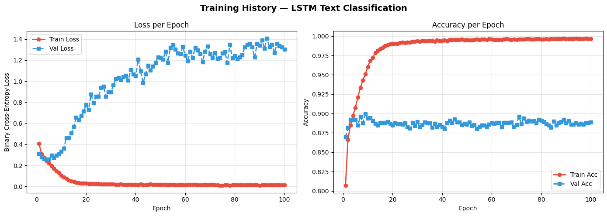

### Đánh giá Định lượng trên Tập Kiểm thử (Test Set)

Để đưa ra kết luận khách quan, hai mô hình tốt nhất (Best Checkpoints) được tải lên và suy diễn trên tập Test hoàn toàn độc lập gồm 5,000 mẫu (2,500 Tiêu cực và 2,500 Tích cực).

**Bảng:** Báo cáo phân loại (Classification Report) chi tiết của hai mô hình

| **Chỉ số** | **Lớp (Class)** | **Bi-LSTM** | **BERT (Fine-tuned)** |
| --- | --- | --- | --- |
| **Độ xác thực (Precision)** | Negative (0) | $0.90$ | $\mathbf{0.95}$ |
| | Positive (1) | $0.89$ | $\mathbf{0.93}$ |
| **Độ bao phủ (Recall)** | Negative (0) | $0.89$ | $\mathbf{0.93}$ |
| | Positive (1) | $0.90$ | $\mathbf{0.95}$ |
| **F1-Score** | Negative (0) | $0.90$ | $\mathbf{0.94}$ |
| | Positive (1) | $0.89$ | $\mathbf{0.94}$ |

**Bảng:** Tổng hợp hiệu suất tổng thể (Overall Performance)

| **Độ đo (Metric)** | **Bi-LSTM** | **BERT (Fine-tuned)** | **Khoảng cách** |
| --- | --- | --- | --- |
| **Accuracy (Độ chính xác)** | $89.50\%$ | $\mathbf{94.32\%}$ | $+4.82\%$ |
| **Test Loss** | $0.3089$ | $\mathbf{0.2511}$ | $-0.0578$ |
| **Macro Avg F1-Score** | $0.8950$ | $\mathbf{0.9432}$ | $+0.0482$ |

Dữ liệu từ hai bảng trên khẳng định sự ưu việt toàn diện của kiến trúc Transformer. BERT đạt mức F1-Score đồng đều $0.94$ cho cả hai lớp cảm xúc, trong khi Độ xác thực (Precision) của lớp Negative lên tới $0.95$, đồng nghĩa với việc khi BERT dự đoán một đánh giá là \"Tiêu cực\", khả năng sai sót chỉ ở mức $5\%$. Bi-LSTM duy trì mức hiệu suất dao động quanh biên độ $0.89 - 0.90$, một kết quả đáng khích lệ đối với kiến trúc tuần tự nhưng vẫn bộc lộ khoảng cách công nghệ rõ nét.

### Phân tích Ma trận Nhầm lẫn (Confusion Matrix)

Phân tích 4 thành phần $TP, TN, FP, FN$ cung cấp góc nhìn vi mô về các điểm mù của thuật toán.


1.  **Mô hình BERT:**

    -   True Negatives ($TN$): $2,333$ mẫu.

    -   True Positives ($TP$): $2,383$ mẫu.

    -   False Positives ($FP$): $167$ mẫu.

    -   False Negatives ($FN$): $117$ mẫu.

    Phân phối lỗi của BERT khá cân bằng và được nén ở mức tối thiểu. Việc $FN$ ($117$) thấp hơn $FP$ ($167$) cho thấy BERT có xu hướng \"nhạy\" hơn một chút trong việc phát hiện cảm xúc tích cực, đôi khi dán nhãn nhầm các câu chê bai tinh vi thành khen ngợi.

2.  **Mô hình Bi-LSTM:**

    -   True Negatives ($TN$): $2,263$ mẫu.

    -   True Positives ($TP$): $2,212$ mẫu.

    -   False Positives ($FP$): $272$ mẫu.

    -   False Negatives ($FN$): $253$ mẫu.

    Tổng số mẫu bị phân loại sai của LSTM là $525$ mẫu, cao hơn $84.8\%$ so với tổng số lỗi của BERT ($284$ mẫu). LSTM gặp khó khăn lớn đối với các cấu trúc ngữ pháp đảo ngược hoặc châm biếm. Khi khoảng cách vật lý giữa hư từ (như \"not\", \"never\") và tính từ gốc (như \"good\", \"masterpiece\") quá xa, lớp RNN dần quên đi bối cảnh phủ định, dẫn đến các sai số $FP$ và $FN$ gia tăng mạnh. Cơ chế Self-Attention của BERT đã khắc phục triệt để nhược điểm này bằng cách tính toán trọng số tương quan trực tiếp giữa mọi cặp từ bất chấp khoảng cách.

### Đánh giá Định tính: Thử nghiệm Suy diễn (Inference Case Studies)

Để kiểm chứng năng lực ngữ nghĩa thực tế, 5 mẫu văn bản giả định mang các sắc thái cực đoan và hỗn hợp được đưa vào hệ thống suy diễn (inference pipeline) để quan sát sự tự tin (confidence scores) của hai mô hình.

-   **Ca kiểm thử số 1 (Tích cực mạnh):** *\"An absolute masterpiece. The cinematography is stunning\...\"* Cả hai mô hình đều trích xuất thành công các tính từ mạnh (\"masterpiece\", \"stunning\"). BERT tự tin dự đoán POSITIVE với $99.9\%$, LSTM tự tin tuyệt đối $100.0\%$.

-   **Ca kiểm thử số 2 (Tiêu cực mạnh):** *\"What a complete waste of time and money\...\"* Các ngữ nghĩa \"waste\", \"wooden\" giúp hai mô hình dễ dàng dán nhãn NEGATIVE với sự tự tin cực đại (BERT $99.9\%$, LSTM $100.0\%$).

-   **Ca kiểm thử số 3 (Cảm xúc hỗn hợp/Phân cực chìm):** *\"It was okay, nothing special. Some scenes were interesting but the pacing felt off. Probably wouldn't watch it again.\"*\
    Đây là một mẫu văn bản bẫy thuật toán (adversarial example) khi đan xen các từ có vẻ tích cực (\"okay\", \"interesting\") bên trong một đánh giá tiêu cực tổng thể.

    -   Mô hình BERT xử lý xuất sắc, triệt tiêu nhiễu từ các từ tích cực và dán nhãn NEGATIVE với xác suất $99.8\%$.

    -   Mô hình Bi-LSTM, do bị tác động bởi các hàm lượng thông tin tích cực xuất hiện rải rác, đã bị giảm độ tự tin xuống còn $97.8\%$, phân bổ $2.2\%$ xác suất cho lớp POSITIVE. Sự dao động này phản ánh hạn chế trong việc tổng hợp ngữ nghĩa toàn cục của mạng quy hồi.

-   **Ca kiểm thử số 4 và 5:** Cả hai mô hình tiếp tục thể hiện sự ổn định khi nhận diện chính xác câu khen ngợi đạo diễn Nolan (POSITIVE) và câu chê bai CGI tệ hại (NEGATIVE) với độ tin cậy gần như tuyệt đối.

### Tiểu kết

Kết quả thực nghiệm đã minh chứng định lượng sức mạnh biểu diễn vượt trội của mô hình BERT. Bằng cách tận dụng cơ chế Tự chú ý và không gian kiến thức học chuyển giao, BERT không chỉ thiết lập mức hiệu suất $94.32\%$ mà còn duy trì độ bền vững tuyệt đối trước các văn bản có cấu trúc đánh lừa. Về phần mình, kiến trúc Bi-LSTM với ma trận GloVe, dù có hiện tượng quá khớp và độ chính xác thấp hơn ($89.50\%$), vẫn chứng minh được giá trị thực tiễn trong các bài toán yêu cầu chi phí tham số thấp và tốc độ suy diễn nhanh.

## Kết luận

### Kết luận chung

Nghiên cứu này đã hoàn thành xuất sắc các mục tiêu đề ra ban đầu thông qua việc xây dựng, tinh chỉnh và đối sánh toàn diện hai kiến trúc học sâu đại diện cho hai thế hệ công nghệ trong Xử lý Ngôn ngữ Tự nhiên (NLP): Mạng nơ-ron hồi quy hai chiều (Bi-LSTM) kết hợp không gian nhúng từ GloVe, và Mô hình ngôn ngữ lớn dựa trên kiến trúc Transformer (BERT). Quá trình thực nghiệm trên tập dữ liệu đánh giá điện ảnh IMDb quy mô 50,000 mẫu đã cung cấp những minh chứng định lượng và định tính rõ nét, cho phép rút ra các kết luận trọng tâm sau:

1.  **Sự dịch chuyển mô hình (Paradigm Shift) và Sức mạnh của Học chuyển giao (Transfer Learning):** Việc áp dụng kỹ thuật tinh chỉnh (fine-tuning) trên mô hình `bert-base-uncased` đã thiết lập một cột mốc hiệu suất vượt trội. Kiến trúc Transformer đạt độ chính xác (Accuracy) trên tập kiểm thử lên tới $94.32\%$ và điểm F1-Score là $0.9432$, với hàm suy hao (Test Loss) ở mức $0.2511$. Cơ chế Tự chú ý (Self-Attention) cho phép mạng tính toán tương quan toàn cục của mọi từ vựng trong câu cùng một thời điểm, giúp giải quyết triệt để rào cản về \"khoảng cách ngữ nghĩa\" mà các mạng tuần tự thường gặp phải. Khả năng thừa hưởng tri thức ngôn ngữ từ quá trình tiền huấn luyện (pre-training) giúp BERT hội tụ cực nhanh chỉ sau 3 epoch.

2.  **Giới hạn của Kiến trúc Quy hồi (RNN) trước bài toán Ngữ cảnh dài:**
    Mô hình Bi-LSTM, mặc dù đã được tối ưu hóa bằng cách kết hợp ma trận nhúng GloVe 100 chiều và chiến lược gộp đặc trưng kép (Average Pooling kết hợp Max Pooling), vẫn bộc lộ những hạn chế cố hữu. Hiệu suất mô hình đạt đỉnh ở mức $89.50\%$ độ chính xác. Phân tích động lực học huấn luyện chỉ ra rằng Bi-LSTM rất dễ rơi vào trạng thái quá khớp (overfitting) nghiêm trọng khi xử lý dữ liệu phức tạp trong thời gian dài (độ chính xác tập huấn luyện đạt $99.62\%$ nhưng hàm mất mát trên tập kiểm định lại phân kỳ lên mức $1.3039$). Kiến trúc xử lý tuần tự khiến thông tin bị suy hao khi khoảng cách giữa các từ mang tính quyết định cảm xúc và các hư từ (như từ phủ định) cách xa nhau.

3.  **Giá trị thực tiễn và Sự đánh đổi (Trade-off) trong triển khai:**
    Bất chấp sự chênh lệch xấp xỉ $5\%$ về độ chính xác, kiến trúc Bi-LSTM vẫn duy trì được giá trị thực tiễn nhất định. So với hệ thống khổng lồ chứa hơn 109 triệu tham số của BERT, mạng LSTM có kiến trúc gọn nhẹ hơn đáng kể, đòi hỏi ít tài nguyên phần cứng (VRAM) và thời gian suy diễn (inference time) nhanh hơn. Việc lựa chọn mô hình trong môi trường công nghiệp thực tế sẽ phụ thuộc vào bài toán tối ưu hóa giữa yêu cầu khắt khe về độ chính xác và ràng buộc về năng lực điện toán.

### Hạn chế của nghiên cứu

Bên cạnh các thành tựu đạt được về mặt phương pháp luận và thực nghiệm, đồ án vẫn còn tồn tại một số rào cản mang tính hệ thống cần được nhìn nhận một cách khách quan:

-   **Rào cản về độ dài chuỗi đầu vào và khó khăn trong huấn luyện LSTM:** Kiến trúc BERT được cấu hình với chiều dài chuỗi tối đa là 512 token, trong khi mô hình Bi-LSTM bị giới hạn ở 256 token để tránh hiện tượng bùng nổ thời gian huấn luyện và tràn bộ nhớ. Sự chênh lệch này có thể tạo ra một lợi thế nhất định cho BERT khi tiếp cận các văn bản cực dài. Hơn nữa, việc áp đặt cơ chế cắt xén (truncation) phần đuôi văn bản chứa đựng rủi ro làm mất đi các luận điểm chốt mang tính quyết định ở cuối bài đánh giá.

-   **Tính chất phân loại nhị phân (Binary Classification Constraint):** Việc ép buộc phổ thái độ và cảm xúc phức tạp của con người vào hai lớp duy nhất (Tích cực và Tiêu cực) đã vô hình trung triệt tiêu các sắc thái đánh giá trung lập (Neutral) hoặc các bình luận mang tính đa chiều (khen chê đan xen ở mức độ ngang nhau).

# Phân loại ảnh với CNN & ViT

## Mở đầu

### Lý do chọn đề tài

Phân loại ảnh là một trong những bài toán nền tảng và quan trọng nhất trong lĩnh vực Thị giác máy tính (Computer Vision). Sự bùng nổ của Học sâu (Deep Learning), đặc biệt là các Mạng nơ-ron tích chập (CNN) và gần đây là Vision Transformers (ViT), đã mang lại những bước tiến đột phá trong khả năng nhận dạng và trích xuất đặc trưng hình ảnh. Tuy nhiên, việc lựa chọn kiến trúc mô hình, phương pháp huấn luyện (từ đầu hay học chuyển giao), cũng như tối ưu hóa siêu tham số (hyperparameters) luôn là thách thức lớn. Nghiên cứu này được thực hiện nhằm đánh giá toàn diện hiệu năng của các phương pháp tiếp cận khác nhau, từ việc tự thiết kế một mạng CNN đặc tả cho ảnh độ phân giải thấp, đến việc tận dụng tri thức từ các mô hình khổng lồ thông qua Transfer Learning.

### Mục tiêu nghiên cứu

Nghiên cứu tập trung vào việc hiện thực hóa và so sánh hiệu suất phân loại của bốn phương pháp tiếp cận trên tập dữ liệu CIFAR-10:

-   Xây dựng và huấn luyện từ đầu một kiến trúc mạng phần dư tùy chỉnh (Custom ResNet) dành riêng cho ảnh kích thước nhỏ $32 \times 32$.

-   Áp dụng kỹ thuật tinh chỉnh toàn bộ trọng số (Fine-tuning) trên mô hình Pre-trained ResNet18.

-   Sử dụng mô hình Pre-trained ResNet18 như một bộ trích xuất đặc trưng tĩnh (Frozen Backbone).

-   Sử dụng mô hình Pre-trained Vision Transformer (ViT-B/16) như một bộ trích xuất đặc trưng tĩnh (Frozen Backbone).

### Phạm vi nghiên cứu

Nghiên cứu được giới hạn trên tập dữ liệu chuẩn CIFAR-10, bao gồm 10 lớp đối tượng cơ bản. Quá trình đánh giá không chỉ dừng lại ở các độ đo thống kê (Accuracy, F1-score) mà còn mở rộng sang khả năng suy luận trên dữ liệu thực tế ngoài phân bố (out-of-distribution) và phân tích tính giải thích của mô hình thông qua thuật toán Grad-CAM.

## Cơ sở lý thuyết

### Giới thiệu về thuật toán CNN {#sec:dataset}

Trong bài toán phân loại ảnh, Mạng Nơ-ron Tích chập (Convolutional Neural Network - CNN) không đơn thuần là một bộ phân loại (classifier) mà đóng vai trò là bộ mã hóa đặc trưng thị giác (*Visual Feature Encoder*). Mục tiêu của nó là ánh xạ hình ảnh đầu vào $I \in \mathbb{R}^{H \times W \times C}$ (với $H, W, C$ lần lượt là chiều cao, chiều rộng và số kênh màu) thành một bản đồ đặc trưng (feature map) trừu tượng $X \in \mathbb{R}^{H' \times W' \times D}$.
#### Động lực và ý tưởng cốt lõi 
Trước khi đi sâu vào kiến trúc, cần xem xét lý do CNN vượt trội hơn các mạng MLP (Multi-layer Perceptron) truyền thống trong xử lý ảnh:

1.  **Vấn đề bùng nổ tham số:** Nếu áp dụng MLP fully-connected trực tiếp lên một ảnh có kích thước lớn (ví dụ $1000 \times 1000$ pixels), số lượng trọng số sẽ tăng lên khổng lồ (lên tới $10^{12}$ cho một lớp ẩn), dẫn đến việc mô hình dễ bị *overfitting* và tiêu tốn tài nguyên tính toán không cần thiết.

2.  **Cấu trúc không gian (Spatial Structure):** MLP coi các pixel là độc lập, trong khi hình ảnh có tính chất cục bộ (*feature localization*) - các pixel lân cận có mối quan hệ mật thiết, và tính chất bất biến vị trí (*translation invariance*) - một đặc trưng (như cạnh, góc) có ý nghĩa như nhau dù xuất hiện ở vị trí nào trong ảnh.

Để giải quyết vấn đề này, CNN sử dụng ba cơ chế tính toán chính: **Local Receptive Fields** (Vùng cảm nhận cục bộ), **Shared Weights** (Chia sẻ trọng số) và **Spatial Subsampling** (Lấy mẫu không gian).

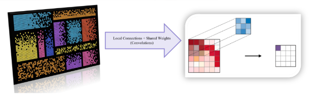
#### Các thành phần toán học và kiến trúc

**Phép toán tích chập (Convolution Operation)**

Đây là lớp cốt lõi dùng để trích xuất các đặc trưng cục bộ. Thay vì kết nối đầy đủ, CNN sử dụng một bộ lọc (kernel/filter) $K$ có kích thước nhỏ $K_h \times K_w$ trượt qua toàn bộ ảnh.

Với một ảnh đầu vào $I$ và bộ lọc $K$, giá trị của bản đồ đặc trưng đầu ra $S$ tại vị trí $(i, j)$ được tính bằng công thức tích chập rời rạc:

$$S(i, j) = (I * K)(i, j) = \sum_{u=0}^{K_h-1} \sum_{v=0}^{K_w-1} I(i - u, j - v) \cdot K(u, v)$$

Ngoài ra, trong các ứng dụng thực tế về thị giác máy tính, một lớp tích chập thường được biểu diễn dưới dạng: $$Y = \sigma(W * X + b)$$ trong đó $W$ là kernel, $X$ là input, $b$ là bias, và $\sigma$ là hàm activation.

Ngoài kích thước bộ lọc, hai siêu tham số quan trọng kiểm soát kiến trúc là:

-   **Padding ($P$):** Thêm các pixel giả (thường là 0) xung quanh biên ảnh để kiểm soát kích thước đầu ra và tránh mất thông tin ở rìa ảnh.

-   **Stride ($S$):** Bước nhảy của bộ lọc khi trượt trên ảnh. Stride càng lớn thì kích thước đầu ra càng nhỏ (giảm độ phân giải không gian).

Kích thước của Feature Map đầu ra ($H_{out} \times W_{out}$) được tính theo công thức:

$$
H_{out} = \left\lfloor \frac{H_{in} + 2P - K_h}{S}\right\rfloor + 1; \quad W_{out} = \left\lfloor \frac{W_{in} + 2P - K_w}{S}\right\rfloor + 1
$$

Trong bài toán thị giác máy tính, các lớp tích chập đầu tiên sẽ học các đặc trưng cấp thấp (*low-level features*) như các cạnh (edges), góc (corners). Các lớp sâu hơn sẽ tổ hợp lại để nhận diện các bộ phận của vật thể và cấu trúc tổng thể của đối tượng.

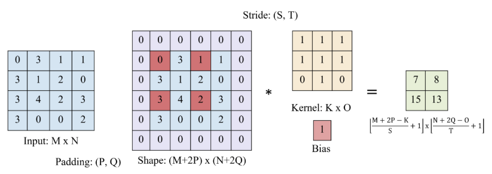

**Hàm kích hoạt phi tuyến (Non-linearity)**

Sau mỗi phép tích chập, một hàm kích hoạt phi tuyến được áp dụng để mô hình có thể học được các mối quan hệ phức tạp. Hàm phổ biến nhất là **ReLU (Rectified Linear Unit)**, giúp giảm thiểu vấn đề biến mất đạo hàm (*vanishing gradient*) và tăng tốc độ hội tụ:

$$f(x) = \max(0, x)$$

Ngoài ReLU, có nhiều hàm activation khác được sử dụng trong các kiến trúc CNN hiện đại:

**Bảng:** So sánh các hàm Activation phổ biến

| **Hàm Activation** | **Công thức** | **Ưu điểm/Nhược điểm** |
| --- | --- | --- |
| ReLU | $f(x) = \max(0, x)$ | Nhanh, tránh vanishing gradient, nhưng có dead neuron |
| Leaky ReLU | $f(x) = \max(\alpha x, x)$ | Khắc phục dead neuron của ReLU |
| ELU | $f(x) = \begin{cases} x & x > 0 \\ \alpha(e^x - 1) & x \leq 0 \end{cases}$ | Smooth, tốt hơn ReLU nhưng chậm hơn |
| Sigmoid | $f(x) = \frac{1}{1+e^{-x}}$ | Dễ hiểu nhưng dễ bị vanishing gradient |
| Tanh | $f(x) = \frac{e^x - e^{-x}}{e^x + e^{-x}}$ | Đầu ra trong $[-1, 1]$, tốt hơn Sigmoid |


**Pooling và Bất biến dịch chuyển**

Lớp Pooling thực hiện giảm chiều dữ liệu (*down-sampling*) để giảm chi phí tính toán và tăng tính bất biến với các biến dạng nhẹ. Có hai loại phổ biến:

-   **Max Pooling:** Chọn giá trị lớn nhất trong vùng lân cận (giữ lại đặc trưng nổi bật nhất).

    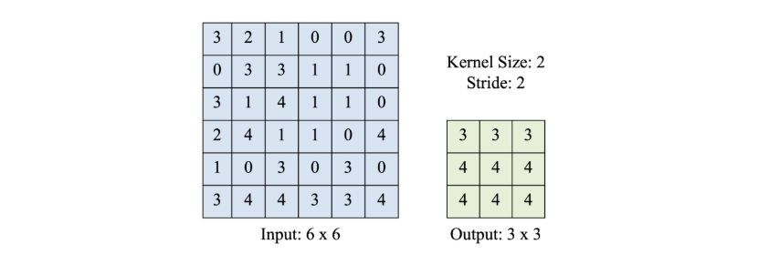

-   **Average Pooling:** Tính giá trị trung bình trong vùng lân cận (làm mượt đặc trưng).

    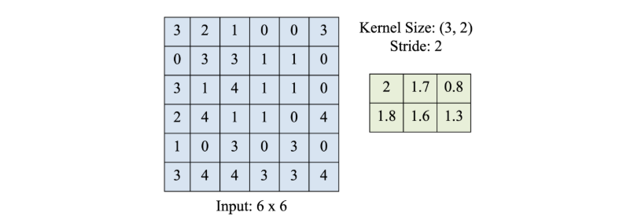

Về mặt toán học, với một vùng lân cận $R_{i,j}$ kích thước $K \times K$ và stride $S$, công thức tính kích thước đầu ra sau Pooling (không
padding) là:

$$H_{out} = \left\lfloor \frac{H_{in} - K}{S} \right\rfloor + 1$$

Đối với bài toán nhận dạng đối tượng, lớp này giúp mô hình nhận diện được vật thể ngay cả khi nó bị dịch chuyển nhẹ hoặc co giãn trong ảnh (*Translation Invariance*).

**Bảng:** So sánh các loại Pooling

| **Loại Pooling** | **Định nghĩa** | **Ứng dụng** |
| --- | --- | --- |
| Max Pooling | $y_{i,j} = \max_{(p,q) \in R_{i,j}} x_{p,q}$ | Giữ lại feature mạnh nhất |
| Average Pooling | $y_{i,j} = \frac{1}{R_{i,j}}\sum_{(p,q) \in R_{i,j}} x_{p,q}$ | Làm mịn features |
| L2 Pooling | $y_{i,j} = \sqrt{\sum_{(p,q) \in R_{i,j}} x_{p,q}^2}$ | Cân bằng hơn Max Pooling |


### Mạng Phần dư (Residual Networks - ResNet)

Khi thiết kế các mạng nơ-ron tích chập (CNN) với độ sâu lớn nhằm trích xuất các đặc trưng ngữ nghĩa phức tạp (high-level semantic features), quá trình huấn luyện thường đối mặt với hai rào cản lớn: hiện tượng triệt tiêu đạo hàm (vanishing gradient) và sự suy thoái hiệu suất (degradation problem). Mặc dù các kỹ thuật như chuẩn hóa theo lô (Batch Normalization) đã phần nào giải quyết vấn đề đạo hàm, hiện tượng suy thoái vẫn khiến cho mạng càng sâu thì sai số huấn luyện càng tăng. Kiến trúc Mạng phần dư (Residual Networks - ResNet) đã đề xuất một mô thức học hoàn toàn mới để khắc phục triệt để vấn đề này thông qua các cơ chế định tuyến tín hiệu tiên tiến.
#### Cơ chế Kết nối tắt (Skip Connections)

Thay vì kỳ vọng một chuỗi các lớp (layers) xếp chồng lên nhau có thể xấp xỉ trực tiếp hàm mục tiêu lý tưởng $\mathcal{H}(\mathbf{x})$, ResNet thay đổi hướng tiếp cận bằng cách ép các lớp này xấp xỉ một hàm phần dư (residual function) $\mathcal{F}(\mathbf{x})$. Hàm phần dư được định nghĩa là sự chênh lệch giữa hàm mục tiêu và vector đầu vào: $\mathcal{F}(\mathbf{x}) = \mathcal{H}(\mathbf{x}) - \mathbf{x}$.

Từ đó, ánh xạ đầu ra của một khối phần dư (Residual Block) được biểu diễn toán học như sau:
$$\mathbf{y} = \mathcal{F}(\mathbf{x}, \{W_i\}) + \mathbf{x}$$

Trong phương trình này:

-   $\mathbf{x}$ và $\mathbf{y}$ lần lượt là vector đặc trưng đầu vào và đầu ra của khối phần dư.

-   Khối $\mathcal{F}(\mathbf{x}, \{W_i\})$ đại diện cho quá trình biến đổi phi tuyến thông qua các lớp tích chập với tập trọng số $W_i$.

-   Phép toán cộng $\mathcal{F}(\mathbf{x}) + \mathbf{x}$ chính là hiện thân của \"kết nối tắt\" (skip connection hay shortcut connection), cho phép thông tin và đạo hàm có thể lan truyền trực tiếp qua các cấu trúc mạng sâu mà không bị suy hao.

Trong khuôn khổ của nghiên cứu, cấu trúc này được hiện thực hóa mã nguồn thông qua lớp `ResidualBlock`, nơi kết nối tắt được tính toán trực tiếp bằng vòng lặp cộng dồn tensor đầu vào với đầu ra của lớp tích chập qua phép gán `x = layer(x) + x`. Đối với những khối mà không gian đặc trưng (spatial dimensions) hoặc số kênh (channels) bị thay đổi, một phép biến đổi tuyến tính $W_s$ (thường là tích chập kích thước $1 \times 1$) sẽ được áp dụng lên $\mathbf{x}$ để đảm bảo tính đồng nhất về mặt kích thước trước khi thực hiện phép cộng ma trận:
$$\mathbf{y} = \mathcal{F}(\mathbf{x}, \{W_i\}) + W_s \mathbf{x}$$

#### Cấu trúc Tiền kích hoạt (Pre-activation)

Trong kiến trúc ResNet nguyên bản, thứ tự các phép toán bên trong một khối phần dư thường được sắp xếp theo chuỗi tiêu chuẩn: Tích chập (Convolution) $\rightarrow$ Chuẩn hóa theo lô (Batch Normalization - BN) $\rightarrow$ Hàm kích hoạt (ReLU). Tuy nhiên, để tối ưu hóa hơn nữa luồng lan truyền ngược (backward pass) của đạo hàm khi mạng trở nên rất sâu, nghiên cứu này đã áp dụng biến thể Tiền kích hoạt (Pre-activation) cho mạng tự thiết kế (Custom ResNet).

Trong cấu trúc `PreActConvLayer` được đề xuất, trình tự xử lý tín hiệu được tái cấu trúc thành: Chuẩn hóa theo lô $\rightarrow$ Hàm kích hoạt ReLU $\rightarrow$ Tích chập. Phương trình toán học cho chuỗi biến đổi khối này được viết lại như sau:
$$\mathbf{x}_{out} = \text{Conv}(\text{ReLU}(\text{BatchNorm}(\mathbf{x}_{in})))$$

Việc đưa hàm chuẩn hóa và hàm kích hoạt phi tuyến lên trước phép tích chập mang lại hai lợi ích lý thuyết quan trọng để cải thiện hiệu suất:

1.  **Tính trơn tru trong tối ưu hóa (Ease of optimization):** Thiết kế này giữ cho trục kết nối tắt truyền tín hiệu thẳng từ đầu vào đến đầu ra mà không phải đi qua bất kỳ phép biến đổi phi tuyến nào sau phép cộng. Điều này giúp luồng gradient truyền ngược trở về các lớp nông (shallow layers) một cách nguyên vẹn nhất, gia tăng tốc độ hội tụ của hệ thống.

2.  **Khả năng điều chuẩn (Regularization effect):** Vì phép chuẩn hóa theo lô (BN) được áp dụng trực tiếp lên đầu vào $\mathbf{x}_{in}$ thay vì đầu ra của lớp tích chập, nó cung cấp một hiệu ứng nhiễu có lợi ở mức độ thấp, hoạt động như một cơ chế điều chuẩn tự nhiên giúp giảm thiểu khả năng mạng bị quá khớp (overfitting) trong quá trình huấn luyện.

### Vision Transformer - ViT

Sự ra đời của kiến trúc Transformer ban đầu dành riêng cho Xử lý Ngôn ngữ Tự nhiên (NLP) đã tạo ra một sự chuyển dịch mô thức mạnh mẽ. Vision Transformer (ViT) là bước đột phá mang triết lý đó áp dụng trực tiếp vào lĩnh vực Thị giác máy tính, loại bỏ hoàn toàn sự phụ thuộc vào các phép toán tích chập cục bộ truyền thống. Trong nghiên cứu này, phiên bản mô hình `ViT_B_16` được triển khai nhằm đối sánh trực tiếp với kiến trúc phần dư ResNet.

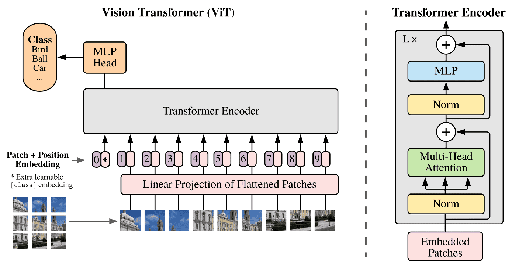
#### Cơ chế Phân mảnh và Biểu diễn Tuyến tính (Patch Embedding)

Khác biệt cốt lõi của ViT so với CNN nằm ở cách tiếp cận hình ảnh. ViT xử lý bức ảnh đầu vào dưới dạng một chuỗi (sequence) các mảnh ảnh nhỏ (patches) tương tự như các chuỗi từ vựng trong văn bản. Cụ thể, với dữ liệu ảnh đầu vào được chuẩn hóa lên không gian $224 \times 224$ và 3 kênh màu, kiến trúc `ViT_B_16` sẽ chia nhỏ bức ảnh thành các mảnh không chồng chéo có kích thước cố định là $16 \times 16$.


Giả sử bức ảnh đầu vào được ký hiệu là $\mathbf{x} \in \mathbb{R}^{H \times W \times C}$, nó sẽ được phân rã thành $N = \frac{HW}{P^2}$ mảnh ảnh $\mathbf{x}_p \in \mathbb{R}^{N \times (P^2 \cdot C)}$, với $(P, P)$ là độ phân giải của mỗi mảnh. Mỗi mảnh ảnh sau đó được làm phẳng và đi qua một phép chiếu tuyến tính (linear projection) $E$ để chuyển đổi thành một vector nhúng 1D có kích thước $D$ bất biến xuyên suốt các lớp của mạng lưới. Phương trình tạo chuỗi vector nhúng được biểu diễn như sau:
$$\mathbf{z}_0 = [\mathbf{x}_{class}; \mathbf{x}_{p}^1 E; \mathbf{x}_{p}^2 E; \dots; \mathbf{x}_{p}^N E] + \mathbf{E}_{pos}$$
Trong đó, $\mathbf{x}_{class}$ là một tham số học thuyết (Learnable Classification Token - thường được gọi là `[CLS] token`) được gắn vào đầu chuỗi. Vai trò của token này là tổng hợp và nén thông tin từ toàn bộ các mảnh ảnh để phục vụ cho tác vụ phân loại ở đầu ra cuối cùng. $\mathbf{E}_{pos}$ là ma trận mã hóa vị trí (Positional Encoding) dạng 1D, được cộng trực tiếp vào các vector nhúng để giúp mô hình bù đắp lại thông tin cấu trúc không gian đã bị mất khi phân mảnh ảnh.
#### Khối Mã hóa Transformer (Transformer Encoder) và Cơ chế Tự chú ý

Cốt lõi sức mạnh của ViT nằm ở bộ mã hóa Transformer (Encoder) với kiến trúc xếp chồng nhiều tầng. Trái tim của mỗi khối Encoder là cơ chế Tự chú ý nhiều luồng (Multi-Head Self-Attention - MHSA). MHSA cho phép mạng nơ-ron đánh giá và tính toán mối tương quan giữa một mảnh ảnh bất kỳ với toàn bộ các mảnh ảnh khác, tạo ra một trường nhìn toàn cục (global receptive field) ngay từ những lớp trích xuất đầu tiên.

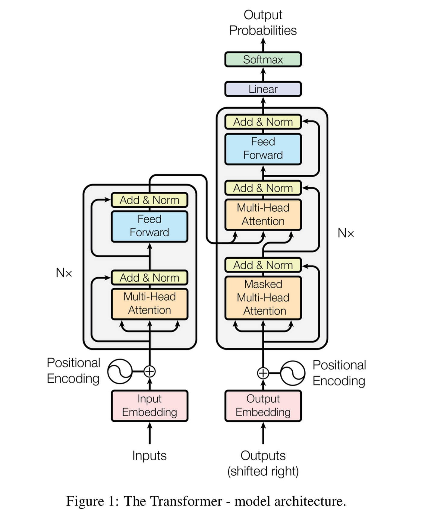

Quá trình tính toán hệ số chú ý (Attention) được thực hiện thông qua ba ma trận biến đổi tuyến tính: Truy vấn (Query - $Q$), Khóa (Key - $K$), và Giá trị (Value - $V$). Ma trận điểm số chú ý (Attention score) được tính toán theo phương trình:
$$\text{Attention}(Q, K, V) = \text{Softmax}\left(\frac{QK^T}{\sqrt{d_k}}\right)V$$
Trong đó, $d_k$ là số chiều của vector khóa, hoạt động như một hệ số điều chuẩn (scaling factor) nhằm ngăn chặn hiện tượng bão hòa đạo hàm khi lan truyền qua hàm Softmax. Đầu ra của cơ chế MHSA sau đó được đưa qua Mạng nơ-ron truyền thẳng (Feed-Forward Network) kết hợp với các lớp Chuẩn hóa tầng (Layer Normalization). Trong thực nghiệm phân tích khả năng diễn giải bằng Grad-CAM, chính lớp chuẩn hóa `ln_1` thuộc khối mã hóa cuối cùng (`encoder.layers[-1].ln_1`) đã được cô lập làm lớp mục tiêu để trích xuất bản đồ nhiệt, phản ánh các khu vực không gian mang tính quyết định. Do đầu ra của ViT là chuỗi 1D, một hàm biến đổi hình dáng (reshape transform) đã được định nghĩa để ánh xạ chuỗi này ngược về không gian lưới 2D kích thước $14 \times 14$ trước khi nội suy.
#### Áp dụng ViT trong Thực nghiệm Học chuyển giao (Transfer Learning)

Trong khuôn khổ báo cáo, mô hình `ViT_B_16` được khởi tạo với tập trọng số tối ưu từ ImageNet (`IMAGENET1K_V1`). Thay vì thực hiện tinh chỉnh toàn bộ hệ thống (Fine-tuning), nghiên cứu áp dụng chiến lược Học chuyển giao đặc trưng tĩnh (Frozen Backbone). Theo đó, toàn bộ các tham số cấu thành mạng bộ mã hóa đều bị đóng băng, vô hiệu hóa việc cập nhật thông qua cơ chế lan truyền ngược. Chỉ có các thành phần tuyến tính ở tầng phân loại cuối cùng (head) được phép học hỏi từ dữ liệu huấn luyện, giúp giảm thiểu đáng kể chi phí tính toán và hạn chế hiện tượng quá khớp (overfitting) khi làm việc với tập dữ liệu y tế có kích thước giới hạn.
Mô hình chỉ tháo gỡ lớp phân loại nguyên bản (`heads.head`) và cấu trúc lại bằng một lớp tuyến tính mới (`nn.Linear`), ánh xạ trực tiếp từ không gian đặc trưng (`in_features`) về 10 nơ-ron đầu ra tương ứng với 10 lớp đối tượng của tập CIFAR-10. Nhờ phương pháp cô lập này, mặc dù tổng dung lượng hệ thống khi triển khai qua cơ chế song song (DataParallel) báo cáo lên tới hơn 483 triệu tham số, số lượng tham số cần huấn luyện thực tế (Trainable params) được nén gọn chỉ còn 23,070 tham số. Thiết kế này tối ưu hóa cực đoan tài nguyên tính toán nhưng vẫn kế thừa trọn vẹn năng lực phân tích hình thái học đỉnh cao của mô hình Transformer.

## Phương pháp nghiên cứu và mô hình đề xuất

Quá trình nghiên cứu được thiết kế thành một quy trình (pipeline) khép kín, từ khâu xử lý dữ liệu thô, thiết lập kiến trúc mạng nơ-ron, cho đến chiến lược huấn luyện. Đề tài triển khai ba hướng tiếp cận kiến trúc chính: xây dựng mạng tự thiết kế (Custom CNN), tinh chỉnh mô hình (Fine-tuning) và trích xuất đặc trưng tĩnh (Frozen Backbone).

### Kỹ thuật Tiền xử lý và Tăng cường Dữ liệu (Data Preprocessing & Augmentation)
#### Giới thiệu tập dữ liệu CIFAR-10 
Nghiên cứu sử dụng tập dữ liệu hình ảnh chuẩn mực CIFAR-10. Tập dữ liệu này bao gồm 10 lớp đối tượng cơ bản: Máy bay (Plane), Ô tô (Car), Chim (Bird), Mèo (Cat), Hươu (Deer), Chó (Dog), Ếch (Frog), Ngựa (Horse), Tàu thủy (Ship) và Xe tải (Truck). Để đảm bảo tính khách quan trong quá trình huấn luyện và xác thực chéo, tập dữ liệu gốc được phân chia ngẫu nhiên (sử dụng `random_split` với `seed=42`) thành hai tập con: tập huấn luyện (Training Set) chứa $40,000$ mẫu và tập xác thực (Validation Set) chứa $10,000$ mẫu. Quá trình nạp dữ liệu (Data Loading) được cấu hình với kích thước lô (batch size) lớn là 512 mẫu/lô để tối ưu hóa việc tính toán gradient trên GPU, kết hợp với tham số `num_workers=4` nhằm tăng tốc độ tiền xử lý song song.

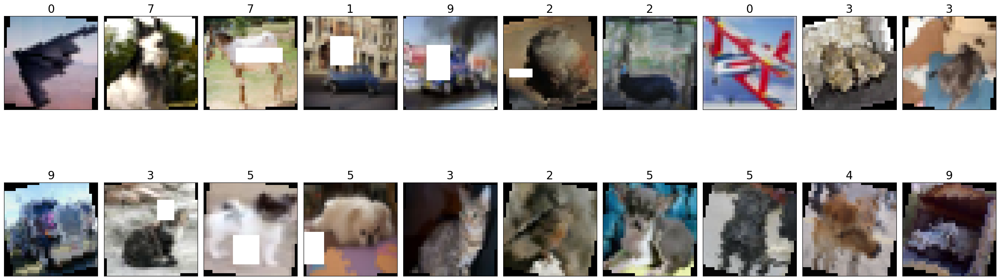
#### Chiến lược Tăng cường Dữ liệu Ảnh 
Để khắc phục hiện tượng quá khớp (overfitting) do giới hạn về số lượng dữ liệu, hai bộ tiền xử lý hình ảnh riêng biệt đã được lập trình để tương thích với cấu trúc không gian đầu vào của từng loại kiến trúc mạng bằng thư viện `torchvision.transforms`:

**1. Bộ biến đổi cho Kiến trúc Custom ResNet ($32 \times 32$):**\
Mô hình tự thiết kế nhận đầu vào giữ nguyên độ phân giải gốc $32 \times 32$. Các phương pháp biến đổi ngẫu nhiên được áp dụng trong quá trình huấn luyện bao gồm xoay, lật ngang, điều chỉnh màu sắc, độ sắc nét và xóa ngẫu nhiên (Random Erasing):

``` {.python linenos="" breaklines="" fontsize="\\small"}
train_transform_custom = transforms.Compose([
    transforms.RandomRotation(15),
    transforms.RandomHorizontalFlip(p=0.5),
    transforms.ColorJitter(brightness=0.1, contrast=0.1, saturation=0.1),
    transforms.RandomAdjustSharpness(sharpness_factor=2, p=0.1),
    transforms.ToTensor(),
    transforms.Normalize((0.5, 0.5, 0.5), (0.5, 0.5, 0.5)),
    transforms.RandomErasing(p=0.5, scale=(0.02, 0.1), value=1.0, inplace=False)
])
```

**2. Bộ biến đổi cho Kiến trúc Pre-trained ($224 \times 224$):**\
Đối với các kiến trúc sử dụng học chuyển giao (ResNet18 và ViT), hình ảnh đầu vào bắt buộc phải được nội suy lên kích thước $224 \times 224$. Quá trình chuẩn hóa áp dụng trực tiếp thống kê kênh màu của tập dữ liệu ImageNet:

``` {.python linenos="" breaklines="" fontsize="\\small"}
IMAGENET_MEAN, IMAGENET_STD = [0.485, 0.456, 0.406], [0.229, 0.224, 0.225]

train_transform_pretrained = transforms.Compose([
    transforms.Resize((224, 224)),
    transforms.RandomRotation(20), # Kích thước ảnh lớn (224x224), phép xoay 20 độ giúp tăng tính tổng quát hóa
    transforms.RandomHorizontalFlip(p=0.5),
    transforms.ColorJitter(brightness=0.1, contrast=0.1, saturation=0.1),
    transforms.RandomAdjustSharpness(sharpness_factor=2, p=0.1),
    transforms.ToTensor(),
    transforms.Normalize(mean=IMAGENET_MEAN, std=IMAGENET_STD),
    transforms.RandomErasing(p=0.5, scale=(0.02, 0.1), value=1.0, inplace=False)
])
```

### Cấu trúc Các Mô hình Đề xuất
#### Kiến trúc Custom ResNet (Tự thiết kế) 

Kiến trúc này được lập trình hướng đối tượng (OOP) thông qua `torch.nn.Module` nhằm phục vụ riêng cho ảnh kích thước $32 \times 32$. Điểm nhấn của kiến trúc là việc áp dụng cấu trúc Tiền kích hoạt (Pre-activation) thay vì thứ tự tiêu chuẩn.

Khối Tiền kích hoạt (`PreActConvLayer`) thực hiện chuẩn hóa và kích hoạt trước khi tích chập:

``` {.python linenos="" breaklines="" fontsize="\\small"}
class PreActConvLayer(nn.Sequential):
    """Lop Pre-activation: Chuan hoa, Kich hoat va Tich chap"""
    def __init__(self, channels):
        super().__init__(
            nn.BatchNorm2d(channels),
            nn.ReLU(inplace=False),
            conv3x3(channels, channels)
        )
```

Khối phần dư (`ResidualBlock`) áp dụng kết nối tắt (skip connection) bằng cách cộng trực tiếp tensor đầu vào `x` với đầu ra của mảng các lớp tiền kích hoạt:

``` {.python linenos="" breaklines="" fontsize="\\small"}
class ResidualBlock(nn.Module):
    """Khoi Residual voi co che ket noi tat (skip connections)."""
    def __init__(self, channels, num_layers):
        super().__init__()
        self.layers = nn.ModuleList([PreActConvLayer(channels) for _ in range(num_layers)])

    def forward(self, x):
        for layer in self.layers:
            x = layer(x) + x
        return x
```

#### Cấu hình Học chuyển giao (Transfer Learning) cho ResNet18 và ViT 

Để tái sử dụng tri thức từ tập ImageNet nhưng giảm thiểu khối lượng tính toán, nghiên cứu tiến hành đóng băng (freeze) mạng xương sống và chỉ khởi tạo lại lớp phân loại tuyến tính cuối cùng.

**Trích xuất đặc trưng tĩnh với Pre-trained ResNet18 Frozen:**\
Toàn bộ tham số được duyệt qua và vô hiệu hóa tính toán đạo hàm (`requires_grad = False`). Lớp `fc` cuối cùng được thay thế bằng một lớp tuyến tính ánh xạ ra 10 lớp phân loại của CIFAR-10:

``` {.python linenos="" breaklines="" fontsize="\\small"}
model_resnet_frozen = models.resnet18(weights=models.ResNet18_Weights.IMAGENET1K_V1)

for param in model_resnet_frozen.parameters():
    param.requires_grad = False

in_features = model_resnet_frozen.fc.in_features
model_resnet_frozen.fc = nn.Linear(in_features, 10)
```

**Trích xuất đặc trưng tĩnh với Pre-trained ViT Frozen:**\
Tương tự, bộ mã hóa Transformer khổng lồ của `vit_b_16` bị đóng băng. Thay thế lớp `heads.head` thành `nn.Linear` để phân loại:

``` {.python linenos="" breaklines="" fontsize="\\small"}
vit_model = models.vit_b_16(weights=models.ViT_B_16_Weights.IMAGENET1K_V1)

for param in vit_model.parameters():
    param.requires_grad = False

in_features = vit_model.heads.head.in_features
vit_model.heads.head = nn.Linear(in_features, 10)
```

### Thiết lập Huấn luyện và Chiến lược Tối ưu hóa

Để đảm bảo thuật toán đạt được trạng thái hội tụ lý tưởng tại các điểm cực tiểu toàn cục, quá trình lan truyền ngược được điều hướng bởi bộ tối ưu hóa Adam, kết hợp với hàm Cross-Entropy Loss.

Đặc biệt, kỹ thuật điều chỉnh tốc độ học động (dynamic learning rate) được triển khai thông qua hàm `ReduceLROnPlateau`. Thuật toán sẽ tự động cắt giảm một nửa tốc độ học hiện tại (`factor=0.5`) nếu Loss trên tập xác thực không có dấu hiệu suy giảm sau hai chu kỳ huấn luyện liên tiếp
(`patience=2`):

``` {.python linenos="" breaklines="" fontsize="\\small"}
criterion = nn.CrossEntropyLoss()
optimizer = optim.Adam(model.parameters(), lr=lr)

# mode='min': Theo doi val_loss (cang nho cang tot)
# factor=0.5: Giam LR di mot nua (chia 2) moi lan kich hoat
# patience=2: Cho 2 epochs, neu loss ko giam, giam LR
scheduler = optim.lr_scheduler.ReduceLROnPlateau(
    optimizer, 
    mode='min', 
    factor=0.5, 
    patience=2
)
```

Cơ chế này kết hợp cùng với thuật toán dừng sớm (Early Stopping) giúp kiểm soát chặt chẽ quá trình hội tụ, tối ưu hóa thời gian tính toán và ngăn chặn suy thoái mô hình.

### Phương pháp Đánh giá và Khả năng Diễn giải (Evaluation & Explainability)

Quá trình kiểm thử tính hiệu quả của các kiến trúc được xây dựng thông qua một tập hợp các phép đo chuẩn mực:

-   **Đo lường Định lượng:** Sử dụng thư viện `scikit-learn` để xuất báo cáo phân loại chi tiết (Classification Report) và Ma trận nhầm lẫn (Confusion Matrix). Các chỉ số đánh giá bao gồm: Độ chính xác tổng thể (Accuracy), Độ chuẩn xác (Precision), Độ bao phủ (Recall) và Điểm số F1 (F1-score) cho từng lớp trong không gian CIFAR-10.

-   **Phân tích Định tính và Khả năng Diễn giải (Grad-CAM):** Kỹ thuật Gradient-weighted Class Activation Mapping (Grad-CAM) được áp dụng nhằm trực quan hóa các khu vực hình ảnh mà mạng nơ-ron tập trung cường độ tính toán cao nhất. Bằng cách khai thác đạo hàm lan truyền về lớp `layer4[-1]` (đối với ResNet) hoặc lớp `encoder.layers[-1].ln_1` (đối với ViT), thuật toán sinh ra các bản đồ nhiệt (heatmap) chèn lên ảnh gốc. Quá trình này giúp lý giải sự khác biệt trong tư duy hình học của CNN (tập trung đặc trưng viền cạnh, không gian cục bộ) so với tư duy cơ chế chú ý của ViT (tập trung vào cấu trúc ngữ cảnh toàn cục).

## Thực nghiệm và đánh giá kết quả

Chương này trình bày và phân tích chi tiết kết quả thực nghiệm đạt được từ bốn cấu hình mô hình học sâu trên tập dữ liệu CIFAR-10. Các đánh giá bao gồm khả năng hội tụ trong quá trình huấn luyện, hiệu năng định lượng trên tập kiểm thử thông qua các độ đo chuẩn mực, khả năng khái quát hóa trên dữ liệu thực tế và phân tích khả năng diễn giải hành vi mô hình bằng thuật toán Grad-CAM.

### Đánh giá Quá trình Huấn luyện và Hội tụ (Training Analysis)

Quá trình huấn luyện sử dụng bộ tối ưu Adam với kích thước lô (batch size) là 512. Việc giám sát sự hội tụ được thực hiện thông qua biến thiên của hàm mất mát (Loss) và độ chính xác (Accuracy) trên cả tập huấn luyện và tập xác thực.
#### Phân tích đường cong học tập (Learning Curves) 
Hệ thống sử dụng hàm `plot_models_comparison` để trực quan hóa lịch sử huấn luyện:

``` {.python linenos="" breaklines="" fontsize="\\small"}
def plot_models_comparison(histories_dict):
    fig, axes = plt.subplots(1, 2, figsize=(16,6))
    # ... (Ma nguon ve bieu do so sanh Loss va Accuracy)
```

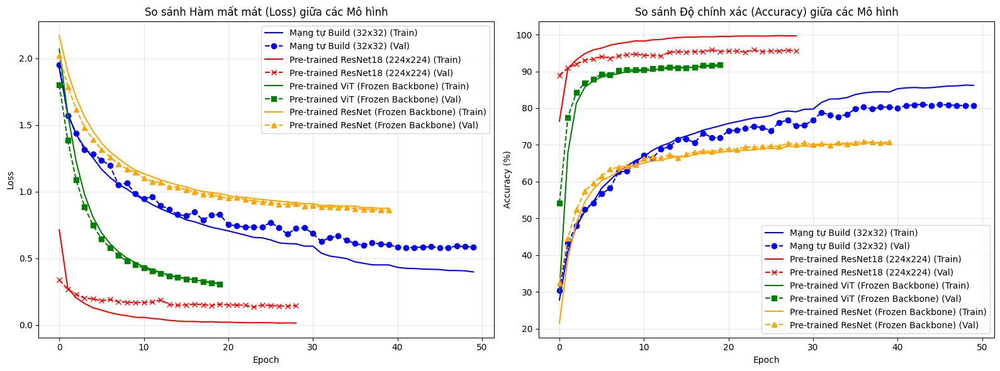

**Kết quả ghi nhận:**

-   **Pre-trained ResNet18 (Fine-tuning):** Thể hiện ưu thế tuyệt đối về tốc độ hội tụ nhờ tri thức từ ImageNet. Mô hình đạt độ chính xác trên 90% chỉ sau 2 epoch. Cơ chế dừng sớm (Early Stopping) đã ngắt quá trình tại epoch 29 khi Validation Loss đạt mức cực tiểu 0.1436.

-   **Custom ResNet ($32 \times 32$):** Do huấn luyện từ đầu (from scratch), mô hình yêu cầu trọn vẹn 50 epoch để đạt trạng thái ổn định. Tuy nhiên, mức Loss cuối cùng (0.5842) vẫn cao hơn đáng kể so với phương pháp Fine-tuning.

-   **Pre-trained ViT (Frozen Backbone):** Dù chỉ huấn luyện lớp phân loại (23,070 tham số), mô hình đạt sự ổn định rất nhanh. Tại epoch 20, mô hình đạt Validation Accuracy ấn tượng là 91.82%.

-   **Pre-trained ResNet18 (Frozen Backbone):** Đây là mô hình có hiệu suất thấp nhất, dừng lại ở mức 70.78% accuracy tại epoch 40. Điều này cho thấy bộ trích xuất đặc trưng của CNN khi bị đóng băng không linh hoạt bằng Transformer đối với dữ liệu CIFAR-10.

### Hiệu năng Định lượng trên Tập Kiểm thử (Test Evaluation)

Sau khi nạp lại bộ trọng số tốt nhất từ các checkpoint lưu trữ, các mô hình được đánh giá trên 10,000 mẫu ảnh kiểm thử chưa từng xuất hiện.
#### Phân tích Báo cáo Phân loại (Classification Reports) 
Dữ liệu từ ma trận nhầm lẫn và báo cáo chi tiết cho thấy sự phân hóa rõ rệt:

**Bảng:** So sánh hiệu năng các mô hình trên tập kiểm thử CIFAR-10

| **Mô hình** | **Accuracy (%)** | **F1-Score (Macro Avg)** | **Lớp tốt nhất (F1)** | **Lớp kém nhất (F1)** |
| --- | --- | --- | --- | --- |
| **ResNet18 Fine-tuning** | **96%** | **0.96** | Ship (0.98) | Cat (0.91) |
| **ViT Frozen** | **93%** | **0.93** | Car (0.97) | Cat (0.87) |
| **Custom ResNet** | **84%** | **0.84** | Car (0.93) | Cat (0.66) |
| **ResNet18 Frozen** | **77%** | **0.77** | Ship (0.84) | Cat (0.64) |


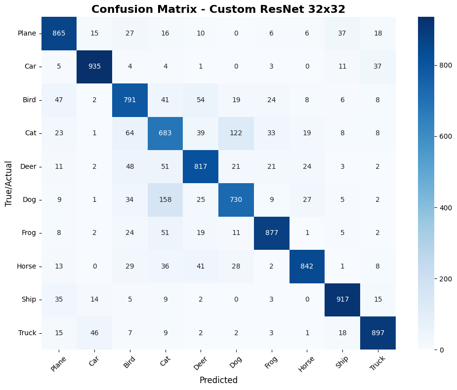

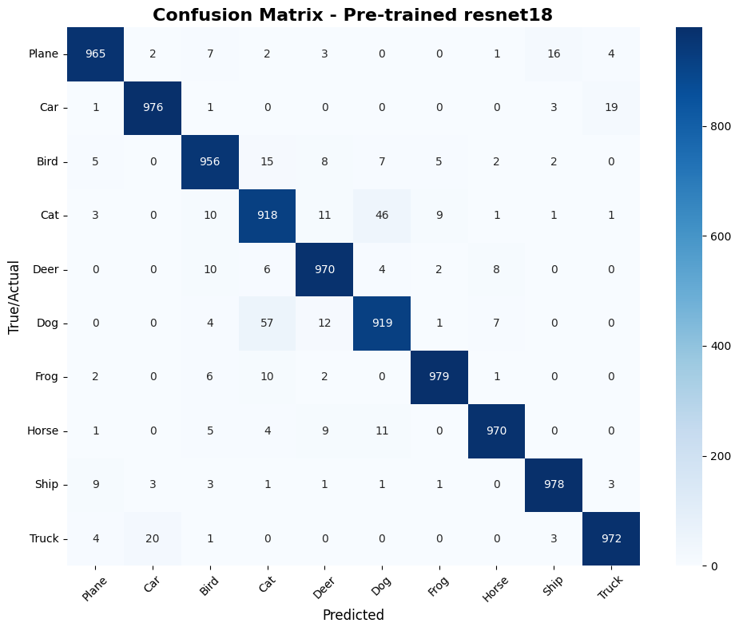

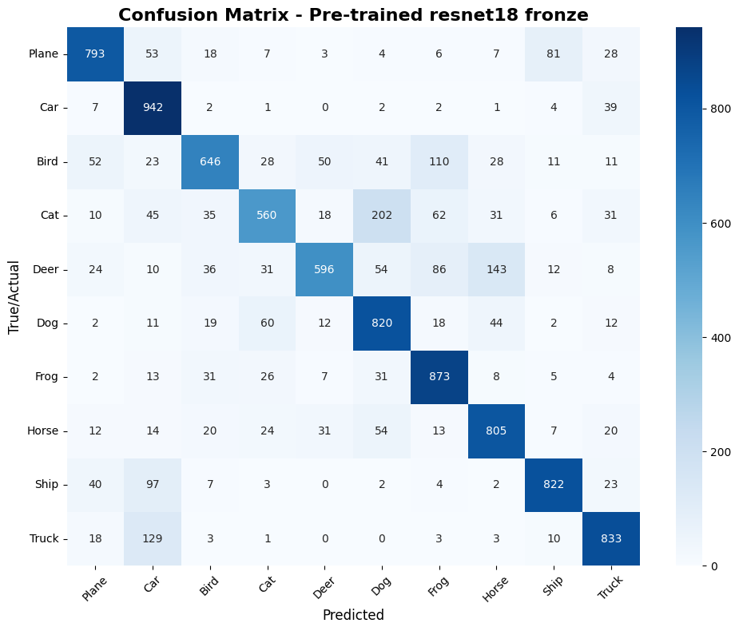

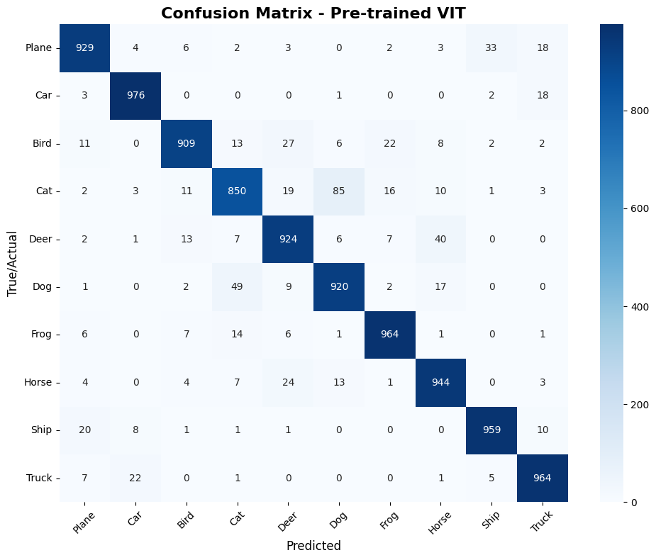

*Hình: Ma trận nhầm lẫn của các mô hình đánh giá trên tập Kiểm thử*

#### Insights và Giải thích chuyên sâu

1.  **Sự nhầm lẫn giữa các lớp tương đồng (Semantic Confusion):** Ma trận nhầm lẫn của Custom ResNet chỉ ra rằng lớp **Cat (Mèo)** thường bị dự đoán nhầm thành **Dog (Chó)** (158 mẫu). Điều này giải thích tại sao F1-score của lớp Cat luôn thấp nhất. Ở độ phân giải thấp ($32 \times 32$), các đặc trưng phân biệt như tai, mũi, hay lông bị mờ nhòe, khiến mô hình dựa vào hình dáng tổng thể vốn rất giống nhau giữa hai loài.

2.  **Tầm quan trọng của bối cảnh:** Các lớp như **Ship (Tàu thủy)** và **Plane (Máy bay)** đạt độ chính xác rất cao vì mô hình dễ dàng nhận diện dựa trên phông nền (nước biển xanh hoặc bầu trời) thay vì chỉ tập trung vào thực thể.

### Suy luận Thực tế và Độ bền vững (In-the-wild Inference)

Nghiên cứu tiến hành suy luận trên một hình ảnh thực tế (ảnh chú chó Beagle) để kiểm chứng khả năng thích ứng miền (Domain Adaptation).

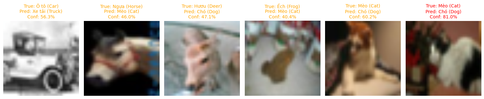

**Kết quả suy luận thực tế:**

-   **ResNet18 Fine-tuning:** Dự đoán đúng lớp Chó (Dog) với độ tự tin **99.78%**.

-   **Custom ResNet:** Dự đoán đúng lớp Chó (Dog) với độ tự tin **96.73%**.

-   **ViT Frozen:** Dự đoán đúng lớp Chó (Dog) nhưng độ tự tin chỉ đạt **66.71%**.

**Giải thích:** Mặc dù ViT có độ chính xác trên tập Test rất cao (93%), nhưng khi gặp dữ liệu thực tế ngoài phân bố (Out-of-distribution), độ tự tin giảm mạnh. Ngược lại, việc tinh chỉnh toàn bộ trọng số (Fine-tuning) giúp mô hình ResNet18 sở hữu không gian đặc trưng \"mềm dẻo\" hơn, dẫn đến độ tự tin cực cao khi suy luận thực tế.

### Phân tích Khả năng Diễn giải Mô hình (Explainable AI - Grad-CAM)

Trong lĩnh vực Học sâu, các mô hình thường được coi là \"hộp đen\" (black-box) do sự phức tạp của hàng triệu tham số và các phép biến đổi phi tuyến tính. Để nâng cao tính minh bạch và độ tin cậy, nghiên cứu đã áp dụng kỹ thuật Grad-CAM (Gradient-weighted Class Activation Mapping). Phương pháp này sử dụng dòng gradient chảy ngược từ lớp đầu ra về các lớp không gian cuối cùng để xác định mức độ đóng góp của từng vùng pixel đối với kết quả dự đoán.

#### Cài đặt Kỹ thuật và Lựa chọn Lớp Mục tiêu

Hiệu quả của Grad-CAM phụ thuộc trực tiếp vào việc lựa chọn lớp mục tiêu (target layer). Do đặc thù kiến trúc, các lớp được cô lập để trích xuất bản đồ nhiệt như sau:

-   **Đối với ResNet-18:** Mục tiêu là lớp tích chập sâu nhất `layer4[-1]`, nơi chứa các đặc trưng ngữ nghĩa phức tạp nhất về mặt không gian.

-   **Đối với Vision Transformer (ViT):** Do ViT xử lý dữ liệu dưới dạng chuỗi (sequence), lớp mục tiêu được chọn là lớp chuẩn hóa `encoder.layers[-1].ln_1` thuộc khối mã hóa cuối cùng. Một hàm biến đổi hình dáng (`reshape_transform`) được định nghĩa để ánh xạ chuỗi 1D về không gian lưới 2D ($14 \times 14$) trước khi nội suy lên kích thước ảnh gốc.

``` {.python linenos="" breaklines="" fontsize="\\small"}
# Ma nguon hien thuc hoa bo trich xuat Grad-CAM cho hai truong phai kien truc
from pytorch_grad_cam import GradCAM

# 1. Cau hinh cho ResNet
target_layer_res = [model_res.layer4[-1]]
cam_res = GradCAM(model=model_res, target_layers=target_layer_res)

# 2. Cau hinh cho ViT (kem theo reshape_transform)
target_layer_vit = [vit_model.encoder.layers[-1].ln_1]
cam_vit = GradCAM(model=vit_model, target_layers=target_layer_vit, 
                  reshape_transform=reshape_transform_vit)
```

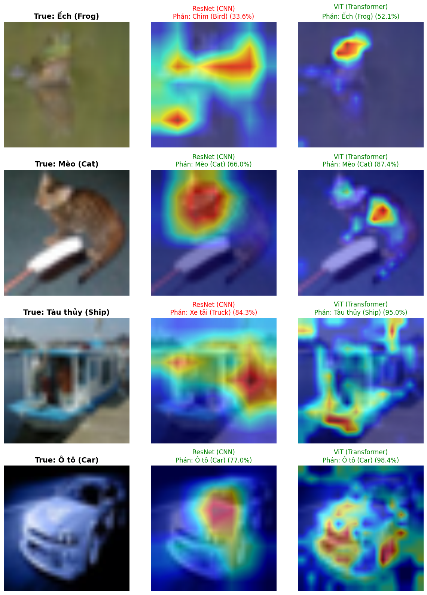

#### Phân tích các trường hợp điển hình và Insights chuyên sâu

Quá trình đối chiếu bản đồ nhiệt giữa ResNet và ViT trên các mẫu ảnh khó đã mang lại những phát hiện quan trọng về cách thức trích xuất đặc trưng của từng mô hình:

-   **Trường hợp \"Ếch\" (Frog):**

    -   **ResNet:** Dự đoán sai thành lớp **Chim (Bird)** với độ tin cậy $33.6\%$. Bản đồ nhiệt cho thấy mô hình tập trung vào các đường viền sắc nét ở phía trên, nhầm lẫn đó là hình dáng của mỏ hoặc cánh chim.

    -   **ViT:** Dự đoán chính xác lớp **Ếch (Frog)** với độ tin cậy $52.1\%$. Vùng chú ý của ViT bao quát toàn bộ cơ thể vật thể, chứng minh khả năng nhận diện dựa trên hình thái tổng thể tốt hơn trong điều kiện thiếu chi tiết kết cấu.

-   **Trường hợp \"Tàu thủy\" (Ship):**

    -   **ResNet:** Dự đoán sai thành lớp **Xe tải (Truck)** với xác suất cao $84.3\%$. Phân tích Grad-CAM chỉ ra rằng ResNet bị \"đánh lừa\" bởi phần cabin vuông vức của con tàu, vốn có các đặc trưng hình học rất giống với thùng xe tải. Điều này chứng minh cho tính cục bộ (locality) của CNN: chỉ cần một phần của vật thể giống lớp khác, mô hình dễ dàng đưa ra kết luận sai.

    -   **ViT:** Dự đoán đúng lớp **Tàu thủy (Ship)** với độ tự tin áp đảo $95.0\%$. Bản đồ nhiệt trải rộng ra cả phần mặt nước xung quanh, cho thấy ViT đã sử dụng ngữ cảnh (context) để khẳng định vật thể này không thể là xe tải.

-   **Trường hợp \"Mèo\" (Cat) và \"Ô tô\" (Car):**

    -   Ở cả hai trường hợp này, ViT đều thể hiện sự vượt trội về độ tự tin ($87.4\%$ cho Mèo và $98.4\%$ cho Ô tô). Bản đồ chú ý của ViT cho thấy nó \"nhìn\" vào trung tâm khối của vật thể, trong khi ResNet thường bị phân tán bởi các chi tiết nhỏ như bánh xe hoặc tai mèo.

#### Nhận định về sự khác biệt trong tư duy hình học

Từ các kết quả trực quan trên, ta có thể rút ra các nhận định sau về khả năng diễn giải:

1.  **Tính Cục bộ của CNN (Local Patterns):** ResNet hoạt động như một bộ dò tìm kết cấu. Quyết định của nó dựa trên sự xuất hiện của các tổ hợp cạnh và viền. Điều này giúp mô hình mạnh mẽ với các ảnh có kết cấu rõ ràng nhưng dễ bị sai lệch nếu một bộ phận của vật thể mang đặc điểm của lớp khác.

2.  **Tính Ngữ cảnh của Transformer (Global Context):** ViT ra quyết định dựa trên mối tương quan toàn cục. Nhờ cơ chế Self-Attention, nó không chỉ xem xét vật thể mà còn đánh giá sự tương thích của vật thể với bối cảnh xung quanh. Chính tư duy này giúp ViT đạt độ chính xác cao ngay cả khi không được tinh chỉnh toàn bộ trọng số (Frozen Backbone), vì không gian đặc trưng của nó mang tính ngữ nghĩa rất cao.

3.  **Giải thích hiện tượng nhầm lẫn:** Các vùng màu đỏ trên bản đồ nhiệt Grad-CAM đã giải mã tại sao lớp Mèo thường có điểm số thấp: mô hình thường tập trung vào các vùng pixel nhiễu xung quanh thay vì cô lập được chính xác chủ thể, đặc biệt là trong các ảnh có độ tương phản thấp.

Việc tích hợp Grad-CAM vào quy trình đánh giá không chỉ giúp xác nhận độ chính xác của con số, mà còn cung cấp bằng chứng trực quan để các nhà nghiên cứu tin tưởng vào quy trình ra quyết định của mô hình trước khi triển khai vào các ứng dụng thực tiễn.

### Nhận định Tổng quát

Thực nghiệm cho thấy một nghịch lý thú vị: Mặc dù **ViT** có cấu trúc tham số khổng lồ (hơn 483 triệu tham số), nhưng khi áp dụng chiến lược đóng băng, nó vẫn cực kỳ hiệu quả và vượt trội so với **ResNet18 Frozen** trong việc trích xuất đặc trưng ngữ nghĩa. Tuy nhiên, để đạt được độ chính xác tối thượng và độ tin cậy trong thực tế, kỹ thuật **Fine-tuning** toàn bộ mạng vẫn là \"tiêu chuẩn vàng\" không thể thay thế.

## Kết luận

Sau quá trình thực hiện nghiên cứu, thiết kế kiến trúc và triển khai thực nghiệm trên tập dữ liệu CIFAR-10, đề tài đã đạt được các kết quả quan trọng sau:

-   **Hiệu năng vượt trội của Học chuyển giao (Transfer Learning):** Kết quả thực nghiệm khẳng định sức mạnh của việc tái sử dụng tri thức từ các tập dữ liệu lớn. Mô hình **ResNet18 Fine-tuning** đạt độ chính xác cao nhất với **96%**, vượt xa việc huấn luyện từ đầu một mạng tùy chỉnh (**84%**). Điều này chứng minh rằng việc khởi tạo trọng số bằng ImageNet giúp mô hình hội tụ nhanh hơn và đạt được điểm tối ưu sâu hơn trong không gian hàm mất mát.

-   **Tiềm năng của Vision Transformer (ViT):** Mặc dù chỉ được sử dụng dưới dạng bộ trích xuất đặc trưng tĩnh (Frozen Backbone) với chỉ **23,070** tham số huấn luyện trên tổng số hơn **483 triệu** tham số, ViT vẫn đạt được độ chính xác ấn tượng là **93%**. Kết quả này cho thấy không gian đặc trưng của Transformer có tính phân tách ngữ nghĩa rất cao, vượt trội hơn hẳn so với việc đóng băng mạng CNN truyền thống (ResNet18 Frozen chỉ đạt **77%**).

-   **Hạn chế của dữ liệu phân giải thấp:** Thực nghiệm chỉ ra rằng lớp **Mèo (Cat)** luôn là đối tượng khó nhận diện nhất đối với tất cả các kiến trúc, thường xuyên bị nhầm lẫn với lớp **Chó (Dog)** (ví dụ: mô hình Custom ResNet có 158 mẫu nhầm lẫn). Điều này do các đặc trưng tinh vi bị mất đi ở độ phân giải $32 \times 32$, tạo ra sự chồng lấn trong không gian đặc trưng giữa các lớp có hình thái học tương đồng.

-   **Tính minh bạch của mô hình qua Grad-CAM:** Việc áp dụng thuật toán giải thích mô hình đã xác nhận sự khác biệt về bản chất học đặc trưng: trong khi CNN tập trung vào các kết cấu cục bộ (như bánh xe, tai vật thể), ViT lại có xu hướng xem xét toàn cục và mối tương quan giữa vật thể với bối cảnh xung quanh.

### Hạn chế và Điểm mù của thực nghiệm (Limitations)

Bên cạnh các điểm sáng, quá trình thực nghiệm bộc lộ một điểm mù kỹ thuật đáng lưu ý liên quan đến độ phân giải: **Nhiễu nội suy (Interpolation artifacts)**. Do giới hạn hình học của các mô hình tiền huấn luyện lớn (ResNet18 và ViT), toàn bộ ảnh CIFAR-10 ($32 \times 32$) phải trải qua quá trình phóng đại lên $224 \times 224$. Việc phóng to kích thước ảnh lên gấp 7 lần chắc chắn sinh ra nhiễu và làm mờ các kết cấu nguyên bản. Độ chính xác của kiến trúc ViT ($93\%$) có thể đã bị kìm hãm một phần bởi chất lượng nội suy này, thay vì phản ánh toàn bộ nội lực thực sự của cơ chế Self-Attention.

### Nhận xét và Đánh giá

Nghiên cứu đã cung cấp một cái nhìn đối sánh trực quan giữa các trường phái kiến trúc khác nhau. Việc lựa chọn mô hình không chỉ dựa trên độ chính xác đơn thuần mà còn phụ thuộc vào tài nguyên tính toán và mục tiêu ứng dụng.

-   Nếu ưu tiên **độ chính xác tối đa**, việc **Fine-tuning** các mạng CNN sâu là lựa chọn hàng đầu.

-   Nếu ưu tiên **tiết kiệm tài nguyên huấn luyện** nhưng vẫn đảm bảo hiệu suất tốt, việc sử dụng **Frozen ViT** là một hướng đi cực kỳ hiệu quả nhờ khả năng trích xuất đặc trưng mạnh mẽ mà không cần cập nhật hàng triệu tham số.

-   Việc sử dụng các kỹ thuật như **ReduceLROnPlateau** và **Early Stopping** là then chốt để đảm bảo mô hình hội tụ ổn định và tránh lãng phí tài nguyên tính toán.

# Phân loại Đa phương thức với CLIP {#sec:multimodal}

## Giới thiệu

Phân loại đa phương thức (Multimodal Classification) là bài toán nhận dạng và phân loại dữ liệu từ nhiều nguồn thông tin khác nhau, trong đó phổ biến nhất là sự kết hợp giữa **hình ảnh** và **văn bản**. Khác với phân loại đơn phương thức truyền thống (chỉ dùng ảnh hoặc chỉ dùng text), phương pháp đa phương thức có khả năng tận dụng thông tin bổ sung từ nhiều modality để cải thiện độ chính xác.

Trong phần này, chúng tôi thực hiện so sánh **ba phương pháp** phân loại đa phương thức trên tập dữ liệu COCO (Common Objects in Context), sử dụng mô hình CLIP (Contrastive Language-Image Pre-training) từ OpenAI:

1.  **Zero-shot Classification**: Phân loại trực tiếp mà không cần huấn luyện thêm.

2.  **Few-shot Classification (Frozen Backbone)**: Tinh chỉnh đầu phân loại với số lượng mẫu nhỏ (k=1,5,10,20), giữ nguyên trọng số của mạng nền CLIP.

3.  **Full Fine-Tuning (Unfrozen Backbone)**: Tinh chỉnh toàn bộ mô hình CLIP với lượng dữ liệu lớn hơn (100 samples/class).

## Tập dữ liệu COCO 2017 {#subsec:coco-dataset}

### Giới thiệu về COCO

COCO (Common Objects in Context) là một trong những tập dữ liệu chuẩn quốc tế quan trọng nhất cho các bài toán thị giác máy tính, bao gồm:

-   **Object Detection** (Phát hiện đối tượng)

-   **Instance Segmentation** (Phân đoạn thực thể)

-   **Image Captioning** (Mô tả ảnh)

-   **Multimodal Classification** (Phân loại đa phương thức)

Tập dữ liệu gốc chứa **80 categories** phổ biến trong đời sống hàng ngày, từ con người, phương tiện, động vật đến đồ vật gia dụng. Mỗi ảnh trong COCO đi kèm với:

-   **Annotations**: Bounding boxes, segmentation masks

-   **Captions**: 5 câu mô tả tiếng Anh cho mỗi ảnh

-   **Category labels**: Nhãn phân loại đối tượng

### Xử lý và Lọc Dữ liệu

Trong thực nghiệm này, chúng tôi sử dụng phiên bản COCO 2017 từ Kaggle[^1]. Quy trình xử lý dữ liệu bao gồm:

1.  **Kết hợp train và validation splits**: Gộp cả train2017 và val2017 để tăng số lượng mẫu.

2.  **Lọc categories thiếu dữ liệu**: Loại bỏ các categories có ít hơn 100 samples để đảm bảo chất lượng huấn luyện.

3.  **Primary category assignment**: Với mỗi ảnh chứa nhiều đối tượng, chọn đối tượng có diện tích lớn nhất làm category chính.

4.  **Caption extraction**: Lấy caption đầu tiên cho mỗi ảnh làm thông tin văn bản.

Sau khi xử lý, tập dữ liệu cuối cùng có các thông số sau:

**Bảng:** Thống kê tập dữ liệu COCO sau xử lý

| **Thuộc tính** | **Giá trị** |
| --- | --- |
| Tổng số categories | 43 |
| Tổng số samples | 4,424 |
| Samples per class | 100-103 |
| Training set (80%) | 3,539 |
| Test set (20%) | 885 |
| Modality | Image + Text (caption) |


**43 categories** được giữ lại bao gồm: person, dog, bowl, bench, toilet, motorcycle, boat, bed, giraffe, car, zebra, chair, airplane, umbrella, bus, cow, dining table, teddy bear, couch, horse, bird, elephant, sheep, clock, train, bicycle, truck, oven, refrigerator, pizza, stop sign, kite, sink, sandwich, cat, fire hydrant, tv, traffic light, bear, suitcase, laptop, surfboard, vase.

## Kiến trúc CLIP {#subsec:clip-architecture}

### Tổng quan về CLIP

CLIP (Contrastive Language-Image Pre-training) là mô hình đột phá từ OpenAI, được giới thiệu năm 2021[@radford2021learning]. Điểm đặc biệt của CLIP là khả năng học biểu diễn chung (joint representation) cho cả hình ảnh và văn bản thông qua huấn luyện contrastive trên **400 triệu cặp image-text** từ internet.


### Các thành phần chính

CLIP bao gồm hai encoder hoạt động song song:

#### Vision Encoder

Sử dụng kiến trúc **Vision Transformer (ViT)** với patch size 32x32. Mô hình chia ảnh đầu vào thành các patches nhỏ, sau đó xử lý chúng như một chuỗi tokens tương tự như trong NLP.

-   **Input**: Ảnh RGB kích thước $224 \times 224$ pixels

-   **Patch embedding**: Chia thành $7 \times 7 = 49$ patches

-   **Transformer layers**: 12 layers với multi-head attention

-   **Output**: Image embedding vector $\in \mathbb{R}^{512}$

#### Text Encoder

Sử dụng kiến trúc **Transformer** để mã hóa câu văn bản thành vector đặc trưng.

-   **Input**: Text sequence (max 77 tokens)

-   **Tokenization**: Byte-Pair Encoding (BPE)

-   **Transformer layers**: 12 layers với causal attention

-   **Output**: Text embedding vector $\in \mathbb{R}^{512}$

### Contrastive Learning

CLIP được huấn luyện với mục tiêu contrastive: tối đa hóa cosine similarity giữa các cặp (image, text) đúng và tối thiểu hóa similarity giữa các cặp không khớp. Hàm loss được định nghĩa:

$$\mathcal{L}_{\text{CLIP}} = \frac{1}{2}\left(\mathcal{L}_{\text{I2T}} + \mathcal{L}_{\text{T2I}}\right)$$

Trong đó:

-   $\mathcal{L}_{\text{I2T}}$: Cross-entropy loss từ image sang text

-   $\mathcal{L}_{\text{T2I}}$: Cross-entropy loss từ text sang image

### Tại sao CLIP phù hợp cho Multimodal Classification?

1.  **Pre-trained trên dữ liệu đa dạng**: 400M cặp image-text từ internet.

2.  **Zero-shot capability**: Có thể phân loại các class chưa từng thấy trong quá trình huấn luyện.

3.  **Joint embedding space**: Biểu diễn ảnh và text trong cùng một không gian vector.

4.  **Transfer learning friendly**: Dễ dàng fine-tune cho các tác vụ downstream.

## Ba Phương pháp So sánh {#subsec:three-methods}

### Zero-Shot Classification {#subsubsec:zero-shot}

#### Khái niệm

Zero-shot classification là phương pháp phân loại **không cần huấn luyện thêm** (no additional training). Mô hình CLIP pretrained được sử dụng trực tiếp để phân loại các ảnh bằng cách so sánh chúng với các text prompts tương ứng với mỗi category.

#### Cơ chế hoạt động

1.  **Tạo text prompts**: Với mỗi category $c$, tạo prompt theo template: `"a photo of a {category}"`

    Ví dụ:

    -   Category \"person\" → `"a photo of a person"`

    -   Category \"car\" → `"a photo of a car"`

2.  **Encode image và text**: $$\begin{aligned}
            \mathbf{v}_{\text{img}} &= \text{VisionEncoder}(\text{image}) \\ \mathbf{v}_{\text{text}}^{(i)} &= \text{TextEncoder}(\text{prompt}_i), \quad i=1,\ldots,C
        
    \end{aligned}$$

3.  **Tính similarity scores**:
    $$s_i = \cos(\mathbf{v}_{\text{img}}, \mathbf{v}_{\text{text}}^{(i)}) = \frac{\mathbf{v}_{\text{img}} \cdot \mathbf{v}_{\text{text}}^{(i)}}{\|\mathbf{v}_{\text{img}}\| \|\mathbf{v}_{\text{text}}^{(i)}\|}$$

4.  **Dự đoán category**:
    $$\hat{y} = \arg\max_{i} \, \text{softmax}(s_i / \tau)$$

    Trong đó $\tau$ là temperature parameter (thường = 0.01).

#### Ưu điểm

-   Không cần dữ liệu huấn luyện

-   Thời gian inference nhanh (không có training phase)

-   Có thể mở rộng sang các class mới ngay lập tức

-   Tận dụng tối đa knowledge từ pretrained model

#### Nhược điểm

-   Không customize được cho dataset cụ thể

-   Performance bị giới hạn bởi pretrained knowledge

-   Có thể kém hiệu quả với domain-specific tasks

#### Cấu hình thực nghiệm

**Bảng:** Thông số Zero-shot Classification

| **Tham số** | **Giá trị** |
| --- | --- |
| Model | openai/clip-vit-base-patch32 |
| Training data | 0 samples |
| Trainable parameters | 0 (all frozen) |
| Training time | 0s |
| Prompt template | \"a photo of a {category}\" |
| Temperature $\tau$ | 0.01 |


### Few-Shot Classification (Frozen Backbone) {#subsubsec:few-shot}

#### Khái niệm

Few-shot classification là phương pháp huấn luyện mô hình với **số lượng mẫu rất nhỏ** cho mỗi class (thường từ 1-20 samples). Trong phương pháp này, backbone CLIP được **đóng băng** (frozen), chỉ có classification head được huấn luyện.

#### Kiến trúc

Mô hình bao gồm hai phần chính:

1.  **CLIP Encoder (FROZEN)**:

    -   Vision Encoder: xử lý ảnh → image embedding

    -   Text Encoder: xử lý caption → text embedding

    -   Tất cả trọng số của CLIP đều `requires_grad=False`

2.  **Classification Head (TRAINABLE)**:

    -   Input: Concatenation của image embedding và text embedding

    -   Architecture: 2-layer MLP

    -   Layer 1: Linear($512 \times 2 = 1024$, 512) + ReLU +
        Dropout(0.1)

    -   Layer 2: Linear(512, num_classes)

    -   Output: Logits cho 43 categories

``` {.python linenos="" breaklines="" fontsize="\\small"}
class CLIPClassifier(nn.Module):
    def __init__(self, clip_model, num_classes, freeze_backbone=True):
        super().__init__()
        self.clip = clip_model

        # Đóng băng CLIP backbone
        if freeze_backbone:
            for param in self.clip.parameters():
                param.requires_grad = False

        # Classification head (trainable)
        hidden_size = self.clip.config.projection_dim  # 512
        self.classifier = nn.Sequential(
            nn.Linear(hidden_size * 2, hidden_size),
            nn.ReLU(),
            nn.Dropout(0.1),
            nn.Linear(hidden_size, num_classes)
        )

    def forward(self, input_ids, attention_mask, pixel_values):
        outputs = self.clip(input_ids, attention_mask, pixel_values)
        combined = torch.cat([outputs.image_embeds,
                             outputs.text_embeds], dim=1)
        return self.classifier(combined)
```

#### Cấu hình huấn luyện

Chúng tôi thực nghiệm với **4 giá trị k khác nhau**: k=1, 5, 10, 20 samples per class.

**Bảng:** Thông số Few-shot Classification

| **Tham số** | **1-shot** | **5-shot** | **10-shot** | **20-shot** |
| --- | --- | --- | --- | --- |
| Training samples | 43 | 215 | 430 | 860 |
| Samples/class | 1 | 5 | 10 | 20 |
| Epochs | 20 | 20 | 10 | 10 |
| Learning rate | 1e-4 | 1e-4 | 5e-5 | 5e-5 |
| Batch size | 8 | 8 | 8 | 8 |
| Optimizer | AdamW |
| Trainable params | 262K (chỉ classification head) |
| Frozen params | 151M (CLIP backbone) |


#### Ưu điểm

-   Cải thiện performance với rất ít dữ liệu

-   Training nhanh (chỉ train head, không train backbone)

-   Tránh overfitting nhờ freeze pretrained weights

-   Giữ lại được generalization capability của CLIP

#### Nhược điểm

-   Performance bị giới hạn bởi frozen features

-   Không thể adapt backbone cho domain-specific patterns

-   Với k quá nhỏ (k=1), performance vẫn rất thấp

### Full Fine-Tuning (Unfrozen Backbone) {#subsubsec:full-finetune}

#### Khái niệm

Full fine-tuning là phương pháp huấn luyện **toàn bộ mô hình**, bao gồm cả CLIP backbone. Khác với few-shot learning, ở đây tất cả các layers đều có thể cập nhật trọng số (`requires_grad=True`).

#### Điểm khác biệt chính

**Bảng:** So sánh Few-shot (Frozen) vs Full Fine-tuning (Unfrozen)

| **Aspect** | **Few-shot (Frozen)** | **Full Fine-tune (Unfrozen)** |
| --- | --- | --- |
| Backbone status | `freeze_backbone=True` | `freeze_backbone=False` |
| Trainable layers | Chỉ classification head | Toàn bộ model |
| Trainable params | 262K | 546K |
| Training data | 1-20 samples/class | 100 samples/class |
| Learning rate | 1e-4 hoặc 5e-5 | 2e-5 (thấp hơn) |
| Epochs | 10-20 | 5 (ít hơn) |
| Risk of overfitting | Thấp | Cao hơn |
| Training time | Nhanh ( 85-137s) | Chậm hơn ( 151s) |


#### Cấu hình huấn luyện

**Bảng:** Thông số Full Fine-Tuning

| **Tham số** | **Giá trị** |
| --- | --- |
| Training samples | 3,539 (100 samples/class) |
| Epochs | 5 |
| Learning rate | 2e-5 (thấp để stability) |
| Batch size | 8 |
| Optimizer | AdamW |
| Scheduler | Linear warmup (10% steps) |
| Trainable params | 546K (toàn bộ model) |
| freeze_backbone | False |


#### Ưu điểm

-   Tiềm năng đạt accuracy cao nhất

-   Có thể adapt toàn bộ model cho domain-specific task

-   Học được patterns phức tạp hơn từ dữ liệu

#### Nhược điểm

-   Cần nhiều dữ liệu hơn (ít nhất 50-100 samples/class)

-   Training chậm hơn (train toàn bộ 151M parameters)

-   Nguy cơ overfitting cao nếu dữ liệu không đủ

-   Có thể mất đi generalization capability của pretrained model

## Thiết lập Thực nghiệm {#subsec:experiment-setup}

### Môi trường và Phần cứng

-   **Platform**: Kaggle Notebook

-   **GPU**: Tesla T4 x2 (16GB VRAM mỗi card)

-   **Framework**: PyTorch 2.x, Transformers (HuggingFace)

-   **Python**: 3.10

### Chia tách dữ liệu

-   **Test set**: 20% (885 samples) - stratified by category

-   **Training set**: 80% (3,539 samples)

    -   Few-shot: Lấy ngẫu nhiên k samples/class (k=1,5,10,20)

    -   Full fine-tune: Sử dụng toàn bộ 100 samples/class

### Metrics đánh giá

Theo yêu cầu của đề bài (Section 4.4), chúng tôi đánh giá tất cả các phương pháp với các metrics sau:

1.  **Accuracy**: Tỷ lệ phân loại đúng tổng thể
    $$\text{Accuracy} = \frac{\text{Số lượng dự đoán đúng}}{\text{Tổng số mẫu}}$$

2.  **F1 Score (Macro)**: Trung bình cộng F1 của từng class
    $$F1_{\text{macro}} = \frac{1}{C}\sum_{i=1}^{C} F1_i$$

3.  **F1 Score (Weighted)**: Trung bình có trọng số theo số lượng
    samples
    $$F1_{\text{weighted}} = \sum_{i=1}^{C} w_i \cdot F1_i, \quad w_i = \frac{n_i}{\sum_j n_j}$$

4.  **Precision (Macro)**: Độ chính xác trung bình

5.  **Recall (Macro)**: Độ phủ trung bình

6.  **Confusion Matrix**: Ma trận nhầm lẫn 43x43

7.  **Per-class Metrics**: F1, Precision, Recall cho từng category

## Kết quả và Phân tích {#subsec:results}

### So sánh Tổng quan

Bảng 9 tổng hợp kết quả của tất cả 6 thí nghiệm (1 zero-shot + 4 few-shot + 1 full fine-tuning).

**Bảng:** So sánh tổng quan: Zero-shot vs Few-shot vs Full Fine-tuning

| **Method** | **K** **Backbone** | **Acc** | **F1 Ma** | **F1 We** | **Prec** | **Recall** |
| --- | --- | --- | --- | --- | --- | --- |
| Zero-Shot | 0 Frozen | **0.758** | **0.741** | **0.740** | 0.754 | 0.759 |
| 1-Shot | 1 Frozen | 0.162 | 0.106 | 0.106 | 0.189 | 0.161 |
| 5-Shot | 5 Frozen | 0.645 | 0.614 | 0.614 | 0.672 | 0.645 |
| 10-Shot | 10 Frozen | 0.399 | 0.367 | 0.367 | 0.487 | 0.398 |
| 20-Shot | 20 Frozen | 0.652 | 0.616 | 0.615 | 0.671 | 0.652 |
| Full FT | 100 Unfrozen | 0.644 | 0.602 | 0.600 | **0.653** | **0.645** |


**Chú thích**: Acc = Accuracy, F1 Ma = F1 Macro, F1 We = F1 Weighted,
Prec = Precision Macro, FT = Fine-Tuning

#### Quan sát chính

1.  **Zero-shot đạt kết quả tốt nhất** với accuracy 75.8%, vượt trội hơn tất cả các phương pháp fine-tuning. Điều này cho thấy CLIP pretrained đã học được biểu diễn rất mạnh cho COCO dataset.

2.  **1-shot performance cực kỳ thấp** (16.2%), chứng tỏ 1 sample/class không đủ để học được pattern phân loại.

3.  **5-shot và 20-shot đạt kết quả tương đương nhau** ( 64-65%), cho thấy diminishing returns khi tăng k từ 5 lên 20.

4.  **Full fine-tuning không vượt trội** (64.4%), thậm chí còn kém hơn zero-shot. Dưới góc độ lý thuyết, sự sụt giảm này là minh chứng rõ rệt cho hiện tượng **\"Quên thảm khốc\" (Catastrophic Forgetting)**. Khi mở khóa (unfreeze) toàn bộ mạng lưới chứa khoảng 150 triệu tham số và liên tục đẩy đạo hàm cập nhật từ một lượng dữ liệu tập trung quá nhỏ (chỉ 100 mẫu/lớp), mô hình đã tự phá vỡ không gian biểu diễn tổng quát mà nó từng tích lũy từ 400 triệu ảnh pre-train. Các trọng số bị \"bẻ cong\" (bias) thái quá về phía tập phân bố của COCO, hệ
    quả là mất đi khả năng tổng quát hóa ban đầu.

### Thời gian Huấn luyện và Inference

**Bảng:** Phân tích thời gian xử lý

| **Method** | **Training Time (s)** | **Inference Time (s)** |
| --- | --- | --- |
| Zero-Shot | 0 | 23.5 |
| 1-Shot | 108.5 | 5.2 |
| 5-Shot | 136.6 | 5.3 |
| 10-Shot | 85.0 | 5.3 |
| 20-Shot | 113.9 | 5.2 |
| Full Fine-tuning | 150.7 | 5.2 |


**Nhận xét**:

-   Zero-shot có inference time cao nhất (23.5s) vì phải encode 43 text prompts cho mỗi batch.

-   Các phương pháp fine-tuning có inference nhanh hơn ( 5s) vì chỉ cần forward pass qua classification head.

-   Training time tăng dần từ few-shot (85-137s) đến full fine-tuning (151s).

### Phân tích theo K (Samples per Class)

Hình 24 cho thấy xu hướng thay đổi của accuracy và F1 macro theo số lượng samples per class.

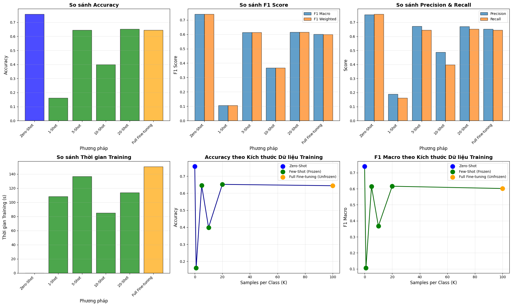

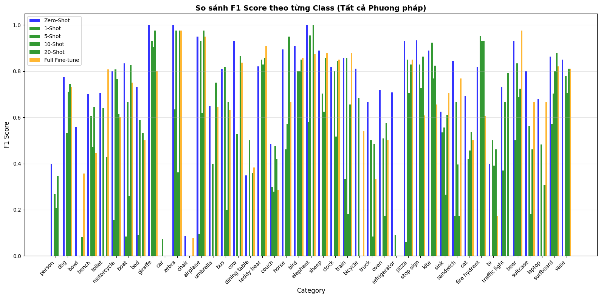

*Hình: Xu hướng thay đổi metrics theo K. Quan sát: performance tăng mạnh từ k=1 đến k=5, sau đó có diminishing returns.*

**Quan sát**:

-   Accuracy tăng mạnh từ k=1 (16%) lên k=5 (64.5%)

-   Từ k=5 trở đi, accuracy gần như không tăng (k=5: 64.5%, k=20: 65.2%)

-   Full fine-tuning (k=100) cũng chỉ đạt 64.4%, tương đương k=5

-   Điều này chứng tỏ: **k=5 đã đủ để đạt performance tốt** với frozen backbone

### Confusion Matrices

Hình 25 trình bày confusion matrices cho ba phương pháp đại diện: Zero-shot, 5-shot (frozen), và Full fine-tuning (unfrozen).

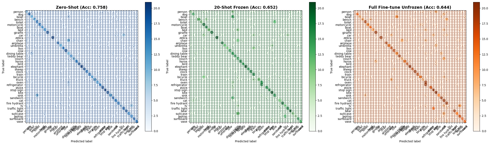

**Phân tích**:

-   **Zero-shot**: Đường chéo chính rất nổi bật, ít confusion giữa các classes. Cho thấy CLIP pretrained phân biệt tốt các categories COCO.

-   **5-shot**: Có một số confusion tăng lên so với zero-shot, đặc biệt ở các classes tương tự nhau (ví dụ: chair vs couch, car vs truck).

-   **Full fine-tuning**: Tương tự 5-shot, không cải thiện đáng kể về confusion patterns.

### Per-class Performance

Phân tích chi tiết F1 score của từng category
(Hình 26) cho thấy:


#### Top-performing classes (F1 \> 0.9)

-   **giraffe**, **zebra**, **elephant**: Động vật có đặc điểm ngoại hình độc nhất

-   **airplane**, **train**: Phương tiện lớn, dễ phân biệt

-   **stop sign**, **pizza**: Có pattern rõ ràng

#### Challenging classes (F1 \< 0.5)

-   **chair**: Bị nhầm với bench, couch do cùng là đồ nội thất

-   **person**: Xuất hiện trong nhiều context khác nhau

-   **bowl**, **cup**: Nhỏ, khó phân biệt trong ảnh

## Kết luận {#subsec:conclusion}

### Tổng kết Kết quả

Qua thực nghiệm so sánh ba phương pháp phân loại đa phương thức trên COCO dataset, chúng tôi rút ra các kết luận sau:

1.  **Zero-shot CLIP cực kỳ mạnh** cho COCO dataset (75.8% accuracy), vượt trội hơn cả fine-tuning. Điều này chứng tỏ CLIP pretrained đã học được biểu diễn tốt cho các object categories phổ biến.

2.  **Few-shot learning hiệu quả với ít dữ liệu**. Chỉ với 5 samples/class, model đã đạt 64.5% accuracy, cải thiện đáng kể so với 1-shot (16.2%).

3.  **Diminishing returns khi tăng k**: Performance gần như không thay đổi từ k=5 đến k=20, cho thấy k=5 đã đủ để học được pattern cơ bản.

4.  **Hệ lụy của Full Fine-tuning trên dữ liệu nhỏ**: Việc unfreeze toàn bộ mạng backbone khổng lồ trên lượng dữ liệu ít ỏi không mang lại cải thiện. Thay vào đó, nó gây ra hiện tượng **\"Quên thảm khốc\" (Catastrophic Forgetting)**, khiến mô hình đánh mất năng lực tổng quát hóa nguyên bản và rơi vào trạng thái quá khớp (overfitting) cục bộ.

### Trade-offs giữa các Phương pháp

**Bảng:** So sánh Trade-offs

| **Tiêu chí** | **Zero-Shot** | **Few-Shot** | **Full Fine-tune** |
| --- | --- | --- | --- |
| Training data | Không cần | Ít (5-20/class) | Nhiều (100+/class) |
| Training time | 0s | Phút | Giờ |
| Accuracy | Tốt (75.8%) | Khá (64.5%) | Khá (64.4%) |
| Resource cost | Thấp | Trung bình | Cao |
| Deployment speed | Tức thì | Nhanh | Chậm |
| Customization | Không | Có hạn | Toàn diện |
| Overfitting risk | Không có | Thấp | Cao |


### Khuyến nghị Sử dụng

#### Khi nào dùng Zero-shot?

-   Không có dữ liệu labeled

-   Cần triển khai nhanh, không có thời gian training

-   Task gần với CLIP pretraining (object recognition trên ảnh tự nhiên)

-   Cần phân loại các classes mới liên tục

#### Khi nào dùng Few-shot (Frozen)?

-   Có ít dữ liệu labeled (5-20 samples/class)

-   Muốn cải thiện performance so với zero-shot

-   Thời gian training giới hạn (vài phút)

-   Muốn giữ lại generalization capability của CLIP

#### Khi nào dùng Full Fine-tuning (Unfrozen)?

-   Có nhiều dữ liệu labeled (100+ samples/class)

-   Task khác xa CLIP pretraining (medical images, satellite imagery, etc.)

-   Có GPU và thời gian để train toàn bộ model

-   Zero-shot và few-shot không đạt yêu cầu

### Hướng Phát triển

Một số hướng cải thiện tiềm năng:

1.  **Prompt engineering**: Thay vì chỉ sử dụng template đơn giản `"a photo of a {category}"`, có thể thử các dạng prompt phong phú hơn nhằm tận dụng tối đa năng lực ngôn ngữ của CLIP để nâng cao hiệu năng Zero-shot. Ví dụ:

    -   `"a photo of a {category}, a type of animal/vehicle/object"` (cung cấp ngữ cảnh siêu phạm trù)

    -   `"a clear photo of {category} in natural lighting"` (mô tả điều kiện chụp)

    -   **Prompt Ensembling**: Kết hợp dự đoán từ nhiều template prompt khác nhau và lấy trung bình vector text embedding, thay vì chỉ dùng một template duy nhất. Phương pháp này được OpenAI sử dụng trong bài báo gốc của CLIP và cho thấy cải thiện đáng kể so với single-template.

2.  **Data augmentation**: Tăng cường dữ liệu cho few-shot learning

3.  **Adapter tuning**: Thay vì full fine-tuning, chỉ thêm các adapter layers nhỏ

4.  **Knowledge distillation**: Dùng zero-shot làm teacher cho few-shot student

5.  **Ensemble methods**: Kết hợp predictions từ nhiều phương pháp

# Tổng kết Bài tập lớn

Bài tập lớn \"Học sâu và ứng dụng trong thị giác máy tính\" đã hoàn thành trọn vẹn mục tiêu đánh giá và đối sánh toàn diện năng lực của các nền tảng kiến trúc mạng nơ-ron tiêu biểu hiện nay. Xuyên suốt quá trình thực hiện, nhóm đã tiến hành khảo sát trên ba miền dữ liệu đặc thù, ứng dụng thành công các kỹ thuật học chuyển giao (Transfer Learning), tinh chỉnh (Fine-tuning) và đánh giá khả năng mô hình hóa:

-   **Phân loại Văn bản (Text Classification):** Đối sánh hiệu năng giữa kiến trúc truy hồi truyền thống **Bi-LSTM** (kết hợp không gian nhúng từ phân tán GloVe) và Mô hình ngôn ngữ lớn **BERT**. Kết quả làm nổi bật sự chênh lệch về năng lực biểu diễn ngữ cảnh toàn cục của cơ chế Tự chú ý (Self-Attention) bên trong Transformer so với khả năng đọc chuỗi tuần tự của LSTM.

-   **Phân loại Ảnh (Image Classification):** Tiến hành thực nghiệm đối chiếu ba trường phái: xây dựng mạng **Custom CNN (Pre-activation ResNet)** từ đầu, tinh chỉnh toàn bộ mạng sâu **ResNet18 Fine-tuning**, và sử dụng **Vision Transformer (ViT)** như một bộ trích xuất đặc trưng tĩnh (Frozen Backbone). Kết quả khẳng định việc tinh chỉnh toàn bộ mô hình (Fine-tuning) đóng vai trò sống còn đối với độ phân giải thấp ($32 \times 32$), trong khi ViT thể hiện tiềm năng không gian biểu diễn cực cao kể cả khi bị đóng băng.

-   **Phân loại Đa phương thức (Multimodal Classification):** Khai thác sức mạnh của mô hình nền tảng **CLIP (Contrastive Language-Image Pretraining)**. Việc đánh giá ba chiến lược: **Zero-shot, Few-shot** và **Full Fine-Tuning** đã chứng minh nguyên lý hội tụ của không gian biểu diễn ngôn ngữ-thị giác, mở ra tiềm năng thiết lập các hệ thống tìm kiếm và nhận dạng vật thể dựa trên văn bản với lượng dữ liệu gắn nhãn tối thiểu.

Bên cạnh việc hoàn thiện các tiêu chuẩn kỹ thuật cốt lõi (60% yêu cầu), báo cáo còn tích hợp nhiều khía cạnh mở rộng mang tính học thuật cao (40% yêu cầu), cụ thể:

1.  **Khả năng diễn giải mô hình (Explainable AI):** Kỹ thuật **Grad-CAM** được áp dụng thành công trên dữ liệu hình ảnh nhằm trực quan hóa \"điểm nhìn\" của hai kiến trúc CNN và ViT. Quá trình này đã lý giải thành công hiện tượng \"nhầm lẫn ngữ nghĩa\" do tính cục bộ của các mạng tích chập.

2.  **Đánh giá dựa trên Ma trận nhầm lẫn (Confusion Matrix Profiling):** Ở từng bài toán, báo cáo đi sâu vào các lớp phân loại dễ gây nhiễu nhằm minh họa việc đạt độ chính xác cao không đồng nghĩa với khả năng bắt nhịp mọi dạng phân bố của dữ liệu.

3.  **Tối ưu hóa chiến lược huấn luyện:** Triển khai thành công các thuật toán bổ trợ tự động như Bộ giảm tốc độ học động (`ReduceLROnPlateau`) và Dừng sớm (`Early Stopping`), kết hợp cùng kỹ thuật tăng cường dữ liệu (Data Augmentation) mạnh mẽ để kiểm soát Quá khớp (Overfitting).

Tựu chung lại, nghiên cứu này không chỉ đáp ứng hoàn chỉnh các yêu cầu kỹ thuật tiên quyết được giao mà còn góp phần nâng cao tư duy thiết kế, xử lý lỗi và đào sâu đánh giá chất lượng mô hình. Kết quả thu được tạo tiền đề vững chắc cho việc học tập, thiết kế hệ thống AI Đa phương thức
trong quá trình nghiên cứu sâu hơn.

[^1]: Kaggle COCO Dataset:
    <https://www.kaggle.com/datasets/awsaf49/coco-2017-dataset>
