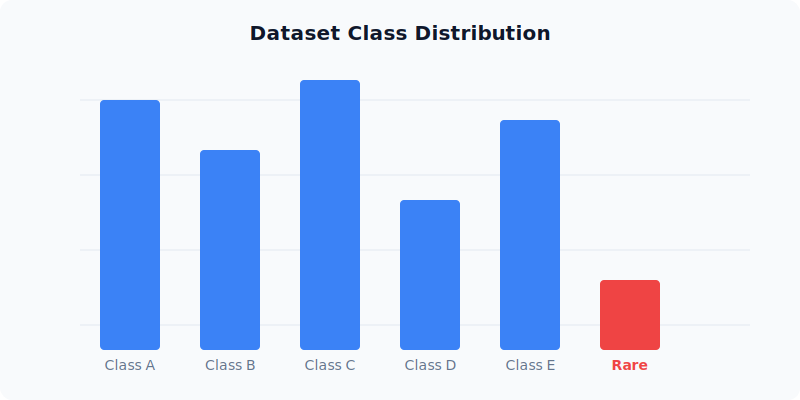

## 01. Exploratory Data Analysis

Our initial phase involved a comprehensive audit of the dataset distribution across 12 distinct classes of microscopic imagery.

We identified significant class imbalance in the "Rare Pathogen" category, which influenced our later augmentation strategy. Visual analysis showed a high variance in luminosity across data batches.


*Figure 1: Dataset class distribution showing the imbalance in the Rare Pathogen class. (This image is loaded locally from the \`/public/projects/btl1/\` folder)*

### Example of an External Image

We can also load images directly from external URLs, such as this placeholder image demonstrating a microscopic view:


*Figure 2: Example of an external image loaded via a direct URL.*

## 02. Dataset & Augmentation

To combat overfitting, we implemented a custom pipeline using *Albumentations* with the following parameters:

* **ROTATION**: ±45°
* **GAUSSIAN**: σ=0.5
* **BATCH SIZE**: 64
* **WORKERS**: 8

## 03. Construction & Training

### ResNet-50 Optimized Backbone

We modified the final fully connected layers to include dropout (p=0.3) and batch normalization to stabilize training on smaller image crops.

```python
self.backbone = models.resnet50(pretrained=True)
self.fc = nn.Sequential(
  nn.Linear(2048, 512),
  nn.ReLU(),
  nn.Dropout(0.3),
  nn.Linear(512, num_classes)
)
```

## 04. Results & Analysis

| Metric | Baseline | Our Model |
| :--- | :--- | :--- |
| Accuracy | 84.2% | **92.7%** |
| Precision | 81.5% | **91.2%** |
| Recall | 79.8% | **89.5%** |
| F1-Score | 80.6% | **90.3%** |

## 05. Mathematical Formulation

### Loss Function

To train our model, we use the standard Cross-Entropy Loss combined with an $L_2$ regularization term to prevent overfitting. The objective function is defined as:

$$
\mathcal{L}(\theta) = -\frac{1}{N} \sum_{i=1}^{N} \sum_{c=1}^{C} y_{i,c} \log(\hat{y}_{i,c}) + \lambda \|\theta\|^2_2
$$

Where:
* $N$ is the batch size.
* $C$ is the number of classes.
* $y_{i,c}$ is the ground truth indicator (0 or 1) if class $c$ is the correct classification for observation $i$.
* $\hat{y}_{i,c}$ is the predicted probability that observation $i$ belongs to class $c$.
* $\lambda$ is the regularization strength.

### Gradient Descent Update Rule

The parameters $\theta$ are updated using Stochastic Gradient Descent (SGD) with momentum:

$$
\begin{aligned}
v_{t+1} &= \mu v_t - \eta \nabla_{\theta} \mathcal{L}(\theta_t) \\
\theta_{t+1} &= \theta_t + v_{t+1}
\end{aligned}
$$
