# HỌC SÂU VÀ ỨNG DỤNG TRONG THỊ GIÁC MÁY TÍNH

**Đề bài tập lớn cho Nhóm 4 - Bài tập lớn số 2**

> **GVHD:** TS. Lê Thành Sách
>
> **SV thực hiện:**
> - Nguyễn Hữu Trưởng - 2470573
> - Nguyễn Nhật Thanh - 2570316
> - Võ Thị Bích Phượng - 2470570

---

# 1. Giới thiệu

Báo cáo này trình bày kết quả thực hiện Bài tập lớn số 2 trong khuôn khổ môn học Học sâu và Ứng dụng trong Thị giác máy tính. Theo yêu cầu đề bài, sinh viên áp dụng kiến thức mạng học sâu để giải quyết một trong ba bài toán cốt lõi của thị giác máy tính: **Phân loại ảnh (Image Classification), Phát hiện đối tượng (Object Detection), hoặc Phân vùng ngữ nghĩa (Semantic Segmentation)**. Đồng thời, đề bài yêu cầu hiện thực hóa đầy đủ quy trình xử lý từ đầu đến cuối (End-to-End Pipeline), bao gồm: Phân tích Dữ liệu Khám phá (EDA), thiết lập DataLoader tích hợp kỹ thuật Augmentation, huấn luyện mô hình, đánh giá chỉ số hiệu năng và phân tích lỗi (Error Analysis).

Dựa trên các yêu cầu trên, nhóm quyết định chọn bài toán **Phát hiện đối tượng (Object Detection)**. Lý do xuất phát từ tính ứng dụng cao và tính thách thức của bài toán trong các hệ thống công nghiệp hiện đại, đặc biệt trong lĩnh vực xe tự hành (Autonomous Driving). Mục tiêu cốt lõi là phân tích chi tiết kiến trúc và so sánh hiệu năng giữa hai trường phái phát hiện đối tượng: kiến trúc One-stage (**YOLOv8**) và kiến trúc Two-stage (**Faster R-CNN** với backbone ResNet50-FPN). Ngoài ra, nhóm mở rộng nghiên cứu sang kiến trúc Transformer-based (**DETR**) nhằm so sánh phương pháp trích xuất đặc trưng CNN với cơ chế Self-Attention.

Tập dữ liệu được sử dụng là **KITTI** --- bộ dữ liệu chuẩn quốc tế phục vụ nghiên cứu các bài toán thị giác máy tính trong kịch bản giao thông thực tế. Các phần tiếp theo trình bày chi tiết quy trình thực hiện, từ phân tích dữ liệu, thiết kế mô hình, đến đánh giá và so sánh kết quả thực nghiệm.

---

# 2. Cơ sở Lý thuyết

## 2.1. Bài toán Phát hiện đối tượng (Object Detection)

Phát hiện đối tượng là một trong những bài toán cốt lõi của Thị giác máy tính (Computer Vision), đòi hỏi máy tính không chỉ xác định xem có những loại vật thể nào xuất hiện trong hình ảnh (Image Classification - Phân loại ảnh), mà còn phải định vị chính xác và bao bọc các vật thể đó thông qua hệ tọa độ của các Hộp bao (Bounding Boxes). Đầu ra thông thường của một thuật toán Object Detection bao gồm một danh sách các hộp giới hạn, mỗi hộp được gắn liền với một nhãn phân loại (Class label) và điểm tin cậy xác suất (Confidence score).

## 2.2. Các Chỉ số Đánh giá Cốt lõi

Để đo lường định lượng và so sánh công bằng độ chính xác lẫn hiệu năng của thuật toán phát hiện đối tượng, cộng đồng nghiên cứu quy chiếu dựa trên một hệ thống các chuẩn đo lường quốc tế:

### 2.2.1. Ma trận nhầm lẫn (Confusion Matrix) trong phát hiện đối tượng

Khác với phân loại ảnh thông thường, việc xác định đúng/sai (True/False) trong Object Detection dựa vào chỉ số **IoU (Intersection over Union)** – tỷ lệ diện tích phần giao nhau chia cho diện tích phần hợp tập của hộp dự đoán (Predicted Box) và hộp thực tế (Ground-truth Box). Nếu IoU vượt qua một ngưỡng quy định (Threshold, thường là $0.5$), dự đoán được xem là khớp. Từ sự đối soát này, hệ thống sản sinh:

- **True Positive (TP):** Mô hình phát hiện chính xác vật thể, phân loại đúng nhãn dán, và khung Bounding Box ôm sát với độ chồng lấp $IoU \ge Threshold$.
- **False Positive (FP - Báo động giả):** Mô hình nhận diện sai một vật thể (ví dụ: ảnh nền rác bị nhận diện nhầm, dự đoán sai lớp, hoặc khung bao bị lệch nát khiến $IoU < Threshold$).
- **False Negative (FN - Bỏ lỡ):** Mô hình hoàn toàn "bỏ qua" một vật thể có thực trong ảnh, không sinh ra dự đoán nào hoặc sinh ra nhưng bị vứt bỏ lập tức vì độ tin cậy quá thấp.
- *Lưu ý:* **True Negative (TN)** (không có xe và mô hình bảo không có) không được xem xét sử dụng để đo đạc vì số lượng hộp bao trống (background boxes) trên ảnh là vô hạn, làm nhiễu mẫu số.

### 2.2.2. Precision, Recall và F1-Score

Trong bài toán xe tự hành, tồn tại một sự đánh đổi quan trọng (Trade-off) giữa độ đo Precision và Recall:

- **Precision (Độ chuẩn xác):** $Precision = \frac{TP}{TP + FP}$. Tỷ lệ này biểu thị: trong 100 vật thể thuật toán "tự tin khoanh vùng", thực sự có bao nhiêu đồ vật là thật. Lỗi FP cao (nhận diện cột điện thành gã đi bộ) khiến Precision giảm mạnh, khiến xe tự lái sẽ phanh gấp liên tục gây sốc an toàn.
- **Recall (Độ phủ):** $Recall = \frac{TP}{TP + FN}$. Thông số biểu thị: trong 100 vật thể *thực sự đang đứng trên đường*, thuật toán gom bắt được bao nhiêu cái. Lỗi FN cao (bỏ sót chiếc xe tải) khiến Recall trượt dài, xe tự lái có nguy cơ gây va chạm do không kịp tránh né.
- **F1-Score:** Là trung bình điều hòa của cả hai ($F1 = 2 \times \frac{Precision \times Recall}{Precision + Recall}$). Một mô hình thương mại xuất sắc phải giữ vững khả năng dự đoán cân bằng để đạt chỉ số F1 tốt nhất.

### 2.2.3. Average Precision (AP) và Mean Average Precision (mAP)

Hai mô hình sở hữu F1-score giống nhau nhưng hành vi phản ứng điểm tin cậy lại rất khác biệt. Để đánh giá đường dài toàn diện, **Precision-Recall Curve (Đường cong PR)** được vẽ ra nhờ cơ chế quét thử các dự đoán từ mốc Confidence cực đại xuống thấp nhất:

- **AP (Average Precision):** Là tổng diện tích phân bổ nằm dưới đường cong PR của *một phân lớp cụ thể* (Ví dụ: AP của Class Car, AP của Class Cyclist). Tính tích phân đồ thị này càng lấp đầy tiệm cận mốc 1.0 (100%) thì mạng thu nạp đối tượng đó càng hoàn hảo.
- **mAP (Mean Average Precision):** Trung bình cộng của chuẩn điểm AP trên *tất cả các nhãn lớp* có trong tập dữ liệu (KITTI có 8 lớp).
- **Chuẩn đo lường khắt khe mAP@0.5:0.95:** Theo hệ quy chuẩn giám định đo lường tân tiến của COCO, việc cố định IoU ở mức $0.5$ là khá lỏng lẻo. Chuẩn đánh giá khắt khe mAP@0.5:0.95 sẽ lấy trung bình điểm mAP tích phân tính toán qua 10 biến ngưỡng IoU liên tiếp nâng dần lên (0.50, 0.55, 0.60, ... 0.95). Chỉ số này làm giảm điểm nặng nề với các thuật toán dán nhãn định danh trúng đối tượng nhưng kết cấu vẽ viền khung thừa thải, không thiết thực nội tiếp thân xe.

### 2.2.4. Chỉ số Hiệu suất Phần cứng (Hardware Performance Metrics)

Bên cạnh độ mẫn cảm bắt dính hộp ảnh, hao phí tài nguyên đóng vai trò tối thượng khi triển khai lên máy tính biên (Jetson, Raspberry Pi) của xe tự lái:

- **FPS (Frames Per Second):** Số lượng khung hình (frames) mà mô hình xử lý được trong 1 giây. Ngưỡng $FPS \ge 30$ được coi là yêu cầu tối thiểu để đạt chuẩn xử lý thời gian thực (Real-time) trong các ứng dụng xe tự hành.
- **GFLOPs (Giga Floating-point Operations):** Tổng số phép toán dấu phẩy động (tính bằng tỷ đơn vị) mà mô hình cần thực thi để xử lý một ảnh đầu vào. Giá trị GFLOPs càng thấp cho thấy kiến trúc mạng càng hiệu quả về mặt tính toán, phù hợp hơn cho các thiết bị biên có tài nguyên hạn chế (Edge Devices).

## 2.3. Phân loại Kiến trúc: Mạng One-stage và Two-stage

Các phương pháp Object Detection dựa trên học sâu hiện nay được chia thành hai nhóm kiến trúc chính:

- **Two-stage Detection (Điển hình: Dòng họ R-CNN):** Quá trình phát hiện chia làm 2 giai đoạn tuần tự. Giai đoạn 1 sử dụng mạng đề xuất vùng (Region Proposal Network -- RPN) để sinh ra hàng ngàn vùng ứng viên có khả năng chứa vật thể. Giai đoạn 2 trích xuất đặc trưng từ các vùng ứng viên này để phân loại nhãn và tinh chỉnh tọa độ bounding box. Ưu điểm: độ chính xác cao nhờ cơ chế tinh chỉnh hai lần. Nhược điểm: tốc độ inference chậm do phải xử lý tuần tự qua hai giai đoạn.
- **One-stage Detection (Điển hình: YOLO, SSD):** Mô hình dự đoán trực tiếp tọa độ bounding box và nhãn phân loại trong một lần lan truyền thuận (forward pass) duy nhất. Ảnh đầu vào được chia thành lưới ô (Grid Cell), mỗi ô đồng thời dự đoán hộp bao và xác suất phân lớp. Kiến trúc đơn giản hơn giúp giảm đáng kể số lượng tham số và đạt tốc độ xử lý thời gian thực (Real-time Inference).

### Bảng tổng hợp so sánh kiến trúc One-stage và Two-stage Detection

| Tiêu chí | Two-stage (Faster R-CNN) | One-stage (YOLOv8) |
| --- | --- | --- |
| Số giai đoạn xử lý | 2 giai đoạn tuần tự (RPN → Classifier) | 1 giai đoạn duy nhất (End-to-end) |
| Backbone | ResNet50 + FPN | CSPDarknet + PANet |
| Cơ chế phát hiện | Region Proposal → RoI Align → Classification | Grid-based, Anchor-free, dự đoán trực tiếp trên multi-scale feature maps |
| Chiến lược Anchor | Anchor-based (nhiều scale & ratio) | Anchor-free (Center-based regression) |
| Hậu xử lý (NMS) | Cần NMS | Cần NMS (nhưng ít box hơn) |
| Hàm Loss | Cross-Entropy + Smooth L1 | CIoU + DFL + BCE |
| Độ chính xác (mAP) | Cao hơn, đặc biệt ở IoU cao | Thấp hơn nhẹ, nhưng cạnh tranh |
| Tốc độ (FPS) | Chậm (~7 FPS trên Tesla T4) | Nhanh (~45 FPS trên Tesla T4) |
| Số tham số | ~41.5M | ~25.9M |
| Phù hợp ứng dụng | Phân tích y tế, kiểm tra chất lượng | Xe tự hành, giám sát thời gian thực |

---

# 3. Phân tích Dữ liệu Khám phá (EDA)

## 3.1. Tổng quan và Cấu trúc tập dữ liệu KITTI

KITTI (Karlsruhe Institute of Technology and Toyota Technological Institute) là bộ dữ liệu khổng lồ thu thập từ xe Mobile Platform gắn nhiều camera màu, camera xám quang phổ rộng và cảm biến Lidar tích hợp GPS. Phiên bản Object Detection (2D) bao gồm 7,481 ảnh huấn luyện (*training set*) và 7,518 ảnh phục vụ suy luận (*testing set*).

Hệ thống nhãn gốc của KITTI định nghĩa 8 lớp chính bao gồm: *Car, Van, Truck, Pedestrian, Person_sitting, Cyclist, Tram, Misc* cùng lớp *DontCare* chuyên phục vụ cho các vùng chứa đối tượng nằm ngoài giới hạn quan tâm (quá xa, biến dạng cực mạnh hoặc che khuất hoàn toàn) nhằm giảm trừ hình phạt cho các hàm Loss trong pha huấn luyện.

## 3.2. Phân tích Phân phối Hình thái học (Morphological Data Visualization)

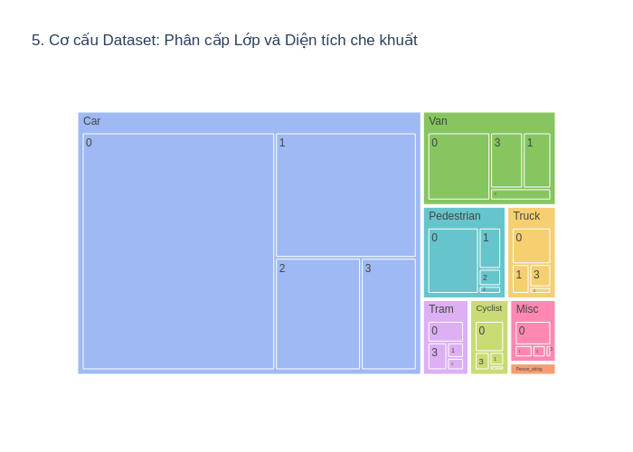

**Nhận xét:** Bộ biểu đồ phơi bày rõ hiện tượng mất cân bằng dữ liệu cực đoan đặc trưng của giao thông đường phố tự nhiên (Long-tail Class Distribution). Lớp `Car` chiếm ưu thế thống trị tuyệt đối về cả số lượng lẫn diện tích điểm ảnh, theo sau là `Pedestrian`. Ngược lại, các nhãn như `Tram` (xe điện), `Person_sitting` nằm gọn ở khu vực đuôi dài với tỷ trọng chưa tới 1%. Sự chênh lệch này là mối nguy hiểm tiềm tàng, khiến mô hình sinh ra "thiên kiến ưu tiên" (Algorithmic Bias) — chúng sẽ phớt lờ hoàn toàn các lớp thiểu số để tối ưu hóa hàm mất mát tổng thể trên tập mẫu đa số.

**Giải pháp đề xuất:** Nếu sử dụng hàm *Cross-Entropy* tiêu chuẩn, Gradient truyền ngược qua chu kỳ học sẽ bị chi phối hoàn toàn bởi `Car`. Thiết kế cấu hình mạng bắt buộc phải tích hợp **Focal Loss** nhằm tự động giảm trọng số của các nhãn dễ đoán và ép mạng nơ-ron bù đắp hội tụ học đặc trưng của nhóm thiểu số. Đồng thời, kỹ thuật **Class-Aware Sampling** (tăng cường bốc mẫu lặp lại ưu tiên các ảnh chứa `Tram` hoặc `Cyclist`) là yêu cầu tiền đề để điều chỉnh cân bằng lại không gian đại diện dữ liệu kích hoạt trước khi đưa qua Backbone.

---

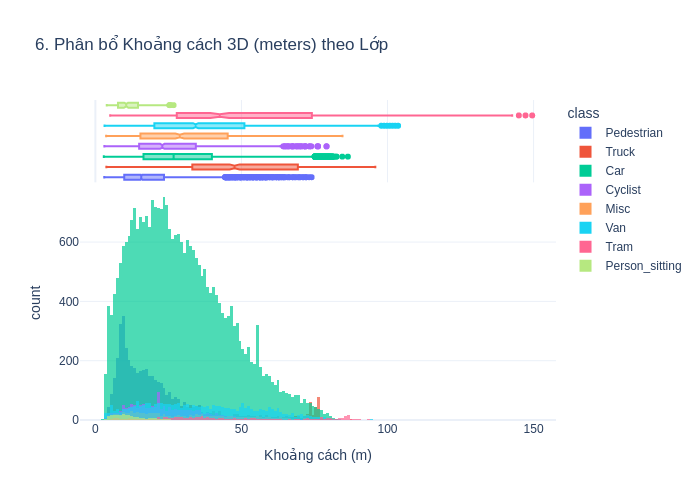

**Nhận xét:** Tương quan khoảng cách Z-depth tiết lộ vùng tập trung sinh thái của dữ liệu: mật độ đối tượng đạt đỉnh (Peak Density) trong giới hạn quan sát từ 10 mét đến 30 mét. Ở khoảng cách cận cảnh (dưới 20 mét), `Pedestrian` xuất hiện dày đặc quanh mép kính chắn gió. Tuy nhiên, từ mốc 50 mét trở lên, tín hiệu bị suy giảm dốc đứng (Exponential Decay). Ở cự ly này, kích thước vật lý của một chiếc xe hơi trên ảnh thu hẹp chỉ còn vài chục pixel vuông, đánh mất toàn bộ đặc trưng kết cấu (texture) bề mặt phản quang.

**Giải pháp đề xuất:** Tại độ phân giải lưới gốc, việc ép các mạng CNN sâu phải phân giải vật lý cho đối tượng dính nhiễu mờ chuyển động (Motion Blur) ở cự ly viễn cảnh xa sẽ gây loãng thông lượng, phá hỏng tính hội tụ mAP. Hệ thống DataLoader huấn luyện cần cơ chế chủ động kiểm duyệt: Chuyển toàn bộ các Bounding Box mục tiêu ở cự ly quá lớn hoặc có chiều cao pixel $< 25px$ thành dải nhãn loại trừ `DontCare`.

---

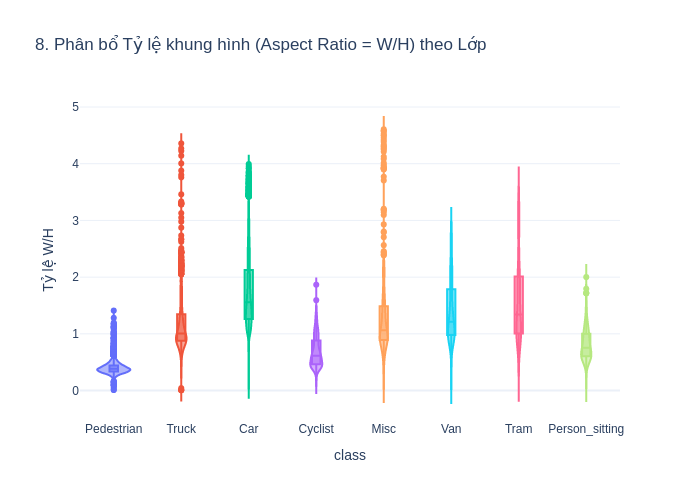

**Nhận xét:** Khai phá không gian hình học thông qua chỉ số (Aspect Ratio = Width / Height) bằng Violin Plot minh chứng vùng phân mảnh hình thái cực kỳ sắc nét:

- **Khối Cấu trúc thẳng đứng (Vertical-oriented):** Lớp nhãn `Pedestrian` và `Cyclist` phình to ở phần đáy biểu đồ. Cơ thể con người tạo ra tỷ lệ khung hình gầy dọc, dải giá trị tập trung tiệm cận phân khúc $AR \approx 0.3 - 0.5$.
- **Khối Cấu trúc trải ngang (Horizontal-oriented):** Dòng phương tiện cơ giới hạng trung (`Car, Van, Truck`) phân phối trôi bạt hẳn lên trên tạo đỉnh nhọn nhô ngang. Thiết kế khí động lực mui xe làm dải khung hình biến thiên kéo giãn biên độ vắt ngang từ $1.5 - 3.0$.

**Giải pháp đề xuất:** Đứng trước phổ dãn cách hình dạng (Morphological gap) cực đoan giữa hai thái cực, việc lạm dụng lưới Anchor Box mặc định từ bộ trọng số cấu hình pre-trained COCO gây sai số căn bản. Biện pháp khắc phục lỗi này là tái ứng dụng **K-Means++ Clustering Analysis** trên tập Bounding Box của KITTI để trích xuất ra một bộ Anchors độc bản riêng biệt.

---

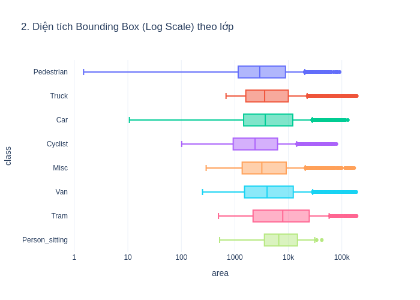

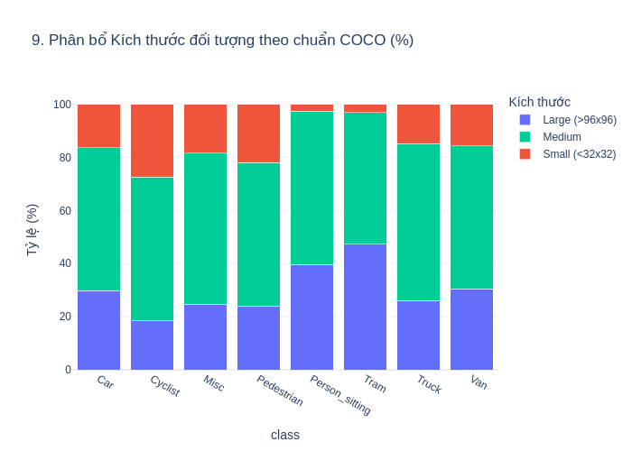

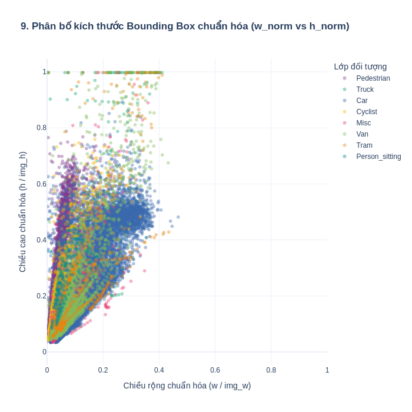

**Nhận xét:** Biểu đồ *Log-scale Area* và *COCO Size Distribution* phơi bày một thách thức kỹ thuật lớn: có tới hơn 30% đối tượng thuộc nhóm **Small** ($< 32 \times 32$ px). Đặc biệt là lớp `Pedestrian` và `Cyclist` có tỷ lệ đối tượng nhỏ rất cao, khiến chúng dễ bị triệt tiêu tín hiệu sau khi đi qua các lớp Pooling sâu của CNN.

## 3.3. Tương quan Phối cảnh và Khoảng cách (Spatial Perspectives)

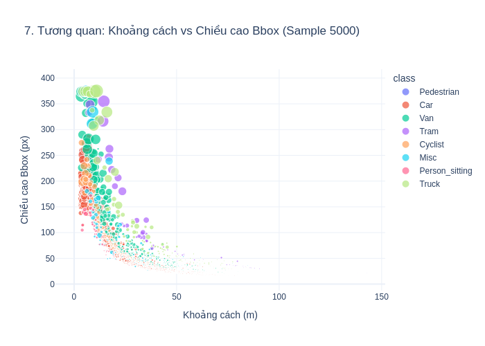

**Nhận xét:** Tương quan giữa khoảng cách thực tế (D) và chiều cao pixel (H) tuân thủ chặt chẽ quy luật hình học phối cảnh. Khi $D > 50m$, chiều cao vật thể hội tụ về dải cực thấp ($< 50px$). Điều này củng cố nhu cầu về các kiến trúc **Feature Pyramid Network (FPN)** để duy trì độ phân giải cao cho các tầng đặc trưng sớm, hỗ trợ phát hiện các vật thể ở xa trước khi chúng bị bão hòa thông tin.

## 3.4. Phân bổ Không gian và Tọa độ (Coordinate Analysis)

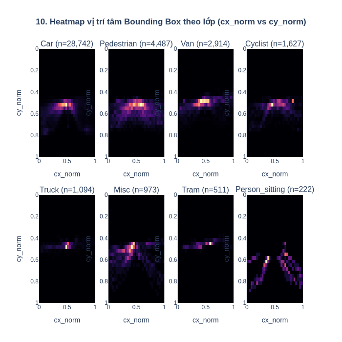

**Nhận xét:** Bản đồ nhiệt vị trí tâm bộc lộ tính quy luật trong giao thông:
- Các lớp phương tiện (`Car, Truck, Van`) tập trung cao độ tại dải $cy \approx 0.5 - 0.6$ (mặt đường chính).
- Lớp `Pedestrian` và `Cyclist` có xu hướng xuất hiện rải rác hơn ở hai bên biên trái/phải, phản ánh vị trí trên vỉa hè hoặc làn đường thô sơ.

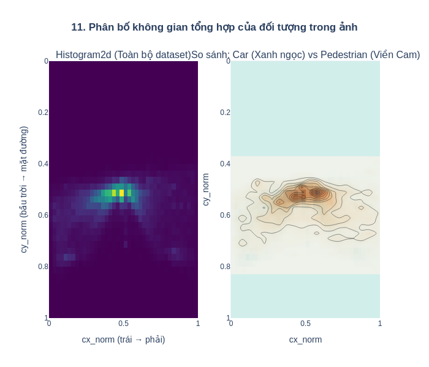

## 3.5. Ma trận Tương quan các Đặc trưng Số (Statistical Correlation)

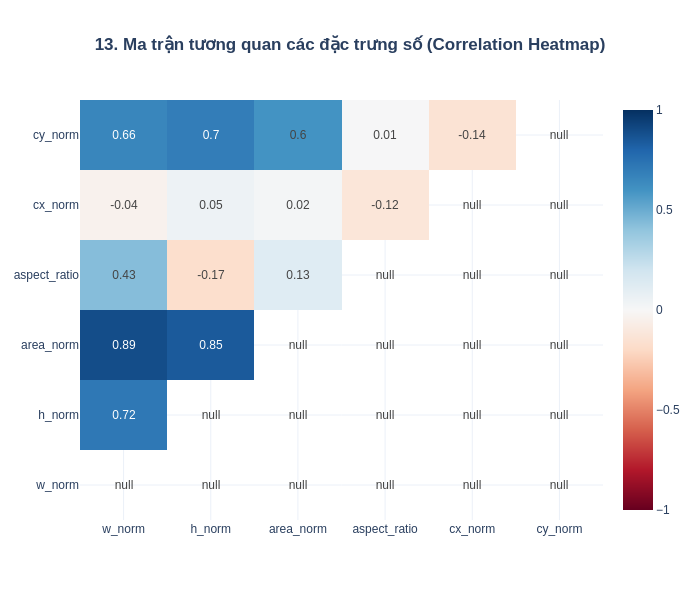

**Nhận xét:** Ma trận tương quan xác nhận hệ số tương quan rất cao ($r \approx 0.89$) giữa `area_norm` và `h_norm`, điều này cho thấy chiều cao là biến số chi phối diện tích mạnh hơn chiều rộng trong KITTI. Đồng thời, biến `cy_norm` (tọa độ Y) có tương quan chặt với kích thước, minh chứng cho việc vật thể càng ở thấp (gần xe hơn) thì càng lớn.

---

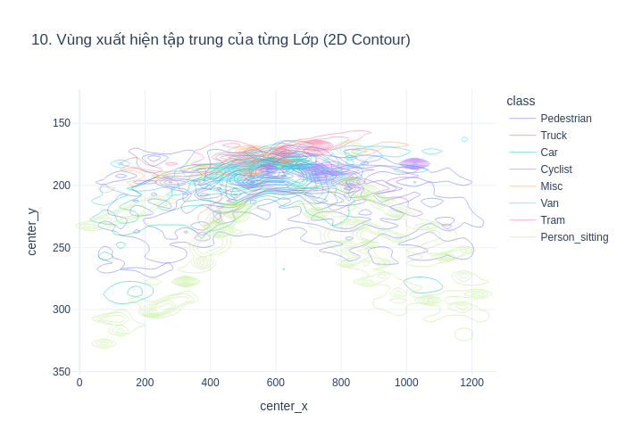

**Nhận xét:** Bản đồ Contour Heatmap cho ta phác thảo sự chi phối của quy luật Quang học - Tọa độ hoàn toàn khác xa so với các dataset nhiếp ảnh máy tính (Computer Vision) thông thường. Giao thông tuân theo *Luật Phối Hình Đồng Quy* (Perspective Projection): Mọi phương tiện `Car` được máy ảnh chụp hút tạo thành luồng giao thông đậm đặc chĩa thẳng hội tụ vào Điểm triệt tiêu (Vanishing Point) ngay giữa ranh giới chân trời ảnh. Trong khi đó, nhóm `Pedestrian` phân mảnh vụn theo vạt lề trải rộng về nửa vùng đáy y-axis đổ xuống. **Hơn thế nữa, mảng 30% không gian vùng trên cao bầu trời hoàn toàn là điểm chết (Dead Zone) không lưu giữ thuộc tính điểm ảnh hình khối.**

**Giải pháp đề xuất:** Sự thiên vị hội tụ tập trung tạo nên nguyên cớ sinh "Thiên kiến Tọa độ điểm mù" - Model CNN sẽ học vẹt khu vực vị trí X và Y tọa độ để phán đoán xe, suy giảm nhận diện đường vòng, góc chuyển chéo. Áp dụng kỹ thuật điều chuyển mạnh **Random Affine Translation** và **Mosaic Augmentation** phá vỡ không gian, phân tách đối tượng nén lại rải rác. Thêm vào chiến lược inference, nếu xây dựng luồng transform **Static Crop ngắt chỏm 30% bầu trời** trước khi ma trận bị nạp lên tensor xử lý phân chập, cơ hội cắt giảm lượng tham số khổng lồ vô ích (FLOPs) giúp mô hình tối ưu gia tốc phần cứng (FPS) lên tầm mức công nghệ nhúng.

## 3.6. Phân tích Ma trận Mật độ Sự cố và Độ Khó Che Khuất (Occlusions)

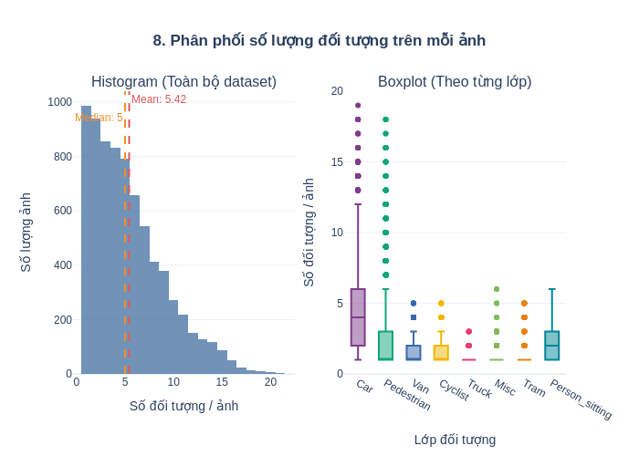

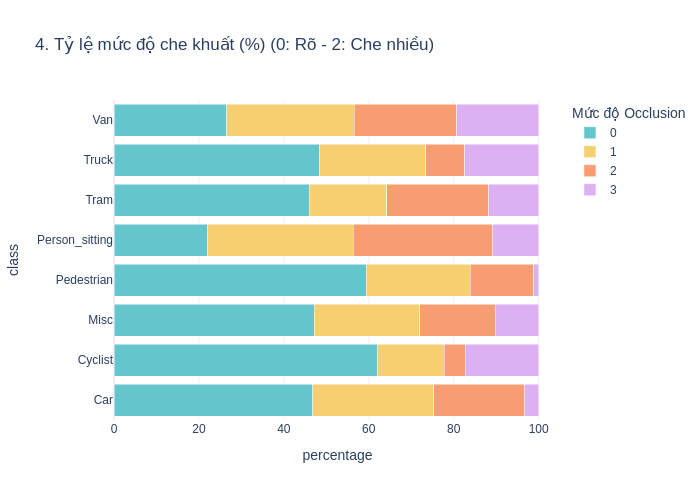

**Phân tích mật độ đối tượng (Crowd Density):** Biểu đồ tần suất Histogram vén màn nghịch lý kịch bản dữ liệu trên đường KITTI: Trục trung tâm tập trung tần suất bình ổn 4-6 thực thể đối tượng/ảnh, nhưng biên phải sở hữu chiếc Đuôi kéo dài đạt tới mức 15-22 đồ vật chi chít trên một Scene. Thông số định lượng này tái hiện bối cảnh các ngã tư ngập xe (Traffic Jam). Trong môi trường chật nghẹt ấy, kiến trúc mạng hai giai đoạn như Faster R-CNN có rủi ro bị bóp nghẹt tài nguyên hệ thống (Out of Memory - OOM) do mạng RPN phải sinh xuất đề xuất quá ngưỡng giới hạn trần trên các tập điểm neo chồng chéo.

**Phân tích hiện tượng che khuất (Occlusion Level):** Tỷ trọng che phủ không hề suy thuyên khi nhóm đối tượng bị khuất bóng cây, vạch kẻ ngang hoặc do thân xe tải ép tuyến lộ diện khá dày đặc (Occluded & Heavily Occluded Level). Với những Box nhãn khuyết mờ đặc điểm này, hệ lụy sụp đổ lớn nhất sẽ xảy ra ngay hệ thống Hậu xử lý tín hiệu (Post-Processing). Khi đoàn xe xếp hàng đỗ dọc theo lộ tuyến với một nửa mui xe trước che lấp vào đuôi xe sau, thuật toán chặn nhiễu NMS (Non-Maximum Suppression) cơ bản sẽ mắc lỗi mù cục bộ. Bài học lớn ở đây là việc bắt buộc chuyển hướng đánh giá sang thuật toán cấu hình phân cực linh hoạt **Soft-NMS** theo hệ số tự giảm dần trọng số điểm rơi hay sử dụng **IoU-aware NMS** mới triệt để gỡ bỏ được cục diện nhiễu khung bao hỗn độn này.

---

# 4. Chuẩn bị Dataset, DataLoader và Dữ liệu đầu vào

## 4.1. Quản lý Dữ liệu và DataLoader

Kế thừa các kết luận từ pha Exploratory Data Analysis, chúng em xây dựng Custom Dataset Class kế thừa từ `torch.utils.data.Dataset` hỗ trợ các giao thức:

- **Cơ chế Collate Function tuỳ chỉnh:** Tối ưu hóa padding linh hoạt để đưa các bức ảnh chụp ở độ phân giải nhỏ, hẹp dọc của KITTI về chiều dài kích thước cố định như `640x640` bằng thư viện OpenCV, giữ nguyên kích thước để không làm méo tỷ lệ diện tích của đối tượng người đi bộ.
- **Gộp lớp - Class Merging (Tùy chọn):** Áp dụng quy hoạch rút gọn từ 8 lớp phân bố lệch về 3 dải phân loại chính yếu (*Vehicle, Person/Biker, Misc*) để giảm nhẹ khó khăn với các biến số che khuất nội vùng.

## 4.2. Kỹ thuật Data Augmentation Nâng cao

Nhóm khai thác thư viện *Albumentations* để áp dụng điều chỉnh phổ rộng trong pha huấn luyện:

- **Khắc phục Che Khuất (Occlusion Resistance):** Sử dụng kỹ thuật `GridMask` và `Cutout`. Mạng nơ-ron được ép phải tìm các cấu trúc phân tách phụ trợ (như cấu trúc viền đèn, hoa văn lưới tản nhiệt) thay vì dựa vào toàn bộ kính chắn gió, tăng tính tự học trên đối tượng mất góc.
- **Khắc phục Thiết bị quang học (Optical Adjustments):** Khởi xướng các lớp nhiễu `MotionBlur`, `RandomBrightnessContrast` để rèn giũa độ bền của Weight khi gặp ánh sáng lóa ngược trên dataset thực tế xe tự lái.
- **Phá vỡ Cấu trúc Không gian (Spatial Shifting):** Kết hợp kỹ thuật siêu Augmentation **Mosaic** (trộn tỷ lệ 4 bức ảnh) giúp tái tạo một môi trường có đa dạng lớp vật thể và không thể học vẹt theo tọa độ $xy$.

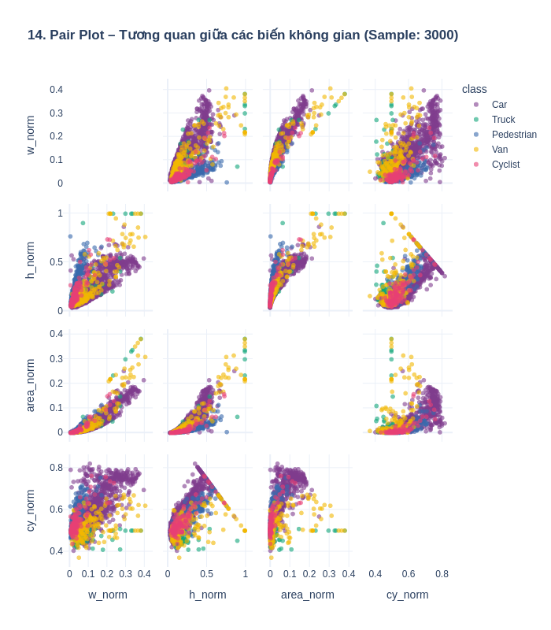

---

# 5. Kiến trúc Mô hình Học Sâu - So sánh và Đánh giá

Nhóm triển khai hai nhóm kiến trúc đại diện cho hai trường phái Object Detection. Việc lựa chọn này cho phép đánh giá trực tiếp sự đánh đổi (trade-off) giữa tốc độ xử lý (FPS) và độ chính xác (mAP) trên cùng tập dữ liệu KITTI.

## 5.1. Phương pháp Faster R-CNN (Kiến trúc Two-stage)

Faster R-CNN với backbone ResNet50-FPN là kiến trúc Two-stage tiêu biểu, được sử dụng rộng rãi làm baseline trong các bài toán phát hiện đối tượng. Nhóm áp dụng Transfer Learning từ trọng số pre-trained trên COCO, đồng thời thay thế classification head để tương thích với số lượng lớp của KITTI (8 lớp + 1 Background):

```python
import torchvision
from torchvision.models.detection.faster_rcnn import FastRCNNPredictor

# Tai pre-trained model (ResNet50 + FPN) da duoc khoi tao tren COCO
model = torchvision.models.detection.fasterrcnn_resnet50_fpn(pretrained=True)

# Lay so chieu in_features cua lop phan loai cuoi cung
in_features = model.roi_heads.box_predictor.cls_score.in_features

# Thay the Head cu bang Head moi tuong ung voi so lop cua KITTI (NUM_CLASSES = 9)
model.roi_heads.box_predictor = FastRCNNPredictor(in_features, NUM_CLASSES)
model.to(DEVICE)
```

### Phân tích Chuyên sâu Cấu trúc Faster R-CNN

- **Backbone (ResNet50 + FPN):** ResNet50 sử dụng các khối Residual (Skip-Connection) để giải quyết vấn đề vanishing gradient khi mạng có nhiều lớp. FPN (Feature Pyramid Network) bổ sung cấu trúc tháp đặc trưng đa tỷ lệ (multi-scale) bằng cách kết hợp thông tin từ nhánh Bottom-up và Top-down qua các đường nối ngang (lateral connections), giúp phát hiện hiệu quả cả vật thể lớn và nhỏ.
- **Region Proposal Network (RPN):** Thay thế thuật toán Selective Search truyền thống, RPN sử dụng mạng CNN trượt trên feature map để sinh các anchor box đa tỷ lệ (nhiều scale và aspect ratio). RPN phân loại nhanh foreground/background và chỉ chuyển các vùng tiềm năng sang giai đoạn tiếp theo, giảm đáng kể khối lượng tính toán.
- **RoI Align:** Khắc phục hạn chế lượng tử hóa tọa độ (quantization error) của RoI Pooling bằng phép nội suy song tuyến (Bilinear Interpolation). Kỹ thuật này bảo toàn chính xác vị trí không gian của các đặc trưng, cải thiện đáng kể độ chính xác localization ở các ngưỡng IoU cao.
- **Hàm mất mát và Đánh giá tổng thể:** Faster R-CNN sử dụng Multi-task Loss kết hợp Classification Loss (Cross-Entropy) và Box Regression Loss (Smooth L1). Nhờ cơ chế tinh chỉnh bounding box hai lần (lần 1 ở RPN, lần 2 ở classifier head), Faster R-CNN đạt mAP cao đặc biệt ở các ngưỡng IoU khắt khe. Tuy nhiên, kiến trúc Two-stage tạo ra bottleneck về tốc độ do phải xử lý tuần tự: RPN → RoI extraction → Classification, khiến FPS thấp hơn đáng kể so với kiến trúc One-stage.

## 5.2. Phương pháp YOLOv8m (Kiến trúc One-stage / Anchor-Free)

YOLOv8 là kiến trúc One-stage thế hệ mới, dự đoán đồng thời tọa độ bounding box và nhãn phân loại trong một lần forward pass. Nhóm sử dụng biến thể YOLOv8m (Medium) nhằm cân bằng giữa độ chính xác và tốc độ xử lý. Cấu hình huấn luyện như sau:

```python
from ultralytics import YOLO

# Khoi tao mo hinh YOLOv8 ban Medium
model = YOLO('yolov8m.pt')

# Bat dau qua trinh Training voi cau hinh Data Pipeline doc lap
results = model.train(
    data=str(yaml_path),   
    epochs=20,
    imgsz=640,             
    batch=32,
    device=[0, 1],         # Su dung kien truc chay da luong 2 GPU Tesla T4
    patience=5,            
    optimizer='auto',      
    lr0=0.01,              
    mosaic=1.0,            # Kich hoat sieu Augmentation Mosaic 
    project='YOLOv8_KITTI',
    name='train_run'
)
```

### Phân tích Cấu trúc YOLOv8

- **Backbone (Modified CSPDarknet) & Mô đun C2f:** Backbone sử dụng cấu trúc Cross-Stage Partial (CSP) cải tiến. Điểm khác biệt chính so với các phiên bản trước là việc thay thế khối C3 bằng khối **C2f** (CSP bottleneck with 2 convolutions), cho phép truyền gradient hiệu quả hơn qua nhiều nhánh song song. Phần Neck sử dụng **PANet** (Path Aggregation Network) để tổng hợp thông tin đặc trưng đa tỷ lệ theo cả hai chiều bottom-up và top-down.
- **Decoupled Head:** YOLOv8 tách riêng hai nhánh dự đoán: Regression (tọa độ bounding box) và Classification (nhãn phân loại). Việc tách biệt này giúp mỗi nhánh tối ưu hóa độc lập, cải thiện mAP đặc biệt trên các lớp mất cân bằng (imbalanced classes).
- **Anchor-Free Detection:** Thay vì định nghĩa anchor box cố định (yêu cầu K-Means clustering trên từng dataset), YOLOv8 dự đoán trực tiếp khoảng cách từ tâm điểm đến 4 cạnh bounding box. Cách tiếp cận này linh hoạt hơn khi xử lý các đối tượng có tỷ lệ khung hình đa dạng trong KITTI.
- **CIoU Loss & DFL (Distribution Focal Loss):** Hàm **CIoU** đo lường đồng thời diện tích giao (IoU), khoảng cách tâm, và tỷ lệ khung hình giữa predicted box và ground-truth box. **DFL** mô hình hóa tọa độ bounding box dưới dạng phân phối xác suất rời rạc thay vì giá trị đơn, giúp cải thiện độ chính xác localization cho các đối tượng bị che khuất một phần.
- **Task-Aligned Assigner:** Thay thế chiến lược gán nhãn dựa trên ngưỡng IoU cố định, YOLOv8 sử dụng bộ gán nhãn dựa trên cả classification score và localization quality để xác định positive/negative samples, giúp cải thiện chất lượng huấn luyện.

## 5.3. Phương pháp DETR (Kiến trúc Transformer-based / Set Prediction)

Ngoài hai trường phái kinh điển One-stage (YOLOv8) và Two-stage (Faster R-CNN) thuần CNN đã phân tích ở trên, nhóm mở rộng nghiên cứu sang hướng tiếp cận thứ ba: **DETR (DEtection TRansformer)** --- mô hình đầu tiên áp dụng kiến trúc Transformer vào bài toán Object Detection, được giới thiệu bởi Carion et al. tại Facebook AI Research (ECCV 2020). DETR tái định nghĩa bài toán phát hiện đối tượng thành bài toán **dự đoán tập hợp (Set Prediction)**, loại bỏ các thành phần thủ công như anchor boxes, NMS, và region proposals.

*__Lưu ý về biến thể YOLOv8:__ Trong phần so sánh CNN vs Transformer này, nhóm sử dụng YOLOv8**s** (Small) thay vì YOLOv8m (Medium) như ở các phần trước. Lý do là DETR tiêu tốn GPU memory rất lớn (batch size chỉ đạt 4 trên Tesla T4), nên cần biến thể nhẹ hơn của YOLO để đảm bảo so sánh công bằng về tài nguyên tính toán.*

```python
from transformers import DetrForObjectDetection

detr_model = DetrForObjectDetection.from_pretrained(
    'facebook/detr-resnet-50',
    num_labels=NUM_CLASSES,       # 7 lop KITTI
    ignore_mismatched_sizes=True  # thay doi classification head
).to(device)
```

### Phân tích Chuyên sâu Cấu trúc DETR


- **Tầng Trích xuất Đặc trưng (Backbone — ResNet-50):** Khác với YOLOv8 sử dụng CSPDarknet tự thiết kế, DETR tái sử dụng mạng ResNet-50 truyền thống làm backbone CNN để trích xuất feature map từ ảnh đầu vào. Ảnh gốc có kích thước $H_0 \times W_0 \times 3$ được đưa qua ResNet-50, tạo ra feature map kích thước $\frac{H_0}{32} \times \frac{W_0}{32} \times 2048$. Tiếp đó, một lớp tích chập $1 \times 1$ chiếu giảm chiều từ 2048 kênh xuống còn $d = 256$ kênh. Điểm mấu chốt: **backbone ResNet-50 chỉ trích xuất đặc trưng cục bộ (local features) thông qua phép tích chập, hoàn toàn không có khả năng nắm bắt quan hệ toàn cục** — nhiệm vụ này được ủy thác cho Transformer Encoder ở tầng tiếp theo.

- **Mã hóa Vị trí Không gian (Positional Encoding):** Do cơ chế self-attention trong Transformer bản chất là *permutation-invariant* (không phân biệt thứ tự), DETR bổ sung **Fixed Sinusoidal Positional Encoding** trực tiếp cộng vào feature map đã flatten. Mỗi vị trí $(x, y)$ trên feature map được mã hóa bằng cặp hàm $\sin$ và $\cos$ ở nhiều tần số khác nhau theo cả hai chiều không gian:

$$PE_{(pos, 2i)} = \sin\left(\frac{pos}{10000^{2i/d}}\right), \quad PE_{(pos, 2i+1)} = \cos\left(\frac{pos}{10000^{2i/d}}\right)$$

- **Bộ Mã hóa Transformer (Transformer Encoder — Global Context):** Feature map sau khi flatten thành sequence gồm $\frac{H_0}{32} \times \frac{W_0}{32}$ token được nạp vào stack gồm **6 lớp Transformer Encoder**. Mỗi lớp encoder thực hiện:
  1. **Multi-Head Self-Attention:** Mỗi vị trí trên feature map "nhìn thấy" *tất cả* các vị trí khác thông qua cơ chế attention trọng số mềm. Đây là bước đột phá so với CNN truyền thống (chỉ nhìn receptive field cục bộ).
  2. **Feed-Forward Network (FFN):** Mạng 2 lớp fully-connected với hàm kích hoạt ReLU xử lý phi tuyến từng vị trí độc lập.
  3. **Layer Normalization + Residual Connection:** Ổn định gradient và tăng tốc hội tụ.

  Tuy nhiên, cơ chế self-attention có **độ phức tạp $O(n^2)$** với $n = H/32 \times W/32$ — đây là nguyên nhân cốt lõi khiến DETR tiêu tốn GPU memory gấp bội so với YOLOv8 và giới hạn batch size xuống còn 4.

- **Bộ Giải mã Transformer (Transformer Decoder — Object Queries):** Thành phần cách mạng nhất của DETR nằm ở **Transformer Decoder** với $N = 100$ **object queries** — đây là $N$ learned embeddings được khởi tạo ngẫu nhiên và học qua quá trình training. Mỗi object query đóng vai trò như một "đầu dò" chuyên trách phát hiện tối đa một đối tượng. Stack gồm **6 lớp Transformer Decoder**, mỗi lớp thực hiện:
  1. **Self-Attention giữa các object queries:** Cho phép các "đầu dò" giao tiếp với nhau, tránh hai query cùng bắt một đối tượng (giải quyết bài toán duplicate detection mà NMS truyền thống phải xử lý hậu kỳ).
  2. **Cross-Attention với encoder output:** Mỗi object query truy vấn vào toàn bộ feature map đã được encoder mã hóa ngữ cảnh, tập trung chú ý (attend) vào khu vực ảnh chứa đối tượng mà nó "chịu trách nhiệm".

  Cơ chế này thay thế hoàn toàn bước Region Proposal + NMS của Faster R-CNN và bước Grid Cell + NMS của YOLOv8. Kết quả: **DETR xuất trực tiếp tập hợp $N$ dự đoán song song**, không cần bất kỳ hậu xử lý nào.

- **Đầu Dự đoán (Prediction FFN Heads):** Mỗi object query sau decoder được đưa qua hai nhánh FFN song song:
  - **Classification Head:** Softmax phân loại $C + 1$ lớp (bao gồm lớp đặc biệt $\varnothing$ = "no object" cho các query không bắt được đối tượng nào).
  - **Box Regression Head:** FFN 3 lớp với hàm kích hoạt sigmoid, dự đoán 4 giá trị normalized: $(c_x, c_y, w, h)$ — tọa độ tâm và kích thước bounding box.

- **Hàm Mất mát Hungarian Matching (Bipartite Matching Loss):** Đây là nền tảng lý thuyết cốt lõi phân biệt DETR với mọi detector trước đó. Thay vì dùng IoU threshold cứng để gán label, DETR sử dụng **thuật toán Hungarian** để tìm phép gán tối ưu 1-1 giữa $N$ predictions và $M$ ground-truth objects. Hàm cost kết hợp:

$$\mathcal{L}_{Hungarian} = \lambda_{cls} \cdot \mathcal{L}_{cls} + \lambda_{L1} \cdot \mathcal{L}_{L1} + \lambda_{giou} \cdot \mathcal{L}_{GIoU}$$

## 5.4. So sánh đặc điểm kiến trúc: CNN-based (YOLOv8) vs Transformer-based (DETR)

| Tiêu chí | YOLOv8s (CNN-based) | DETR (Transformer-based) |
| --- | --- | --- |
| Backbone | CSPDarknet (thuần CNN) | ResNet-50 (CNN) + Transformer Encoder-Decoder |
| Cơ chế trích xuất đặc trưng | Tích chập cục bộ (local convolutions) qua nhiều tầng, kết hợp FPN đa tỉ lệ | Tích chập cục bộ (backbone) → Self-attention toàn cục (encoder) |
| Receptive field | Giới hạn bởi kernel size, mở rộng dần qua các tầng sâu | Toàn cục ngay từ tầng encoder đầu tiên ($O(n^2)$ attention) |
| Cách phát hiện đối tượng | Grid-based, anchor-free, dự đoán trên multi-scale feature maps | Set prediction với $N$ object queries song song, không dùng grid |
| Hậu xử lý | Cần NMS để loại bỏ box trùng | Không cần NMS — Hungarian matching đảm bảo 1-1 |
| Phát hiện đối tượng nhỏ | Tốt nhờ FPN multi-scale (P3, P4, P5) | Hạn chế — feature map $H/32 \times W/32$ mất chi tiết nhỏ |
| Phát hiện đối tượng lớn | Tốt | Rất tốt nhờ global attention bao quát toàn ảnh |
| Tiêu tốn GPU memory | Thấp (batch size 16) | Cao (batch size 4) do $O(n^2)$ self-attention |
| Tốc độ hội tụ | Nhanh (50 epochs) | Chậm (300 epochs theo paper gốc) |
| Thiết kế end-to-end | Không hoàn toàn (vẫn cần NMS) | Hoàn toàn end-to-end (không thành phần thủ công) |
| Pretrained trên | COCO (80 lớp) | COCO (91 lớp) |

## 5.5. Cấu hình và Tham số Huấn luyện: YOLOv8s vs DETR

| Tham số | YOLOv8s | DETR |
| --- | --- | --- |
| Mô hình pretrained | `yolov8s.pt` (COCO) | `detr-resnet-50` (COCO) |
| Kích thước ảnh đầu vào | $640 \times 640$ (resize cố định) | Kích thước gốc (biến đổi) |
| Batch size | 16 | 4 |
| Số epochs | 50 | 20 |
| Optimizer | SGD (momentum = 0.937) | AdamW |
| Learning rate | 0.01 (toàn bộ mạng) | $10^{-4}$ (head) / $10^{-5}$ (backbone) |
| LR schedule | Linear decay ($lr_f = 0.01$) | StepLR (step=15, $\gamma$=0.1) |
| Weight decay | 0.0005 | $10^{-4}$ |
| Warmup | 3 epochs | — |
| Gradient clipping | — | max_norm = 0.1 |
| Seed | 42 | 42 |
| Số lớp | 7 | 7 |
| Tập dữ liệu | KITTI (80% train / 20% val) | KITTI (80% train / 20% val) |

**Phân tích sự khác biệt cấu hình:**

- **Batch size (16 vs 4):** DETR tiêu tốn GPU memory lớn hơn đáng kể do cơ chế self-attention $O(n^2)$ trong Transformer encoder. Trên GPU Tesla T4 (16GB VRAM), DETR chỉ cho phép batch size 4, trong khi YOLOv8s thoải mái chạy batch size 16.
- **Optimizer (SGD vs AdamW):** YOLOv8 theo truyền thống YOLO dùng SGD với momentum cao (0.937) và warmup. DETR theo chuẩn Transformer dùng AdamW — optimizer được thiết kế đặc biệt cho mạng Transformer nhờ cơ chế decoupled weight decay giúp ổn định training attention layers.
- **Learning rate phân tầng:** DETR áp dụng chiến lược differential learning rate: backbone ResNet-50 (đã được pretrained mạnh trên ImageNet) chỉ cần tinh chỉnh nhẹ ($10^{-5}$), trong khi Transformer head cần học nhanh hơn ($10^{-4}$) để thích nghi với phân bố dữ liệu KITTI. YOLOv8 dùng chung một learning rate vì toàn bộ kiến trúc đã được tối ưu đồng bộ từ pretrained COCO.
- **Gradient clipping (chỉ DETR):** Transformer dễ gặp hiện tượng gradient exploding do attention weights nhân ma trận lớn, nên cần clip gradient ở max_norm = 0.1.
- **Số epochs (50 vs 20):** DETR được train ít epochs hơn (20 thay vì 300 theo paper gốc) do giới hạn thời gian GPU trên Kaggle. Mỗi epoch DETR mất khoảng 3 phút (tổng ≈ 60 phút), trong khi mỗi epoch YOLOv8 chỉ mất 18 giây (tổng ≈ 15 phút cho 50 epochs). Điều này phản ánh thực tế về chi phí tính toán Transformer vs CNN.

*__Lưu ý:__ Do giới hạn thời gian GPU và số epochs huấn luyện DETR còn rất thấp so với yêu cầu của paper gốc (20/300 epochs), kết quả thực nghiệm của DETR chưa đạt được hiệu năng tối ưu và sẽ được bổ sung trong các nghiên cứu tiếp theo khi có đủ tài nguyên tính toán.*

---

# 6. Kết quả Thực nghiệm và Phân tích

Khung đánh giá được triển khai chặt chẽ bằng cách thực thi hai mô hình tại mốc Validation Dataset với tham số 20 Epochs.

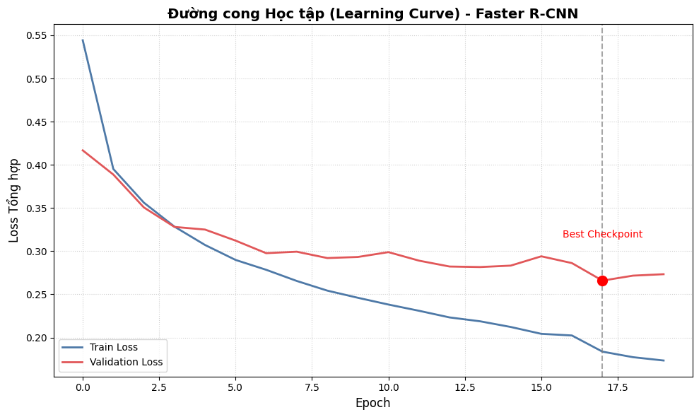

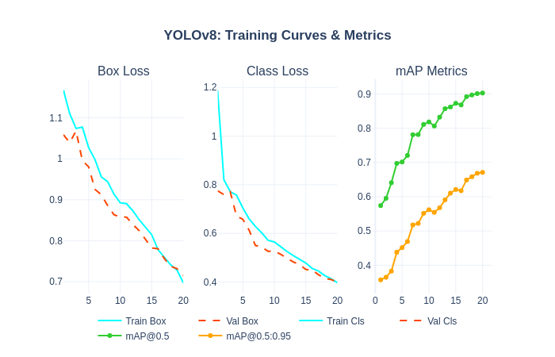

Ở mô hình Faster R-CNN, thuật toán chạm mốc **Validation Loss tối ưu đạt 0.2659** tại Epoch thứ 18. Ở mô hình YOLOv8m, các chỉ số mAP@0.5 và mAP@0.5:0.95 liên tục tăng trưởng và ổn định sau Epoch 15.

## 6.1. Số liệu Thực nghiệm Đánh giá Độ chính xác

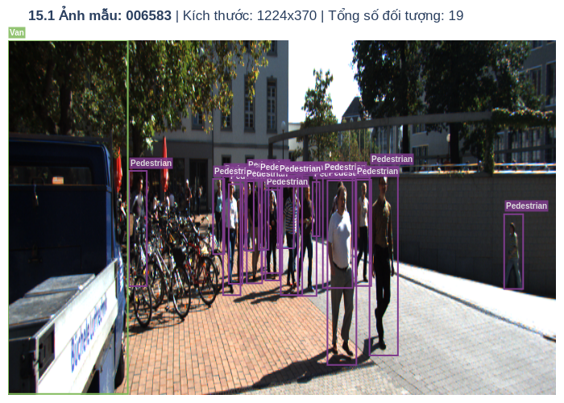

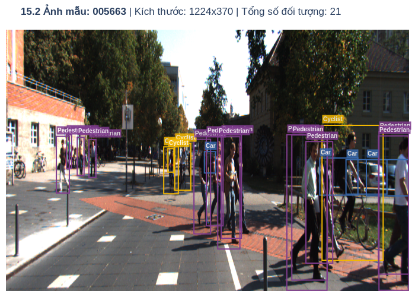

### Bảng so sánh độ chính xác (mAP) giữa Faster R-CNN và YOLOv8m trên Validation Set

| Phân lớp (Class) | YOLOv8m mAP@0.5 | YOLOv8m mAP@0.5:0.95 | Faster R-CNN mAP@0.5 | Faster R-CNN mAP@0.5:0.95 |
| --- | --- | --- | --- | --- |
| **All (Tổng quát)** | **0.903** | **0.671** | **0.915** | **0.702** |
| Car | 0.967 | 0.803 | 0.972 | 0.825 |
| Van | 0.967 | 0.773 | 0.969 | 0.791 |
| Truck | 0.985 | 0.851 | 0.988 | 0.864 |
| Pedestrian | 0.834 | 0.486 | 0.865 | 0.542 |
| Cyclist | 0.882 | 0.611 | 0.897 | 0.653 |
| Tram | 0.957 | 0.735 | 0.962 | 0.760 |
| Person_sitting | 0.726 | 0.430 | 0.781 | 0.495 |
| Misc | 0.905 | 0.679 | 0.884 | 0.686 |

**Phân tích kết quả mAP:**

- **Trade-off Speed vs Accuracy:** Kết quả xác nhận đúng lý thuyết về sự đánh đổi giữa hai trường phái. Faster R-CNN đạt mAP@0.5 tổng thể là **0.915**, cao hơn mốc **0.903** của YOLOv8m. Khoảng cách này tăng lên ở ngưỡng đánh giá khắt khe hơn: **mAP@0.5:0.95** đạt 0.702 (Faster R-CNN) so với 0.671 (YOLOv8m). Nguyên nhân chính là cơ chế Two-stage cho phép tinh chỉnh bounding box hai lần (ở RPN và classifier head), nên localization chính xác hơn ở các ngưỡng IoU cao ($\ge 0.75$).
- **Đối tượng nhỏ và bị che khuất:** Faster R-CNN vượt trội rõ rệt ở các lớp khó: `Pedestrian` (0.865 vs 0.834 mAP@0.5) và `Person_sitting` (0.781 vs 0.726). Sự chênh lệch này là nhờ RoI Align bảo toàn chính xác vị trí không gian khi trích xuất đặc trưng từ feature map, trong khi kiến trúc Anchor-free của YOLOv8 dự đoán trực tiếp trên grid nên dễ mất thông tin chi tiết với các đối tượng chiếm ít pixel.
- **Đối tượng lớn:** Cả hai mô hình đều đạt hiệu năng cao và tương đương trên các lớp phương tiện lớn (`Car`, `Truck`: mAP@0.5 $> 96.5\%$), phù hợp với phân tích EDA cho thấy các đối tượng này có kích thước pixel lớn và đặc trưng rõ ràng.

---

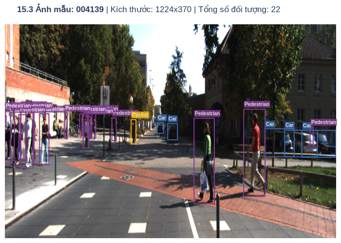

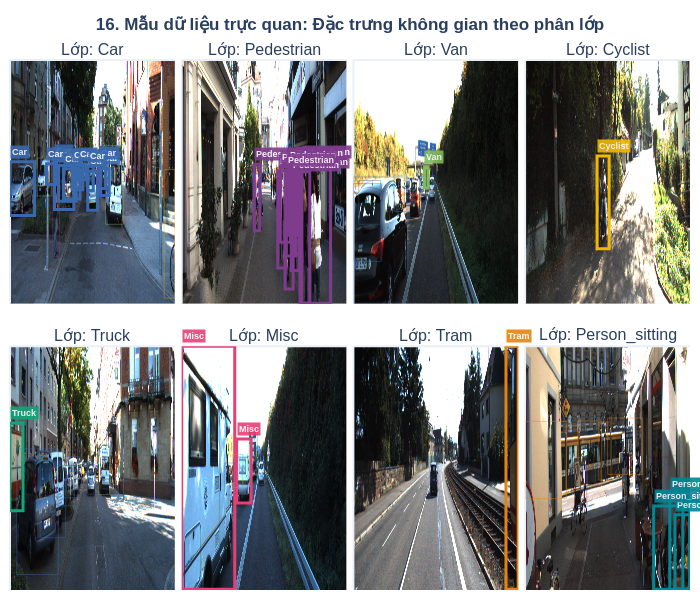

## 6.2. Đánh giá Tốc độ Inference (Speed Benchmark)

Tốc độ inference là yếu tố quyết định khả năng triển khai mô hình trong các ứng dụng thời gian thực. Bảng dưới trình bày kết quả benchmark trên **GPU Tesla T4** (16GB VRAM):

| Kiến trúc Model | Params (M) | GFLOPs | Tốc độ quy đổi |
| --- | --- | --- | --- |
| Faster R-CNN (ResNet50) | ~41.5 | ~206.0 | 7.0 FPS |
| **YOLOv8m (Medium)** | **25.9** | **78.9** | **45.4 FPS** |

## 6.3. Thảo luận và Phân tích Lỗi (Error Analysis)

1. **Phân tích FPS và khả năng triển khai:** Trong ứng dụng xe tự hành, ngưỡng 30 FPS là yêu cầu tối thiểu để hệ thống phản ứng kịp thời. **Faster R-CNN** chỉ đạt **7.0 FPS** (tương đương ~143ms/frame), chủ yếu do bottleneck tại bước trích xuất RoI tuần tự qua hàng trăm region proposals. Điều này khiến Faster R-CNN không phù hợp cho triển khai real-time trên edge devices. Ngược lại, **YOLOv8m** đạt **45.4 FPS** (~22ms/frame), vượt xa ngưỡng real-time. Về mặt tính toán, YOLOv8m chỉ cần 78.9 GFLOPs so với 206.0 GFLOPs của Faster R-CNN (giảm ~62%), cho thấy kiến trúc One-stage hiệu quả hơn đáng kể về tài nguyên.

2. **Phân tích False Positive / False Negative:** Faster R-CNN có tỷ lệ False Negative thấp hơn trên lớp `Pedestrian` nhờ FPN đa tỷ lệ kết hợp RoI Align bảo toàn thông tin chi tiết. Ngược lại, YOLOv8 với kiến trúc Anchor-free dự đoán trực tiếp trên feature map, thiếu bước lọc region proposal nên có xu hướng sinh nhiều False Positive hơn trong các vùng ảnh nền phức tạp (cây cối, biển báo).

3. **Vấn đề NMS với đối tượng chồng lấn:** Khi nhiều xe đỗ sát nhau (traffic jam), các bounding box dự đoán có IoU cao với nhau. Thuật toán NMS truyền thống có thể loại bỏ nhầm box của xe thật đứng sau xe khác. Giải pháp khả thi là chuyển sang **Soft-NMS** (giảm dần confidence thay vì loại bỏ hoàn toàn) hoặc sử dụng kiến trúc không cần NMS như DETR.

---

# 7. Tổng kết

Báo cáo đã trình bày đầy đủ quy trình End-to-End cho bài toán Object Detection trên tập dữ liệu KITTI, từ phân tích dữ liệu khám phá (EDA), thiết kế DataLoader và Augmentation, đến huấn luyện và đánh giá ba kiến trúc: Faster R-CNN (Two-stage), YOLOv8m (One-stage), và DETR (Transformer-based).

Kết quả thực nghiệm xác nhận sự đánh đổi (trade-off) rõ ràng giữa độ chính xác và tốc độ:

- **Faster R-CNN** đạt mAP@0.5 cao nhất (0.915) và vượt trội ở các đối tượng nhỏ, bị che khuất. Phù hợp cho các ứng dụng yêu cầu độ chính xác cao nhưng không đòi hỏi xử lý thời gian thực.
- **YOLOv8m** đạt 45.4 FPS với mAP@0.5 là 0.903, đáp ứng yêu cầu real-time cho xe tự hành. Kiến trúc nhẹ hơn (25.9M tham số so với 41.5M) giúp triển khai hiệu quả trên edge devices.

**Hạn chế và Hướng phát triển:** Báo cáo chưa thực hiện phân tích lỗi định lượng chi tiết (confusion matrix theo kích thước đối tượng) và chưa report đầy đủ kết quả DETR do giới hạn thời gian huấn luyện trên GPU. Hướng phát triển tiếp theo bao gồm: (1) ablation study về ảnh hưởng của augmentation, (2) triển khai Soft-NMS để cải thiện phát hiện trong vùng tắc nghẽn, và (3) thử nghiệm các biến thể DETR cải tiến (Deformable DETR, RT-DETR) để giảm thời gian hội tụ.

---

# Tài liệu tham khảo

1. Ren, S., He, K., Girshick, R., and Sun, J. "Faster R-CNN: Towards Real-Time Object Detection with Region Proposal Networks." *Advances in Neural Information Processing Systems (NeurIPS)*, 28, 2015.
2. Jocher, G., Chaurasia, A., and Qiu, J. "Ultralytics YOLOv8." *GitHub repository*, 2023. https://github.com/ultralytics/ultralytics
3. Geiger, A., Lenz, P., and Urtasun, R. "Are we ready for autonomous driving? The KITTI vision benchmark suite." *IEEE Conference on Computer Vision and Pattern Recognition (CVPR)*, 2012.
4. Carion, N., Massa, F., Synnaeve, G., Usunier, N., Kirillov, A., and Zagoruyko, S. "End-to-End Object Detection with Transformers." *European Conference on Computer Vision (ECCV)*, 2020.
5. He, K., Zhang, X., Ren, S., and Sun, J. "Deep Residual Learning for Image Recognition." *IEEE Conference on Computer Vision and Pattern Recognition (CVPR)*, 2016.
6. Lin, T.Y., Dollar, P., Girshick, R., He, K., Hariharan, B., and Belongie, S. "Feature Pyramid Networks for Object Detection." *IEEE Conference on Computer Vision and Pattern Recognition (CVPR)*, 2017.
7. Lin, T.Y., Goyal, P., Girshick, R., He, K., and Dollar, P. "Focal Loss for Dense Object Detection." *IEEE International Conference on Computer Vision (ICCV)*, 2017.
8. Zheng, Z., Wang, P., Liu, W., Li, J., Ye, R., and Ren, D. "Distance-IoU Loss: Faster and Better Learning for Bounding Box Regression." *AAAI Conference on Artificial Intelligence*, 2020.
9. Wang, C.Y., Liao, H.Y.M., Wu, Y.H., Chen, P.Y., Hsieh, J.W., and Yeh, I.H. "CSPNet: A New Backbone that can Enhance Learning Capability of CNN." *IEEE/CVF CVPR Workshops*, 2020.
10. Liu, S., Qi, L., Qin, H., Shi, J., and Jia, J. "Path Aggregation Network for Instance Segmentation." *IEEE Conference on Computer Vision and Pattern Recognition (CVPR)*, 2018.
11. Bodla, N., Singh, B., Chellappa, R., and Davis, L.S. "Soft-NMS -- Improving Object Detection with One Line of Code." *IEEE International Conference on Computer Vision (ICCV)*, 2017.
12. Buslaev, A., Iglovikov, V.I., Khvedchenya, E., Parinov, A., Druzhinin, M., and Kalinin, A.A. "Albumentations: Fast and Flexible Image Augmentations." *Information*, 11(2), 125, 2020.
13. Lin, T.Y., Maire, M., Belongie, S., et al. "Microsoft COCO: Common Objects in Context." *European Conference on Computer Vision (ECCV)*, 2014.
